# tbg-magic-angle-gaia

Gaia knowledge package synthesized from ten LKM-validated TBG and moire graphene root subgraphs.

<!-- badges:start -->
<!-- badges:end -->

## Overview

> [!TIP]
> **Reasoning graph information gain: `4.1 bits`**
>
> Total mutual information between leaf premises and exported conclusions — measures how much the reasoning structure reduces uncertainty about the results.

```mermaid
---
config:
  flowchart:
    rankSpacing: 80
    nodeSpacing: 30
---
graph TB
    gcn_ffd6d31f_correlated_insulator_phenomenology["gcn_ffd6d31f_correlated_insulator_phenomenology\n(0.78 → 0.78)"]:::premise
    gcn_006f88d8_ma_tbg_superconducting_domes["★ gcn_006f88d8_ma_tbg_superconducting_domes\n(0.50 → 0.87)"]:::exported
    gcn_d3808439ccf6496b["gcn_d3808439ccf6496b\n(0.82 → 0.82)"]:::premise
    gcn_671ceef053a64aa7["gcn_671ceef053a64aa7\n(0.84 → 0.84)"]:::premise
    gcn_7bca73ad98eb4ed4["★ gcn_7bca73ad98eb4ed4\n(0.50 → 0.83)"]:::exported
    gcn_06caff12a4d84b26["gcn_06caff12a4d84b26\n(0.74 → 0.74)"]:::premise
    gcn_fedb8c2683fb48c7["gcn_fedb8c2683fb48c7\n(0.68 → 0.68)"]:::premise
    gcn_afdfbd0c013048d8["★ gcn_afdfbd0c013048d8\n(0.50 → 0.74)"]:::exported
    gcn_e83deb9969844b33["gcn_e83deb9969844b33\n(0.68 → 0.68)"]:::premise
    gcn_ba97172fd9264409["gcn_ba97172fd9264409\n(0.35 → 0.35)"]:::premise
    gcn_105d2fc961f949b6["★ gcn_105d2fc961f949b6\n(0.50 → 0.61)"]:::exported
    gcn_7687975d_small_angle_merging_conjecture["gcn_7687975d_small_angle_merging_conjecture\n(0.64 → 0.64)"]:::premise
    gcn_8159f32d_merged_dirac_magic_angle_flat_band["★ gcn_8159f32d_merged_dirac_magic_angle_flat_band\n(0.50 → 0.80)"]:::exported
    gcn_2fcfd55afc454c94["gcn_2fcfd55afc454c94\n(0.82 → 0.82)"]:::premise
    gcn_2ceab67f16f34d1e["gcn_2ceab67f16f34d1e\n(0.80 → 0.80)"]:::premise
    gcn_f23eff9c755840f2["★ gcn_f23eff9c755840f2\n(0.50 → 0.81)"]:::exported
    gcn_768268d063184cb8["gcn_768268d063184cb8\n(0.84 → 0.84)"]:::premise
    gcn_ba18ade2bb8145ee["gcn_ba18ade2bb8145ee\n(0.83 → 0.83)"]:::premise
    gcn_2a4995cfc44a4638["gcn_2a4995cfc44a4638\n(0.74 → 0.74)"]:::premise
    gcn_4249f998947d4ee0["gcn_4249f998947d4ee0\n(0.72 → 0.72)"]:::premise
    gcn_2cf09f115b814154["★ gcn_2cf09f115b814154\n(0.50 → 0.68)"]:::exported
    gcn_51a6d18a_atqg_tbg_angle_mapping["gcn_51a6d18a_atqg_tbg_angle_mapping\n(0.76 → 0.76)"]:::premise
    gcn_225da7b3_atqg_angle_phase_decoupling["★ gcn_225da7b3_atqg_angle_phase_decoupling\n(0.50 → 0.86)"]:::exported
    gcn_42c7afbd_smab2_layer_resolved_dos["gcn_42c7afbd_smab2_layer_resolved_dos\n(0.82 → 0.82)"]:::premise
    gcn_14a55aff_smab2_flat_band_localization["★ gcn_14a55aff_smab2_flat_band_localization\n(0.50 → 0.89)"]:::exported
    gcn_af432bff_ab_initio_tb_workflow["gcn_af432bff_ab_initio_tb_workflow\n(0.78 → 0.78)"]:::premise
    gcn_be5d1975_detector_interpolation["gcn_be5d1975_detector_interpolation\n(0.72 → 0.72)"]:::premise
    gcn_5f58746b_magic_angle_flat_band_likelihood["★ gcn_5f58746b_magic_angle_flat_band_likelihood\n(0.50 → 0.77)"]:::exported
    gcn_8cd2984a6296435c["gcn_8cd2984a6296435c\n(0.80 → 0.80)"]:::premise
    gcn_ed8fa9253ea24982["gcn_ed8fa9253ea24982\n(0.72 → 0.72)"]:::premise
    gcn_c220df1acc8b476a["★ gcn_c220df1acc8b476a\n(0.50 → 0.77)"]:::exported
    gcn_6463be97083b44fd["gcn_6463be97083b44fd\n(0.62 → 0.62)"]:::premise
    gcn_abaf80790d664630["gcn_abaf80790d664630\n(0.70 → 0.70)"]:::premise
    gcn_de1d329f326f4e75["★ gcn_de1d329f326f4e75\n(0.50 → 0.71)"]:::exported
    gcn_464f6413fccb48be["gcn_464f6413fccb48be\n(0.82 → 0.82)"]:::premise
    gcn_a7252e5aaaf84d38["gcn_a7252e5aaaf84d38\n(0.78 → 0.78)"]:::premise
    gcn_ca5e0f32e91c459b["gcn_ca5e0f32e91c459b\n(0.80 → 0.80)"]:::premise
    gcn_1d940e84a3744c85["gcn_1d940e84a3744c85\n(0.50 → 0.50)"]:::premise
    gcn_584669e24c6145a7["★ gcn_584669e24c6145a7\n(0.50 → 0.62)"]:::exported
    gcn_fb78cfd7_magic_angle_continuum_regime["gcn_fb78cfd7_magic_angle_continuum_regime\n(0.82 → 0.82)"]:::premise
    gcn_9f7dbaf8_substrate_flat_band_topology_regime["★ gcn_9f7dbaf8_substrate_flat_band_topology_regime\n(0.50 → 0.89)"]:::exported
    gcn_c680c239_mattg_continuum_approximations["gcn_c680c239_mattg_continuum_approximations\n(0.76 → 0.76)"]:::premise
    gcn_3618ccee_mattg_theta_over_sqrt2_mapping["gcn_3618ccee_mattg_theta_over_sqrt2_mapping\n(0.80 → 0.80)"]:::premise
    gcn_71314760_mattg_displacement_field_modeling["gcn_71314760_mattg_displacement_field_modeling\n(0.74 → 0.74)"]:::premise
    gcn_b4e3bdff_mattg_mirror_flat_dirac_control["★ gcn_b4e3bdff_mattg_mirror_flat_dirac_control\n(0.50 → 0.71)"]:::exported
    strat_0(["infer\n0.30 bits"]):::weak
    gcn_06caff12a4d84b26 --> strat_0
    gcn_fedb8c2683fb48c7 --> strat_0
    strat_0 --> gcn_afdfbd0c013048d8
    strat_1(["infer\n0.20 bits"]):::weak
    gcn_1d940e84a3744c85 --> strat_1
    gcn_464f6413fccb48be --> strat_1
    gcn_a7252e5aaaf84d38 --> strat_1
    gcn_ca5e0f32e91c459b --> strat_1
    strat_1 --> gcn_584669e24c6145a7
    strat_2(["infer\n0.26 bits"]):::weak
    gcn_2a4995cfc44a4638 --> strat_2
    gcn_4249f998947d4ee0 --> strat_2
    gcn_768268d063184cb8 --> strat_2
    gcn_ba18ade2bb8145ee --> strat_2
    strat_2 --> gcn_2cf09f115b814154
    strat_3(["infer\n0.31 bits"]):::weak
    gcn_2ceab67f16f34d1e --> strat_3
    gcn_2fcfd55afc454c94 --> strat_3
    strat_3 --> gcn_f23eff9c755840f2
    strat_4(["infer\n0.29 bits"]):::weak
    gcn_3618ccee_mattg_theta_over_sqrt2_mapping --> strat_4
    gcn_71314760_mattg_displacement_field_modeling --> strat_4
    gcn_c680c239_mattg_continuum_approximations --> strat_4
    strat_4 --> gcn_b4e3bdff_mattg_mirror_flat_dirac_control
    strat_5(["infer\n0.25 bits"]):::weak
    gcn_42c7afbd_smab2_layer_resolved_dos --> strat_5
    strat_5 --> gcn_14a55aff_smab2_flat_band_localization
    strat_6(["infer\n0.28 bits"]):::weak
    gcn_51a6d18a_atqg_tbg_angle_mapping --> strat_6
    strat_6 --> gcn_225da7b3_atqg_angle_phase_decoupling
    strat_7(["infer\n0.29 bits"]):::weak
    gcn_6463be97083b44fd --> strat_7
    gcn_abaf80790d664630 --> strat_7
    strat_7 --> gcn_de1d329f326f4e75
    strat_8(["infer\n0.30 bits"]):::weak
    gcn_671ceef053a64aa7 --> strat_8
    gcn_d3808439ccf6496b --> strat_8
    strat_8 --> gcn_7bca73ad98eb4ed4
    strat_9(["infer\n0.31 bits"]):::weak
    gcn_7687975d_small_angle_merging_conjecture --> strat_9
    strat_9 --> gcn_8159f32d_merged_dirac_magic_angle_flat_band
    strat_10(["infer\n0.31 bits"]):::weak
    gcn_8cd2984a6296435c --> strat_10
    gcn_ed8fa9253ea24982 --> strat_10
    strat_10 --> gcn_c220df1acc8b476a
    strat_11(["infer\n0.31 bits"]):::weak
    gcn_af432bff_ab_initio_tb_workflow --> strat_11
    gcn_be5d1975_detector_interpolation --> strat_11
    strat_11 --> gcn_5f58746b_magic_angle_flat_band_likelihood
    strat_12(["infer\n0.19 bits"]):::weak
    gcn_ba97172fd9264409 --> strat_12
    gcn_e83deb9969844b33 --> strat_12
    strat_12 --> gcn_105d2fc961f949b6
    strat_13(["infer\n0.25 bits"]):::weak
    gcn_fb78cfd7_magic_angle_continuum_regime --> strat_13
    strat_13 --> gcn_9f7dbaf8_substrate_flat_band_topology_regime
    strat_14(["infer\n0.27 bits"]):::weak
    gcn_ffd6d31f_correlated_insulator_phenomenology --> strat_14
    strat_14 --> gcn_006f88d8_ma_tbg_superconducting_domes

    classDef premise fill:#ddeeff,stroke:#4488bb,color:#333
    classDef exported fill:#d4edda,stroke:#28a745,stroke-width:2px,color:#333
    classDef weak fill:#fff9c4,stroke:#f9a825,stroke-dasharray: 5 5,color:#333
    classDef contra fill:#ffebee,stroke:#c62828,color:#333
```

## Conclusions

| Label | Content | Prior | Belief |
|-------|---------|-------|--------|
| gcn_006f88d8_ma_tbg_superconducting_domes | For Cao et al. 2018 magic-angle twisted bilayer graphene devices M1 (theta=1.... | 0.50 | 0.87 |
| gcn_105d2fc961f949b6 | Applying external compression to commensurate twisted bilayer graphene with t... | 0.50 | 0.61 |
| gcn_14a55aff_smab2_flat_band_localization | For Nguyen et al.'s SM-(AB)_2 twisted monolayer-bilayer graphene geometry nea... | 0.50 | 0.89 |
| gcn_225da7b3_atqg_angle_phase_decoupling | In the two Burg et al. ATQG devices, theta=1.96 deg lies above the stated ATQ... | 0.50 | 0.86 |
| gcn_2cf09f115b814154 | In Ma et al.'s minimal continuum model for twisted trilayer graphene, formed ... | 0.50 | 0.68 |
| gcn_584669e24c6145a7 | In Zhang, Mao, and Senthil's single-valley continuum model for magic-angle TB... | 0.50 | 0.62 |
| gcn_5f58746b_magic_angle_flat_band_likelihood | For 33 unique commensurate twisted bilayer graphene supercells spanning 0.88 ... | 0.50 | 0.77 |
| gcn_7bca73ad98eb4ed4 | For twisted bilayer graphene, the noninteracting low-energy Dirac-point band ... | 0.50 | 0.83 |
| gcn_8159f32d_merged_dirac_magic_angle_flat_band | In sufficiently small-angle twisted bilayer graphene, where the moire-K gap b... | 0.50 | 0.80 |
| gcn_9f7dbaf8_substrate_flat_band_topology_regime | In Wang, Bultinck, and Zaletel's continuum two-decoupled-valley description o... | 0.50 | 0.89 |
| gcn_afdfbd0c013048d8 | The continuum Bistritzer-MacDonald model of magic-angle twisted bilayer
graph... | 0.50 | 0.74 |
| gcn_b4e3bdff_mattg_mirror_flat_dirac_control | For Park et al.'s mirror-symmetric A-tw-A magic-angle twisted trilayer graphe... | 0.50 | 0.71 |
| gcn_c220df1acc8b476a | In Liu et al.'s continuum-model electronic-structure calculation for magic-an... | 0.50 | 0.77 |
| gcn_de1d329f326f4e75 | For twisted bilayer graphene at the first magic twist angle $\theta=1.08^\cir... | 0.50 | 0.71 |
| gcn_f23eff9c755840f2 | In Ma et al.'s continuum description of twisted few-layer graphite, the numer... | 0.50 | 0.81 |

<!-- content:start -->
<!-- content:end -->

## Package Scope

This package formalizes fifteen LKM-backed roots around magic-angle twisted bilayer graphene and nearby moire graphene systems. The graph keeps bilayer TBG, pressure-tuned TBG, hBN/TMD substrate perturbations, graphite/trilayer/quadrilayer/multilayer extensions, and MATTG scopes distinct.

The README graph above is Gaia's generated GitHub overview. It focuses on exported conclusions and immediate evidence. For the exact interactive topology, open `docs/starmap.html` through GitHub Pages.

## Current Statistics

- `gaia compile .`: 126 knowledge nodes, 39 strategies, 0 operators.
- `gaia check --hole .`: 0 holes / 30 independent claims.
- `gaia infer .`: 87 beliefs inferred, exact JT converged.
- `gaia starmap . --out docs/starmap.html`: 108 rendered starmap nodes and 120 edges.

## Audit Status

Raw LKM JSON and all subgraph audit trails are preserved under `artifacts/`. `gaia inquiry review --strict .` reports 0 possible duplicate claims. Remaining strict-review notes concern internal generated helper claims and unreviewed warrants, not science-facing duplicates.
