# tbg-magic-angle-gaia

Gaia knowledge package regenerated from one BM velocity root and connected LKM-backed TBG magic-angle extensions.

<!-- badges:start -->
<!-- badges:end -->

## Overview

> [!TIP]
> **Reasoning graph information gain: `2.1 bits`**
>
> Total mutual information between leaf premises and exported conclusions — measures how much the reasoning structure reduces uncertainty about the results.

```mermaid
---
config:
  flowchart:
    rankSpacing: 80
    nodeSpacing: 30
---
graph TB
    gcn_d3808439ccf6496b["gcn_d3808439ccf6496b\n(0.82 → 0.89)"]:::premise
    gcn_671ceef053a64aa7["gcn_671ceef053a64aa7\n(0.84 → 0.90)"]:::premise
    gcn_7bca73ad98eb4ed4["★ gcn_7bca73ad98eb4ed4\n(0.50 → 1.00)"]:::exported
    gcn_b411dd99a41e4de2["gcn_b411dd99a41e4de2\n(0.76 → 0.81)"]:::premise
    gcn_570f7bfc906e4dbd["gcn_570f7bfc906e4dbd\n(0.78 → 0.83)"]:::premise
    gcn_93c279f20f364a40["★ gcn_93c279f20f364a40\n(0.50 → 0.92)"]:::exported
    gcn_1cb7675d5185405d["gcn_1cb7675d5185405d\n(0.80 → 0.87)"]:::premise
    gcn_feace4c9a0154885["★ gcn_feace4c9a0154885\n(0.50 → 0.98)"]:::exported
    gcn_1b0c5250d2574e24["gcn_1b0c5250d2574e24\n(0.72 → 0.74)"]:::premise
    gcn_4eda4fedb8364912["gcn_4eda4fedb8364912\n(0.68 → 0.71)"]:::premise
    gcn_993c306ad37c4dfb["gcn_993c306ad37c4dfb\n(0.74 → 0.76)"]:::premise
    gcn_2bc94d32817142f7["gcn_2bc94d32817142f7\n(0.70 → 0.73)"]:::premise
    gcn_324b385e04254463["gcn_324b385e04254463\n(0.76 → 0.78)"]:::premise
    gcn_a0ab3201de0e41ad["★ gcn_a0ab3201de0e41ad\n(0.50 → 0.83)"]:::exported
    gcn_159120a419184e9e["gcn_159120a419184e9e\n(0.70 → 0.74)"]:::premise
    gcn_75a1c2477ca448b0["gcn_75a1c2477ca448b0\n(0.66 → 0.70)"]:::premise
    gcn_390a496067b94209["gcn_390a496067b94209\n(0.55 → 0.61)"]:::premise
    gcn_848085b12d384915["★ gcn_848085b12d384915\n(0.50 → 0.87)"]:::exported
    gcn_af432bff_ab_initio_tb_workflow["gcn_af432bff_ab_initio_tb_workflow\n(0.78 → 0.84)"]:::premise
    gcn_be5d1975_detector_interpolation["gcn_be5d1975_detector_interpolation\n(0.72 → 0.79)"]:::premise
    gcn_5f58746b_magic_angle_flat_band_likelihood["★ gcn_5f58746b_magic_angle_flat_band_likelihood\n(0.50 → 0.94)"]:::exported
    gcn_8cd2984a6296435c["gcn_8cd2984a6296435c\n(0.80 → 0.85)"]:::premise
    gcn_ed8fa9253ea24982["gcn_ed8fa9253ea24982\n(0.72 → 0.79)"]:::premise
    gcn_c220df1acc8b476a["★ gcn_c220df1acc8b476a\n(0.50 → 0.94)"]:::exported
    gcn_6463be97083b44fd["gcn_6463be97083b44fd\n(0.62 → 0.70)"]:::premise
    gcn_abaf80790d664630["gcn_abaf80790d664630\n(0.70 → 0.76)"]:::premise
    gcn_de1d329f326f4e75["★ gcn_de1d329f326f4e75\n(0.50 → 0.92)"]:::exported
    gcn_06caff12a4d84b26["gcn_06caff12a4d84b26\n(0.74 → 0.80)"]:::premise
    gcn_fedb8c2683fb48c7["gcn_fedb8c2683fb48c7\n(0.68 → 0.76)"]:::premise
    gcn_afdfbd0c013048d8["★ gcn_afdfbd0c013048d8\n(0.50 → 0.93)"]:::exported
    gcn_7687975d_small_angle_merging_conjecture["gcn_7687975d_small_angle_merging_conjecture\n(0.64 → 0.73)"]:::premise
    gcn_8159f32d_merged_dirac_magic_angle_flat_band["★ gcn_8159f32d_merged_dirac_magic_angle_flat_band\n(0.50 → 0.93)"]:::exported
    strat_0(["infer\n0.29 bits"]):::weak
    gcn_06caff12a4d84b26 --> strat_0
    gcn_7bca73ad98eb4ed4 --> strat_0
    gcn_fedb8c2683fb48c7 --> strat_0
    strat_0 --> gcn_afdfbd0c013048d8
    strat_1(["infer\n0.04 bits"]):::weak
    gcn_159120a419184e9e --> strat_1
    gcn_390a496067b94209 --> strat_1
    gcn_75a1c2477ca448b0 --> strat_1
    strat_1 --> gcn_848085b12d384915
    strat_2(["infer\n0.27 bits"]):::weak
    gcn_1b0c5250d2574e24 --> strat_2
    gcn_2bc94d32817142f7 --> strat_2
    gcn_324b385e04254463 --> strat_2
    gcn_4eda4fedb8364912 --> strat_2
    gcn_93c279f20f364a40 --> strat_2
    gcn_993c306ad37c4dfb --> strat_2
    gcn_feace4c9a0154885 --> strat_2
    strat_2 --> gcn_a0ab3201de0e41ad
    strat_3(["infer\n0.22 bits"]):::weak
    gcn_1cb7675d5185405d --> strat_3
    gcn_7bca73ad98eb4ed4 --> strat_3
    gcn_93c279f20f364a40 --> strat_3
    strat_3 --> gcn_feace4c9a0154885
    strat_4(["infer\n0.11 bits"]):::weak
    gcn_570f7bfc906e4dbd --> strat_4
    gcn_b411dd99a41e4de2 --> strat_4
    strat_4 --> gcn_93c279f20f364a40
    strat_5(["infer\n0.23 bits"]):::weak
    gcn_5f58746b_magic_angle_flat_band_likelihood --> strat_5
    gcn_6463be97083b44fd --> strat_5
    gcn_848085b12d384915 --> strat_5
    gcn_abaf80790d664630 --> strat_5
    strat_5 --> gcn_de1d329f326f4e75
    strat_6(["infer\n0.12 bits"]):::weak
    gcn_671ceef053a64aa7 --> strat_6
    gcn_848085b12d384915 --> strat_6
    gcn_93c279f20f364a40 --> strat_6
    gcn_d3808439ccf6496b --> strat_6
    strat_6 --> gcn_7bca73ad98eb4ed4
    strat_7(["infer\n0.29 bits"]):::weak
    gcn_7687975d_small_angle_merging_conjecture --> strat_7
    gcn_7bca73ad98eb4ed4 --> strat_7
    gcn_848085b12d384915 --> strat_7
    strat_7 --> gcn_8159f32d_merged_dirac_magic_angle_flat_band
    strat_8(["infer\n0.27 bits"]):::weak
    gcn_848085b12d384915 --> strat_8
    gcn_af432bff_ab_initio_tb_workflow --> strat_8
    gcn_be5d1975_detector_interpolation --> strat_8
    strat_8 --> gcn_5f58746b_magic_angle_flat_band_likelihood
    strat_9(["infer\n0.27 bits"]):::weak
    gcn_8cd2984a6296435c --> strat_9
    gcn_de1d329f326f4e75 --> strat_9
    gcn_ed8fa9253ea24982 --> strat_9
    strat_9 --> gcn_c220df1acc8b476a

    classDef premise fill:#ddeeff,stroke:#4488bb,color:#333
    classDef exported fill:#d4edda,stroke:#28a745,stroke-width:2px,color:#333
    classDef weak fill:#fff9c4,stroke:#f9a825,stroke-dasharray: 5 5,color:#333
    classDef contra fill:#ffebee,stroke:#c62828,color:#333
```

## Package Scope

This README is a generated overview plus a short May 4 scope note; it is not necessarily the full graph topology. The executable graph starts from exactly one chain-backed root, `gcn_7bca73ad98eb4ed4`, and grows through connected LKM-backed extensions about BM/continuum velocity suppression, electron-phonon inputs, phonon-mediated pairing calculations, first-principles/DFT flat-band checks, lattice relaxation, magnetic-Bloch BM physics, and a conjectural merged-Dirac velocity-collapse mechanism.

The package stops below the approximate 100-node target because LKM bridge searches did not find honest chain-backed paths from the active graph to the Cao superconducting dome observation, pressure-tuned large-angle TBG, substrate topology, or multilayer branches without generic agent synthesis. Those rejected or deferred candidates are logged in `artifacts/lkm-discovery/candidates.md` and `artifacts/lkm-discovery/merge_audit.md`.

## Current Statistics

- `gaia compile .`: 63 knowledge nodes, 19 strategies, 0 operators.
- `gaia check --hole .`: 0 holes / 22 independent claims.
- `gaia infer .`: 44 beliefs inferred, exact JT converged.
- `gaia inquiry review --strict .`: 0 warnings, 0 errors, 0 possible duplicate claims; 31 internal generated helper structural holes remain non-science-facing.
- `gaia starmap . --out docs/starmap.html`: 51 rendered starmap nodes and 54 edges.

## Interactive Graph

Open `docs/starmap.html` through GitHub Pages for the interactive graph. Raw file browsing on GitHub will show HTML source rather than the rendered starmap.
