# tbg-magic-angle-gaia

Gaia knowledge package synthesized from ten LKM-validated TBG and moire graphene root subgraphs.

## Introduction

#### gcn_006f88d8_ma_tbg_superconducting_domes ★

📌 `gcn_006f88d8_ma_tbg_superconducting_domes`   |   Belief: **0.87**

> For Cao et al. 2018 magic-angle twisted bilayer graphene devices M1 (theta=1.16 deg) and M2 (theta=1.05 deg), the temperature versus gate-induced carrier-density phase diagram shows superconducting dome-shaped regions adjacent to a correlated insulating state centered at nominal half-filling n=+-n_s/2 of the flat moire bands, with n_s=4/A and A~=sqrt(3)a^2/(2 theta^2) for graphene lattice constant a=0.246 nm; near the adjacent carrier densities the four-probe resistance is suppressed below the measurement floor at 70 mK, while the half-filling region has insulating temperature dependence over roughly 1-4 K [@Cao2018].

🔗 **deduction**([gcn_ffd6d31f_correlated_insulator_phenomenology](#gcn_ffd6d31f_correlated_insulator_phenomenology))

Reasoning

1. Treat conclusion 1 (observation of intrinsic, gate-tunable superconductivity in MA-TBG) as established and use it as the starting point: superconductivity appears in MA-TBG devices near the magic angle upon electrostatic doping away from correlated insulating states at half-filling.
2. Describe the $T$ versus $n$ measurements that map the phase diagram: four-probe resistance $R_{xx}$ measured as a function of carrier density $n$ and temperature $T$ for devices M1 and M2 reveals regions of vanishing resistance (superconducting domes) adjacent to an insulating region centered at half-filling $n=\pm n_{s}/2$ of the flat bands.
Fig. 2b
Fig. 2c
3. Characterize the superconducting domes in density-temperature space: in both devices, cooling at densities just adjacent to the half-filling correlated insulating state produces pronounced superconducting regions (domes) where the resistance is fully suppressed below the measurement floor at base temperature; the domes appear on both sides of the correlated insulator (i.e. on densities slightly less and slightly greater than $-n_{s}/2$ in the hole-doped side for these measurements).
Fig. 2b
4. Describe the correlated insulating region's temperature dependence: when cooling through the density corresponding to half-filling, the system exhibits insulating temperature dependence over an intermediate temperature range (roughly 1--4 K) before superconductivity appears at lower temperatures in adjacent densities, indicating a Mott-like correlated insulating phase centered at $n=\pm n_{s}/2$ that gives way to superconductivity upon doping.
Fig. 4a
5. State the authors' interpretation and analogy to cuprates: the presence of superconducting domes adjacent to a correlated insulating (Mott-like) state in the $T$-$n$ phase diagram is highlighted by the authors as phenomenologically similar to cuprate phase diagrams, supporting the description of the insulating phase as a correlated (Mott-like) state and the superconductivity as emerging upon electrostatic doping away from this parent insulator.

#### gcn_7bca73ad98eb4ed4 ★

📌 `gcn_7bca73ad98eb4ed4`   |   Belief: **0.83**

> For twisted bilayer graphene, the noninteracting low-energy Dirac-point band Fermi velocity v_F*(theta) produced by the Bistritzer-MacDonald continuum moire-band model is strongly suppressed as theta approaches the largest magic angle theta_M where that velocity vanishes; for 0 < theta < 3 degrees it is usefully described by v_F*(theta) ~= 0.5 * |theta - theta_M| * v_F, with v_F about 1e8 cm/s [@DasSarma2020].

🔗 **deduction**([gcn_d3808439ccf6496b](#gcn_d3808439ccf6496b), [gcn_671ceef053a64aa7](#gcn_671ceef053a64aa7))

Reasoning

1. Define $v_F^*(\theta)$ as the noninteracting low-energy Dirac-point Fermi velocity of twisted bilayer graphene (tBLG), where $\theta$ is the twist angle expressed in degrees and $\theta_M$ denotes the largest magic angle at which the noninteracting Dirac velocity vanishes (i.e., $v_F^*(\theta_M)=0$); the monolayer graphene (MLG) bare Dirac velocity is $v_F\approx 10^{8}\ \mathrm{cm/s}$. 
Fig. 1(a)
2. State the continuum moiré-band calculation basis: the Bistritzer–MacDonald continuum moiré-band model (band-structure model) is used to compute $v_F^*(\theta)$ as a function of $\theta$, and those calculated values are presented as the tBLG Dirac velocity at the Dirac point versus twist angle. The continuum calculation details are those cited from the band-structure model references and prior work.
[54]
[36]
3. Report the empirical approximation extracted from the continuum moiré-band calculation: for twist angles $\theta<3^\circ$ the computed noninteracting tBLG Dirac velocity is well approximated by the linear formula
$$
v_F^*(\theta)\approx 0.5\,|\theta-\theta_M|\,v_F,
$$
where both $\theta$ and $\theta_M$ are measured in degrees, and $v_F\approx 10^8\ \mathrm{cm/s}$. This empirical expression is the explicit formula appearing in the continuum calculation discussion.
[36]
Fig. 1(a)
4. Explain the domain of validity of the empirical approximation: the authors state the approximation holds for $\theta<3^\circ$, while for $\theta>3^\circ$ one may take $v_F^*(\theta)\approx v_F$ for the purposes of their low-energy continuum theory; the number $\theta_M$ from their calculation is $\theta_M\approx 1.02^\circ$ as reported in their continuum-band evaluation.
[36]
5. Explicitly connect $v_F^*(\theta)$ to subsequent low-energy theories: define the Coulomb fine-structure coupling $\alpha$ in terms of $v_F^*$ by $\alpha=e^2/(\kappa\hbar v_F^*)$, where $e$ is the elementary charge, $\hbar$ is the reduced Planck constant, and $\kappa$ is the background dielectric constant; also state that $v_F^*(\theta)$ is the bare (noninteracting) low-energy parameter entering the continuum electron-phonon resistivity formula (the resistivity formula uses $v_F^{*2}$ in the denominator). Thus the empirical approximation for $v_F^*(\theta)$ summarizes the noninteracting Bistritzer–MacDonald moiré-band calculation used throughout the paper to set band-velocity inputs for both phonon and Coulomb interaction theories.

#### gcn_afdfbd0c013048d8 ★

📌 `gcn_afdfbd0c013048d8`   |   Belief: **0.74**

> The continuum Bistritzer-MacDonald model of magic-angle twisted bilayer
> graphene, after a layer-dependent momentum shift restores moire periodicity,
> can be represented in a magnetic-translation-irrep Landau-level basis at flux
> $\phi=2\pi$ and diagonalized with a finite Landau-level cutoff; for the BM
> interlayer tunneling parameters studied, this calculation produces two
> low-energy reentrant flat bands per valley and spin separated from passive
> bands by a gap of order 40 meV, with topology controlled by $(w_0,w_1)$:
> physical TBG lies in a crystalline regime with vanishing total Chern number for
> the two flat bands, while the first chiral limit $w_0=0$ lies in a
> Landau-level-type regime where each flat band has Chern number -1
> [@HerzogArbeitman2022].

🔗 **deduction**([gcn_06caff12a4d84b26](#gcn_06caff12a4d84b26), [gcn_fedb8c2683fb48c7](#gcn_fedb8c2683fb48c7))

Reasoning

1. Begin with the Bistritzer-MacDonald (BM) continuum model for a single valley at zero flux:
   $$
   H_{BM}=\begin{pmatrix}-i\hbar v_F\boldsymbol{\sigma}\cdot\boldsymbol{\nabla}&T^\dagger(\mathbf{r})\\[4pt]
   T(\mathbf{r})&-i\hbar v_F\boldsymbol{\sigma}\cdot\boldsymbol{\nabla}\end{pmatrix},
   $$
   with moire tunneling $T(\mathbf{r})=\sum_{j=1}^3 e^{2\pi i\mathbf{q}_j\cdot\mathbf{r}}T_j$ and $T_j$ built from interlayer tunneling parameters $w_0,w_1$. Specify moire geometry ($\mathbf{q}_j,\mathbf{a}_i,\mathbf{b}_i$) and the moire unit cell area $\Omega$ so the dimensionless flux $\phi=eB\Omega$ is defined. Sec. VIII A, Eq. (52)-(53); Sec. VIII, geometry discussion [@HerzogArbeitman2022].
2. Introduce magnetic flux by canonical substitution $-i\hbar\boldsymbol{\nabla}\to\boldsymbol{\pi}$ and restore moire periodicity by a layer-dependent unitary momentum-shift:
   $$
   V_1=\mathrm{diag}\big(e^{i\pi\mathbf{q}_1\cdot\mathbf{r}},\,e^{-i\pi\mathbf{q}_1\cdot\mathbf{r}}\big).
   $$
   Conjugating by $V_1$ yields a form with a periodic interlayer potential $\tilde{T}(\mathbf{r})=T_1+T_2 e^{2\pi i\mathbf{b}_1\cdot\mathbf{r}}+T_3 e^{2\pi i\mathbf{b}_2\cdot\mathbf{r}}$ and shifted Dirac kinetic terms, which are readily expressed in Landau-level ladder operators. This step renders the Hamiltonian compatible with the magnetic Bloch construction. Sec. VIII A, Eq. (54)-(55) [@HerzogArbeitman2022].
3. Express the Dirac kinetic term in Landau-level language at $\phi=2\pi$: using $a,a^\dagger$ defined from $\boldsymbol{\pi}$, write
   $$
   v_F\boldsymbol{\sigma}\cdot\boldsymbol{\pi}=v_F\sqrt{2eB}\begin{pmatrix}0&a^\dagger\\[4pt] a&0\end{pmatrix}=v_F k_\theta\Big(\tfrac{3\sqrt{3}}{2\pi}\Big)^{1/2}\begin{pmatrix}0&a^\dagger\\[4pt] a&0\end{pmatrix},
   $$
   so the kinetic energy acts only in Landau-level index space and can be truncated. The momentum-shift terms act as layer-dependent identity contributions on Landau levels and appear as small offsets compared to moire tunneling. Sec. VIII A, Eq. (56) [@HerzogArbeitman2022].
4. Compute the moire tunneling matrix elements in the Landau-level magnetic Bloch basis using the previously derived Landau-level scattering matrices $\mathcal{H}^{\mathbf{q}}$: the periodic tunneling Fourier components scatter Landau levels according to closed-form expressions in terms of Laguerre polynomials, yielding a finite Landau-level matrix Hamiltonian $H^{\phi=2\pi}(\mathbf{k})$ whose off-diagonal blocks are combinations of $T_j$ times phases $e^{\pm i k_i}$ and $\mathcal{H}^{\pm 2\pi\mathbf{b}_i}$ insertions. Truncate the Landau-level basis to a numerically convergent cutoff to obtain a finite matrix to diagonalize. Sec. VIII A; App. A 6; App. D 1 [@HerzogArbeitman2022].
5. Numerically diagonalize the truncated magnetic Bloch Hamiltonian for magic-angle parameters and a range of interlayer tunneling $(w_0,w_1)$: one finds two low-energy flat bands per valley and spin that reenter at $\phi=2\pi$. For magic-angle parameter choices used, these two flat bands are separated from higher passive bands by an energy gap of order $\sim40$ meV. The dispersion and total Chern number of the flat bands depend sensitively on $(w_0,w_1)$, producing a phase diagram where a crystalline regime (physical TBG parameters) has flat bands with vanishing total Chern number, while a Landau-level regime (including the first chiral limit) has each flat band with Chern -1. These numerical band plots, density of states, and Wilson-loop diagnostics are shown in Figs. 5-7 and Fig. 6 panels [@HerzogArbeitman2022].
6. Summarize dependence on $(w_0,w_1)$ and connect to physical regimes: the parameter $w_0$ controlling AA tunneling versus $w_1$ controlling AB/BA tunneling moves the system between a Landau-level-dominated regime and a crystalline regime where the two flat bands together form an elementary band representation with vanishing total Chern number. The calculated reentrant flat bands at $\phi=2\pi$ and the phase diagram in $(w_0,w_1)$ capture this sensitivity, justifying the claim that the BM Hamiltonian expressed in the magnetic Bloch Landau-level basis yields two reentrant low-energy flat bands per valley and spin with significant gaps to passive bands, with topology determined by $(w_0,w_1)$. Sec. VIII A, Figs. 5-7 [@HerzogArbeitman2022].

#### gcn_105d2fc961f949b6 ★

📌 `gcn_105d2fc961f949b6`   |   Belief: **0.61**

> Applying external compression to commensurate twisted bilayer graphene with twist angles from about 9.4 degrees to about 27.8 degrees can produce narrow flat electronic bands and near-Fermi van Hove singularities in large-angle regimes that are single-layer-graphene-like at ambient pressure; pressure is therefore a feasible control parameter for flat-band engineering in easier-to-fabricate larger-angle devices and motivates, but does not demonstrate, possible correlated phases [@Ge2021].

🔗 **deduction**([gcn_e83deb9969844b33](#gcn_e83deb9969844b33), [gcn_ba97172fd9264409](#gcn_ba97172fd9264409))

Reasoning

1. The established results provide three ingredients: at ambient pressure, large-angle TBG from about 9 degrees up to nearly 30 degrees has SLG-like dispersion near K; pressure monotonically reduces Fermi velocity for large twist angles; and for the 9.4 degree structure, compression to 75.52 GPa removes the linear Dirac-like dispersion, creates flat bands near the Fermi level, and produces near-Fermi van Hove singularities associated with saddle points in the VBM and CBM (Fig. 1, Fig. 3).
2. The results summary states that for twist angles above 9 degrees up to nearly 30 degrees, dispersion is SLG-like at K under ambient conditions but changes drastically under external pressure, and the eigenvalue spectra display a flat band around the Fermi level.
3. Because the control parameter is external pressure rather than precise tuning to the magic angle, the paper interprets compression as an alternative route to generating flat bands in TBG, motivated by the difficulty of preparing precisely controlled small-angle bilayers and by prior focus on twist angles below 2 degrees.
4. The near-Fermi flat bands and associated VHSs enhance the density of states close to the Fermi level, and the paper links such electronic structures to properties previously found in small-angle TBG, including superconductivity and correlated insulation, without claiming direct demonstration of those many-body phases.
5. The forward-looking inference is that, if pressure can generate in larger-angle TBG the same electronic ingredients associated with correlated phenomena in magic-angle systems, then pressure provides opportunities for flat-band engineering and further exploration of pressure-tuned correlated behavior.
6. The argument is suggestive rather than demonstrative for many-body phases: the paper says flat bands may induce superconductivity and that electron correlations take place, but provides no separate many-body derivation or experimental proof of superconductivity or correlated insulating order in compressed large-angle systems.
7. Therefore, the conclusion is that external compression is a practical engineering knob for producing narrow flat bands and associated VHSs in larger-angle TBG, offering an alternative to strict magic-angle fabrication and motivating experimental and theoretical exploration of possible correlation-driven phases.

#### gcn_8159f32d_merged_dirac_magic_angle_flat_band ★

📌 `gcn_8159f32d_merged_dirac_magic_angle_flat_band`   |   Belief: **0.80**

> In sufficiently small-angle twisted bilayer graphene, where the moire-K gap between the $2n_0$th and $(2n_0+1)$th bands is negligibly small and the upper two bands near charge neutrality are nearly degenerate, Yamada and Hasegawa 2020 propose that three moving Dirac points merge with the fixed K-point Dirac point, producing vanishing Dirac velocity at K; this suppression is conjectured to contribute to extremely narrow nearly flat bands at the magic angles [@Yamada2020].

🔗 **deduction**([gcn_7687975d_small_angle_merging_conjecture](#gcn_7687975d_small_angle_merging_conjecture))

Reasoning

1. Take as established the upstream mechanism: the zero K-point velocity in commensurate tight-binding calculations at moderate twist angles is caused by the merging of three moving Dirac points with the fixed Dirac point at K, producing a quadratic multi-fold touching at $d_{zc}$ (this is the previously derived merging mechanism).
2. Note the small-angle (continuum) limit characteristics relevant to the conjecture: in the small twist-angle limit the tight-binding K-K' intervalley coupling (the K-K' gap at moire K) becomes exponentially small and the upper two bands near K are nearly degenerate, so the band structure locally resembles the continuum-model limit in which moire K has vanishing gap and near-degenerate bands; experimentally, magic-angle phenomena (extremely narrow bands) occur in this small-angle regime and are known to be pressure tunable.
Fig.1
Fig.3
3. Argue plausibility (as stated by the authors) that the same merging process can continuously evolve into the small-angle regime: because the merging-of-four-Dirac-points mechanism is observed in commensurate tight-binding calculations at moderate angles and because the K-K' gap decreases continuously (exponentially) as the twist angle is reduced, the authors propose that the merging process can persist into the small-angle regime where the K-K' gap is negligible and the upper two bands are nearly degenerate; in that limit the same coalescence of Dirac points would produce vanishing K-point velocity and thus contribute to the formation of extremely narrow (nearly flat) bands at the magic angles.
4. Explicitly label the conjectural nature and the limitation acknowledged by the authors: the authors frame this as a proposal (conjecture) rather than a demonstrated theorem, noting that they have not proved that four-Dirac merging is the full or sole origin of the experimentally observed bandwidth collapse at the smallest magic angles, and they acknowledge that demonstrating the mechanism in the small-angle, almost-degenerate two-band regime is numerically difficult because gaps are exponentially small and the bands are nearly degenerate.
Fig.1

#### gcn_f23eff9c755840f2 ★

📌 `gcn_f23eff9c755840f2`   |   Belief: **0.81**

> In Ma et al.'s continuum description of twisted few-layer graphite, the numerical twist angle at which the two primary moire bands become nearly flat is about 1.05 degrees; this equals the principal magic-angle value obtained for twisted bilayer graphene within the same continuum-model formalism, while the claim is scoped to the primary two-band pair rather than all moire bands [@Ma2020].

🔗 **deduction**([gcn_2fcfd55afc454c94](#gcn_2fcfd55afc454c94), [gcn_2ceab67f16f34d1e](#gcn_2ceab67f16f34d1e))

Reasoning

1. Use the previously established numerical continuum-model framework and the minimal-model calculations to identify the twist angle at which the primary pair of moire bands becomes nearly flat in tFL-graphite; denote the twist angle by $\theta$ measured in degrees.
2. Report the numerical observation from the band plots: the calculations presented for multiple tFL-graphite configurations show that the two primary moire bands become nearly flat at $\theta\approx 1.05^\circ$; this numerical value coincides with the principal magic angle previously reported for twisted bilayer graphene within the same employed continuum-model formalism.
Fig. 2
[9-14]
3. Record the authors' qualification that only two of the multiple moire bands flatten at the magic angle while the remaining bands remain dispersive (albeit narrowed), i.e., the magic-angle flatness pertains to the principal two-band pair in tFL-graphite as in TBG, even though the overall moire spectrum is richer.
Fig. 2

#### gcn_2cf09f115b814154 ★

📌 `gcn_2cf09f115b814154`   |   Belief: **0.68**

> In Ma et al.'s minimal continuum model for twisted trilayer graphene, formed by placing a graphene monolayer on an AB-stacked graphene bilayer, the parameter set gamma_3 = gamma_4 = Delta' = 0, gamma_0 = 2464 meV, and gamma_1 = 400 meV gives a largest magic twist angle near theta = 1.12 degrees, where two low-energy moire bands near charge neutrality become nearly flat around the Fermi level [@Ma2019].

🔗 **deduction**([gcn_768268d063184cb8](#gcn_768268d063184cb8), [gcn_ba18ade2bb8145ee](#gcn_ba18ade2bb8145ee), [gcn_2a4995cfc44a4638](#gcn_2a4995cfc44a4638), [gcn_4249f998947d4ee0](#gcn_4249f998947d4ee0))

Reasoning

1. Define the physical system: "twisted trilayer graphene" (twisted TLG) is a stack where a single graphene monolayer (layer index $3$) is placed on top of an AB-stacked bilayer graphene (layers indices $1,2$) with a relative twist angle $\theta$ between the single layer and the bilayer; the moire superlattice vectors are $\boldsymbol{t}_{1},\boldsymbol{t}_{2}$ and the corresponding moire reciprocal vectors are $\mathbf{G}_{1},\mathbf{G}_{2}$ as constructed from the underlying graphene lattice vectors $\boldsymbol{a}_{1},\boldsymbol{a}_{2}$ and their reciprocal vectors $\boldsymbol{b}_{1},\boldsymbol{b}_{2}$.
2. State the computational framework used to obtain bands: employ a continuum-model Hamiltonian for one valley, written as a $6\times 6$ matrix in the Bloch basis $(A_{1},B_{1},A_{2},B_{2},A_{3},B_{3})$, with the block structure $H_{\mathrm{TLG}}(\theta)=\begin{pmatrix} h_{b}(k_{1}) & T(\boldsymbol{r}) \\ T^{\dagger}(\boldsymbol{r}) & h_{0}(k_{2}) \end{pmatrix} + U$, where $k_{1}=R(-\theta/2)(k-K_{\xi}^{b})$, $k_{2}=R(\theta/2)(k-K_{\xi}^{t})$, $h_{0}(\boldsymbol{k})=-\hbar v_{F}\boldsymbol{k}\cdot\boldsymbol{\sigma}$ is the monolayer graphene Hamiltonian with Fermi velocity $v_{F}$ and Pauli matrices $\boldsymbol{\sigma}$, $h_{b}(k)$ is the AB-stacked bilayer Hamiltonian, $T(\boldsymbol{r})$ is the moire interlayer tunneling between the twisted monolayer and the bilayer, and $U=\mathrm{diag}(-V,-V,0,0,V,V)$ is the perpendicular electric-field induced interlayer potential difference with parameter $V$.
3. Define the minimal-model approximation used to identify the magic-angle physics: set the bilayer remote-hopping parameters to zero, i.e., $\gamma_{3}=0$, $\gamma_{4}=0$, and the on-site dimer potential $\Delta' = 0$, so that the AB-stacked bilayer Hamiltonian $h_{b}$ contains only the leading intralayer nearest-neighbor hopping parameter $\gamma_{0}$ and the dominant interlayer vertical hopping $\gamma_{1}$. The authors state that this minimal model isolates the primary moire and interlayer-coupling physics relevant to flat-band formation.
4. Record the numerical minimal-model tight-binding parameters used to locate the largest magic angle: the nearest-neighbor intralayer hopping is $\gamma_{0}=2464\ \mathrm{meV}$ and the dominant interlayer vertical hopping is $\gamma_{1}=400\ \mathrm{meV}$; set $\gamma_{3}=\gamma_{4}=\Delta'=0$ in the minimal model.
5. Describe the numerical procedure and evidence showing band flattening: use the continuum-model Hamiltonian with the minimal-model parameters and compute moire superlattice band structures for multiple twist angles $\theta$; the computed band structures show that as $\theta$ is decreased from larger values such as $\theta=5^{\circ}$ toward smaller values, the two low-energy moire bands nearest the Fermi level narrow progressively, consistent with moire-band flattening. Fig. 1(c-h).
6. Identify the largest magic angle from the numerical band series: inspect the calculated sequence of band structures shown for decreasing $\theta$ and find the largest twist angle at which the two central bands become nearly dispersionless; the authors report this largest magic angle to be approximately $\theta\approx 1.12^{\circ}$, at which the two low-energy moire bands around charge neutrality are nearly flat in the minimal model. Fig. 1(g,h).
7. State the conclusion that at this magic angle two nearly flat moire bands appear: combine the minimal-model parameter choice ($\gamma_{0}=2464\ \mathrm{meV}$, $\gamma_{1}=400\ \mathrm{meV}$, $\gamma_{3}=\gamma_{4}=\Delta'=0$) with the computed band structures and conclude that for continuum-model twisted trilayer graphene there exists a largest magic twist angle $\theta\approx 1.12^{\circ}$ at which the two low-energy moire bands near charge neutrality become nearly flat. Fig. 1(g,h).

#### gcn_225da7b3_atqg_angle_phase_decoupling ★

📌 `gcn_225da7b3_atqg_angle_phase_decoupling`   |   Belief: **0.86**

> In the two Burg et al. ATQG devices, theta=1.96 deg lies above the stated ATQG magic angle of 1.68 deg and shows dominant hole-side correlated-insulator resistance maxima with no observed superconductivity down to 160 mK, while theta=1.52 deg lies below 1.68 deg and shows superconducting-like transport signatures near half filling with weaker correlated-insulator signatures; comparing these devices indicates that superconductivity favors smaller-than-magic angles and correlated insulators favor larger-than-magic angles in these ATQG samples, so superconductivity and correlated insulating order are decoupled as functions of twist angle in a way that differs from some reported TBG trends [@Burg2022].

🔗 **deduction**([gcn_51a6d18a_atqg_tbg_angle_mapping](#gcn_51a6d18a_atqg_tbg_angle_mapping))

Reasoning

1. From the $\theta = 1.96^\circ$ device measurements, the authors establish that correlated insulators on the hole side (at $n = -n_{\text{s}}/2$ and $-n_{\text{s}}$) are the dominant correlated phenomena and that no superconducting signatures are observed in the measured ranges for that device; these observations were presented earlier and are taken as experimental facts for the comparison.
Fig. 1e
2. From the $\theta = 1.52^\circ$ device measurements, the authors establish that superconducting-like signatures—sharp $\mathrm{d}V/\mathrm{d}I$ peaks, a low-resistance dome, a measured $T_{\mathrm{c}} \approx 1.34\,$K, and $T_{\mathrm{BKT}} \approx 1.29\,$K—occur near half filling while correlated-insulator signatures in that device appear weaker than in the larger-angle device; these observations are likewise taken from the experimental data described for the smaller-angle device.
Fig. 3g
3. Comparing these two device-specific outcomes as a function of twist angle, the authors note an asymmetric dependence: superconductivity appears and is more prominent at the smaller twist angle ($\theta = 1.52^\circ$) while correlated insulators are more prominent at the larger twist angle ($\theta = 1.96^\circ$), indicating that superconductivity and correlated insulating order are not tightly coupled across $\theta$ in the same way they sometimes appear coupled in twisted bilayer graphene (TBG).
Fig. 1e
4. The authors place this experimental twist-angle dependence in context by mapping the ATQG twist angles to an equivalent TBG twist angle by dividing the ATQG twist angle by the golden ratio ($\approx 1.62$), thereby noting that the $\theta = 1.96^\circ$ and $\theta = 1.52^\circ$ samples map to TBG-like angles of $1.21^\circ$ and $0.94^\circ$ respectively; they then compare the observed asymmetry to reports in TBG and conclude that the observed decoupling—superconductivity favoring angles smaller than the magic angle while correlated insulators favor larger-than-magic angles—is a trend that departs from some reported TBG behaviors and suggests a distinct role for dispersive bands in ATQG.
5. Based on the direct experimental comparison between the two samples and the discussion of differences relative to TBG literature, the authors conclude that superconductivity and correlated insulating order in ATQG are decoupled as a function of twist angle in the presented devices: superconductivity is favored at angles smaller than the magic angle in these devices while correlated insulators favor larger-than-magic angles, evidencing an asymmetric twist-angle dependence of correlated phases in ATQG.
(Discussion text and comparisons in main text)

#### gcn_14a55aff_smab2_flat_band_localization ★

📌 `gcn_14a55aff_smab2_flat_band_localization`   |   Belief: **0.89**

> For Nguyen et al.'s SM-(AB)_2 twisted monolayer-bilayer graphene geometry near theta ~= 1.1 deg, relaxed-geometry tight-binding calculations find isolated low-energy flat bands, but the flat-band manifold is less flat than relaxed magic-angle twisted bilayer graphene because it has a larger bandwidth and smaller zero-energy density-of-states peak; layer-resolved density of states further shows flat-band spectral weight localized mainly on the twisted monolayer top layer and broadened or delocalized across the AB-bilayer bottom layers [@Nguyen2022].

🔗 **deduction**([gcn_42c7afbd_smab2_layer_resolved_dos](#gcn_42c7afbd_smab2_layer_resolved_dos))

Reasoning

1. Begin from upstream conclusions taken as known: conclusion 1 (the magic-angle $\theta\simeq1.1^{\circ}$ coincides with maximized AA-region localization and yields flat bands in relaxed structures) and conclusion 10 (the atomistic relaxation and Slater-Koster $p_{z}$ TB protocol used to compute electronic structure) are treated as established starting points for analyzing SM-(AB)$_2$.
2. Describe the system considered and the computational setup: SM-(AB)$_2$ denotes a twisted monolayer placed atop an AB-stacked bilayer (define SM-(AB)$_2$ accordingly); calculations are performed at the system's magic-angle moire using the relaxed geometries and the TB Hamiltonian from the established protocol.
Fig. 5
3. Report the computed bandstructure observation for SM-(AB)$_2$: the TB bandstructure computed on relaxed geometry shows isolated low-energy flat bands near the Fermi level (i.e., similar in topology to magic-angle TBLG), and the DOS shows a zero-energy peak corresponding to these bands; these features are evident in the plotted bandstructure and DOS for SM-(AB)$_2$.
Fig. 5
4. Quantitatively compare the flatness to magic-angle TBLG: although SM-(AB)$_2$ has isolated low-energy flat bands, the computed bandwidth of these flat bands is larger (i.e., the bands are less flat) and the zero-energy DOS peak is smaller than that obtained for magic-angle TBLG in the relaxed-geometry calculations presented; the paper explicitly states that the bands are "less flat (lower)" and the zero-energy DOS peak is reduced compared to TBLG in their magic-angle comparisons.
Fig. 5
5. Explain the structural-electronic rationale provided: define AAB stacking as the local registry of the moire AA-like regions in SM-(AB)$_2$ (i.e., a mixture of AA and AB stacking); because AA regions are favorable for strong electronic localization while AB is unfavorable, the AAB-type regions reduce net AA-like localization compared to pure AA in TBLG, which diminishes the strength of real-space localization and thereby produces a larger flat-band bandwidth and smaller zero-energy DOS peak in SM-(AB)$_2$.
Fig. 6
6. Report the layer-resolved LDOS result that demonstrates spatially separated localized and delocalized character: layer-decomposed LDOS (define LD-DOS as layer-decomposed density of states) for SM-(AB)$_2$ shows that the flat-band states are spatially localized on the twisted monolayer side (top layer) while the same low-energy states are comparatively delocalized on the bilayer (bottom two layers), i.e., a coexistence of localized and delocalized behavior across different layers of the junction.
Fig. 6
7. Cite supportive comparisons and prior observations: the reported layer-separated localized-delocalized electronic character in SM-(AB)$_2$ is consistent with recent experimental observations referenced by the authors and with related theoretical findings on delocalized correlated states in double-bilayer contexts.
[73]
[74]

#### gcn_5f58746b_magic_angle_flat_band_likelihood ★

📌 `gcn_5f58746b_magic_angle_flat_band_likelihood`   |   Belief: **0.77**

> For 33 unique commensurate twisted bilayer graphene supercells spanning 0.88 degrees <= theta <= 21.79 degrees, Tritsaris et al. 2020 use ab initio Wannier-derived tight-binding calculations and automated flat-band detection to find that the blended flat-band likelihood p(theta) is maximized near theta* approximately 1.1 degrees, where low-dispersion near-flat bands emerge near the Fermi level in the single-particle tight-binding band structures [@Tritsaris2020].

🔗 **deduction**([gcn_af432bff_ab_initio_tb_workflow](#gcn_af432bff_ab_initio_tb_workflow), [gcn_be5d1975_detector_interpolation](#gcn_be5d1975_detector_interpolation))

Reasoning

1. Treat the high-throughput ab initio TB workflow (conclusion 3) as established and use it to compute commensurate twisted bilayer graphene band structures for a dense set of commensurate angles in the interval $0.88^{\circ} \leq \theta \leq 21.79^{\circ}$; the workflow uses the Wannier-derived TB Hamiltonian, diagonalization with 60 k-points along $\Gamma$-M-K, and automated flat-band detectors within a 0.30 eV window around the Fermi level.
2. Identify commensurate twist angles using the integer-pair parametrization: associate each commensurate twist angle $\theta$ with a pair of integers $(M,N)$ defining the periodic supercell via $\cos(\theta) = (N^2 + 4NM + M^2)/(2(N^2 + NM + M^2))$, so that specific small angles correspond to large $(M,N)$ pairs (for example, $(32,31) \to 1.05^{\circ}$, $(27,26) \to 1.25^{\circ}$, $(23,22) \to 1.47^{\circ}$), enabling enumeration of 33 unique commensurate bilayers in the stated range. [38]
3. Compute TB band structures for the 33 unique commensurate bilayers and apply the automated flat-band detectors to obtain model-based detections of low-dispersion bands at the sampled commensurate $\theta$ values, producing detection outputs that are converted into continuous predictions $p(\theta)$ via the interpolation/blending prescription (conclusion 2). Fig. 4
4. Observe the evolution of low-energy bands with decreasing $\theta$: for large $\theta$ the low-energy band structure resembles that of an isolated graphene monolayer, while as $\theta$ decreases into the small-angle regime the number of bands increases and the bands near the Fermi level become progressively flatter due to interlayer hybridization as seen in the calculated TB band structures.
5. Report the primary quantitative result for bilayer graphene: the computed, blended prediction $p(\theta)$ is maximized near the well-known magic angle, with the ab initio TB calculations identifying $\theta^{*} \approx 1.1^{\circ}$ (the workflow shows G/G@1.08 as an example close to this maximum), and the formation of low-dispersion bands near the Fermi level is observed in the single-particle TB band structures at this angle. Fig. 4
6. Record the caveat about structural relaxation: note that for twist angles below about $1.0^{\circ}$ atomic relaxation effects (structural reconstruction) can significantly modify band structures (e.g., widening single-particle gaps), and that such relaxation effects are not included in the present high-throughput TB workflow, an explicit limitation acknowledged by the authors. [31]

#### gcn_c220df1acc8b476a ★

📌 `gcn_c220df1acc8b476a`   |   Belief: **0.77**

> In Liu et al.'s continuum-model electronic-structure calculation for magic-angle twisted bilayer graphene, adding atomic-registry-driven lattice relaxation produces reconstructed geometry with enlarged AB/BA regions and reduced AA regions; compared with the rigid unreconstructed calculation, this reconstructed geometry reproduces the key STS spectroscopic trends of broader low-energy flat bands and greater energetic isolation from remote bands, while the calculation omits explicit spatially non-uniform heterostrain and therefore does not reproduce extra flat-band peak splitting, such as three-subpeak structure, observed in some spectra [@Liu2020].

🔗 **deduction**([gcn_8cd2984a6296435c](#gcn_8cd2984a6296435c), [gcn_ed8fa9253ea24982](#gcn_ed8fa9253ea24982))

Reasoning

1. Define the computational framework: perform continuum-model band-structure and density-of-states (DOS) calculations for magic-angle TBG in two geometries -- the unreconstructed (rigid) geometry and a reconstructed geometry that includes lattice relaxation in the form of atomic registry rearrangement corresponding to enlarged AB/BA regions and shrunken AA regions.
Fig. 4
Fig. S10
2. Explain what is meant by lattice relaxation in the calculation: incorporate atomic registry rearrangement (i.e., allowing the local stacking registries to shift so that AB/BA regions are enlarged and AA regions are reduced and corrugated) when computing the continuum-model moire Hamiltonian and deriving band structures and density of states.
[18-21]
3. Report the computational outcome qualitatively: the calculations that include lattice relaxation produce low-energy flat bands that are broader (increased bandwidth) and more energetically isolated from the remote bands (i.e., larger gaps or separation between flat-band manifold and higher-energy conduction bands) than the calculations performed on the unreconstructed, rigid geometry.
Fig. S10
4. Compare computation to experiment: state that these theoretical results reproduce the essential experimental spectroscopic trends observed in STM/STS measurements on magic-angle TBG, namely that the reconstructed geometry yields broadened low-energy flat bands and increased energetic isolation from remote bands relative to the unreconstructed geometry.
Fig. 4d
Fig. 4e
5. State calculation limitations: explicitly record that the present implementation of the continuum-model calculations does not include heterostrain (spatially varying lattice deformation between layers) and therefore does not capture additional subpeak splitting (three subpeaks) observed in some experimental spectra; the authors attribute such extra splittings to strain effects discussed in prior literature.
[54-55]
Fig. S10

#### gcn_de1d329f326f4e75 ★

📌 `gcn_de1d329f326f4e75`   |   Belief: **0.71**

> For twisted bilayer graphene at the first magic twist angle $\theta=1.08^\circ$, plane-wave DFT with vdW-DF2 reproduces the near-Fermi narrow flat-band manifold and the $\Gamma$-point gaps to higher and lower bands only when full atomic relaxation includes both in-plane and out-of-plane displacements. In the fully relaxed geometry, the reported flat-band bandwidth is about $20\,\mathrm{meV}$, with upper and lower separation gaps of about $26\,\mathrm{meV}$ and $16\,\mathrm{meV}$, and tight-binding calculations on the same relaxed coordinates give consistent low-energy bands. Unrelaxed flat geometries lack or strongly underestimate these gaps; in-plane-only relaxation gives zero gaps, while out-of-plane-only relaxation gives underestimated gaps of about $2\,\mathrm{meV}$ and $14\,\mathrm{meV}$ [@Cantele2020].

🔗 **deduction**([gcn_6463be97083b44fd](#gcn_6463be97083b44fd), [gcn_abaf80790d664630](#gcn_abaf80790d664630))

Reasoning

1. State upstream result being used as known: the atomistic relaxation patterns induced by interlayer vdW interactions and their quantitative aspects (out-of-plane buckling, in-plane vortexlike displacements, shrinking of AA regions, and numerical displacement magnitudes) are taken as established from the previously reconstructed structural analysis (conclusion 1). These relaxed atomic geometries are the starting point for the following electronic-structure deductions.
2. Summarize the computational approach used to obtain electronic band structures from relaxed and unrelaxed geometries: single-particle electronic structures were computed using DFT within the same VASP/vdW-DF2 framework (self-consistent-field runs sampled at the $\Gamma$ point for the large supercells), and complementary tight-binding calculations were performed using a Slater-Koster parametrization for $p_z$ orbitals with atom positions taken from the relaxed geometries. Non-self-consistent calculations at other $k$ points used the SCF reference; for the smallest cell only one $k$ point could be computed at a time and energies are referred to the SCF Fermi energy. These computational procedures produce band structures for relaxed and unrelaxed atomic configurations that are directly compared. [51]
3. Compare relaxed versus unrelaxed band structures at the first magic angle $\theta=1.08^\circ$: the band-structure plots along the $K-\Gamma-M-K'$ path show that including full atomic relaxation is necessary to reproduce the experimentally observed narrow flat-band manifold and the energy gaps that separate that manifold from both higher and lower energy bands. The fully relaxed DFT band structure shows a bandwidth of approximately $20\,\mathrm{meV}$ and gaps of about $26\,\mathrm{meV}$ on the electron side and about $16\,\mathrm{meV}$ on the hole side. Fig. 5
4. State the failure of unrelaxed geometries to reproduce the experimental gaps: band structures computed for unrelaxed flat bilayer geometries lack the energy gaps isolating the flat-band manifold at $\theta=1.08^\circ$, or greatly underestimate them, while relaxed panels show the gaps. Fig. 5
5. Report partial-relaxation tests and their electronic consequences: in-plane-only relaxation produces essentially zero energy gaps, whereas out-of-plane-only relaxation produces nonzero but underestimated gaps of approximately $2\,\mathrm{meV}$ and $14\,\mathrm{meV}$ on the two sides. Fig. 6
6. Note the agreement between DFT and tight-binding when using the relaxed geometry: tight-binding calculations using the Slater-Koster $p_z$ parametrization on the DFT-relaxed atomic positions reproduce the DFT bands closely near the Fermi energy, indicating that the relaxed geometry is the essential ingredient for the observed flat bands and gaps. Fig. 5

#### gcn_584669e24c6145a7 ★

📌 `gcn_584669e24c6145a7`   |   Belief: **0.62**

> In Zhang, Mao, and Senthil's single-valley continuum model for magic-angle TBG with the top graphene layer nearly aligned to h-BN, H = H_TBG + H_hBN combines the standard TBG continuum Hamiltonian with a top-layer h-BN term containing a staggered sublattice mass M and weaker V_j moire potentials; for M about 15-17 meV and |V_j| much smaller than w_1 about 110 meV, numerical diagonalization gives gapped MBZ-corner Dirac crossings, one isolated conduction and one isolated valence active band per valley, valley + Chern numbers C = +1 and C = -1 for the conduction and valence active bands respectively, and an indirect active-band gap of order 5 meV at M = 15 meV and theta_M = 1.20 degrees [@Zhang2019].

🔗 **deduction**([gcn_464f6413fccb48be](#gcn_464f6413fccb48be), [gcn_a7252e5aaaf84d38](#gcn_a7252e5aaaf84d38), [gcn_ca5e0f32e91c459b](#gcn_ca5e0f32e91c459b), [gcn_1d940e84a3744c85](#gcn_1d940e84a3744c85))

Reasoning

1. State the single-valley continuum Hamiltonian for magic-angle twisted bilayer graphene (MA-TBG) aligned with hexagonal boron nitride (h-BN) as the sum of a TBG continuum-model term and an h-BN-induced term: H=H_TBG+H_hBN, where H_TBG is the standard continuum-model Hamiltonian for twisted bilayer graphene and H_hBN encodes effects of the aligned h-BN on the top graphene layer. [56]
2. Write explicitly the h-BN-induced part of the Hamiltonian as H_hBN = sum_k M psi_t^\dagger(k) mu_z psi_t(k) + sum_{j=1}^6 psi_t^\dagger(k+Q'_j) V_j psi_t(k), and define k, top and bottom layer spinors, sublattice Pauli matrix mu_z, staggered mass M, h-BN mismatch wavevectors Q'_j, and moire potential matrices V_j. [56]
3. Explain the origin and role of the M term: aligned h-BN breaks in-plane C_2 symmetry of graphene and produces a staggered sublattice potential on the top graphene layer, acting as a mass for that layer's Dirac cones. [57]
4. Provide empirical and theoretical parameter estimates: monolayer graphene nearly aligned with h-BN shows a neutral-point gap around 35 meV, implying M about 17 meV; DFT estimates give V_j about 10 meV; the dominant TBG moire interlayer coupling is w_1 about 110 meV and lattice relaxation is represented by w_0/w_1 = 0.7, establishing M about 15-17 meV and |V_j| much smaller than w_1. [56] [10]
5. State the band-structure approximation: because V_j is estimated to be significantly smaller than the principal TBG moire scale, the authors ignore the sum_j V_j moire-potential term as a first approximation and diagonalize H_TBG + M sum_k psi_t^\dagger(k) mu_z psi_t(k) in the TBG moire Brillouin zone. [10]
6. Describe the continuum-model ingredients diagonalized: H_TBG is the Bistritzer-MacDonald continuum Hamiltonian for one valley, with Dirac Hamiltonians for top and bottom layers coupled by interlayer moire tunneling matrices T_j at wavevectors Q_j; the sublattice spinors and single-valley layer Dirac Hamiltonian form the basis for numerical diagonalization. [56]
7. Report the numerical diagonalization for representative realistic parameters: for theta_M = 1.20 degrees and M = 15 meV, with w_1 = 110 meV and w_0/w_1 = 0.7, the computed single-valley band structure gaps the MBZ-corner Dirac crossings, isolates the conduction and valence active bands from other bands, and gives an indirect active-band gap of order 5 meV. Fig. 1
8. Explain how band Chern numbers are determined and report their values: because the active bands are isolated, their Chern numbers are well defined and computed numerically; for valley + the conduction band has C=+1 and the valence band has C=-1, with opposite signs in the time-reversed valley. [8] Fig. 3
9. Connect the band-gap and topology statements into the final assertion: the explicit H_hBN form plus diagonalization of H_TBG+H_hBN under realistic parameter estimates yields gapped Dirac crossings, isolated conduction and valence active bands, valley-resolved Chern numbers +1 and -1 for valley +, and an about 5 meV indirect gap for M=15 meV and theta_M=1.20 degrees. Fig. 1

#### gcn_9f7dbaf8_substrate_flat_band_topology_regime ★

📌 `gcn_9f7dbaf8_substrate_flat_band_topology_regime`   |   Belief: **0.89**

> In Wang, Bultinck, and Zaletel's continuum two-decoupled-valley description of magic-angle TBG on a transition metal dichalcogenide, the reported reconstructed-band phenomena--Rashba-induced isolated extremely flat band pairs near K^{+/-}, the sixteen-Dirac-point single-valley four-band structure, and Chern-number phase diagrams for isolated active bands--are scoped to sufficiently small twist angles near the first magic angle, where the active eight bands are isolated and have bandwidth comparable to or smaller than proximate scales such as Rashba ~16 meV, Ising ~1 meV, and sublattice u ~1-2 meV; away from that regime, large active-band bandwidth can prevent Rashba reconstruction and the reported topology and extreme flatness need not occur [@Wang2020].

🔗 **deduction**([gcn_fb78cfd7_magic_angle_continuum_regime](#gcn_fb78cfd7_magic_angle_continuum_regime))

Reasoning

1. State the applicability domain of the continuum two-decoupled-valley model: require that the TBG twist angle be small enough so that valley-mixing terms are negligible and the two-valley continuum approximation is valid (i.e., the low-energy physics can be described by separate $\tau=\pm$ valley moire Hamiltonians).
2. Specify the additional constraint that the twist angle must be sufficiently close to the first magic angle (approximately $\theta^{*}\sim 1.08^{\circ}$) so that (i) the eight active flat bands near charge neutrality are well separated from remote bands by an appreciable gap, and (ii) the bandwidth of the active eight bands is comparable to or smaller than the realistic proximity-induced energy scales (Rashba $\sim 16\ \text{meV}$, Ising $\sim 1\ \text{meV}$, sublattice splitting $u\sim 1$-$2\ \text{meV}$); these two conditions ensure that the proximity terms can reconstruct the active bands and induce the topological phenomena described.
3. Explain the failure mode when away from this regime: if the twist angle is too far from the first magic angle so that the active-band bandwidth becomes large compared to the SOC strengths, the Rashba and other proximity couplings will be too weak relative to the kinetic bandwidth to significantly reconstruct the active bands; consequently the Rashba-induced splitting that produces extremely-flat pairs near $K^{\pm}$, the 16 Dirac-point structure, and the Chern-number phase diagrams derived for the reconstructed bands will not occur.
4. Conclude that the reconstructed-band phenomena reported in this work (isolated flat pairs at $K^{\pm}$, the sixteen-Dirac pattern, and the computed valley-Chern and time-reversal TI phase diagrams) apply within the continuum, two-decoupled-valley description appropriate for small twist angles and require being sufficiently close to the first magic angle so that the active eight bands are narrow and separated from remote bands; outside this regime the reported topology and extreme flatness are not expected to be realized.

#### gcn_b4e3bdff_mattg_mirror_flat_dirac_control ★

📌 `gcn_b4e3bdff_mattg_mirror_flat_dirac_control`   |   Belief: **0.71**

> For Park et al.'s mirror-symmetric A-tw-A magic-angle twisted trilayer graphene with sequential twist angles +theta and -theta and theta about 1.57 degrees, continuum-model calculations yield mirror-symmetry-protected flat bands derived from mirror-symmetric outer-layer hopping combinations and coexisting gapless Dirac bands of opposite mirror character, so flat-band/Dirac-band hybridization is forbidden when mirror symmetry is present; the flat bands map approximately to MATBG-like bands with effective twist angle theta/sqrt(2), giving a larger MATTG magic angle near 1.6 degrees, and a perpendicular displacement field D breaks mirror symmetry and hybridizes the flat and Dirac bands, enabling electrical control of flat-band bandwidth and topology under the stated continuum-model approximations [@Park2021].

🔗 **deduction**([gcn_c680c239_mattg_continuum_approximations](#gcn_c680c239_mattg_continuum_approximations), [gcn_3618ccee_mattg_theta_over_sqrt2_mapping](#gcn_3618ccee_mattg_theta_over_sqrt2_mapping), [gcn_71314760_mattg_displacement_field_modeling](#gcn_71314760_mattg_displacement_field_modeling))

Reasoning

1. Define the system and calculation framework: MATTG consists of three graphene monolayers with sequential twist angles $\theta$ and $-\theta$ between layers; the continuum-model calculation used is the twisted-bilayer continuum model extended to a third layer with the same relative twist as the bottom layer. The calculation neglects direct coupling between the topmost and bottommost layers and uses interlayer hopping parameters off-diagonal $w=0.1\ \mathrm{eV}$ and diagonal $w'=0.08\ \mathrm{eV}$ (the latter empirically accounting for lattice relaxation). Fig. 1b, Fig. 1c [2,18,25,26]
2. Present the calculated bandstructure at zero perpendicular electric displacement field $D$: the calculated bands for valley K show a set of nearly flat bands near charge neutrality and coexisting gapless Dirac bands, with the mirror-symmetry character of each eigenstate indicated by a colour scale (mirror-symmetric eigenstates evaluate to $+1$ under the top-bottom layer inner-product projection, mirror-antisymmetric to $-1$, and intermediate values for nonsymmetric states). In these zero-$D$ calculations, the flat bands are mirror symmetric and the Dirac bands are mirror antisymmetric, hence hybridization between them is symmetry-forbidden at $D=0$. Fig. 1b
3. Explain the origin of the flat bands in this mirror-symmetric stacking: the flat bands arise from mirror-symmetric hopping from the two outer layers onto the central layer; mathematically, these flat bands reduce to an effective twisted-bilayer-like bandstructure with an effective twist angle $\theta/\sqrt{2}$ (that is, effective twist $=\theta/\sqrt{2}$), implying a larger MATTG magic angle than MATBG. Using $\theta\approx1.57^\circ$, this reduction yields an estimated MATTG magic-angle value $\theta_{\mathrm{MATTG}}\approx1.6^\circ$. Fig. 1b [18]
4. Describe the effect of a perpendicular displacement field $D$ in the calculation: applying a finite $D$ breaks the mirror symmetry by imposing an interlayer potential difference $\Delta V = d D/\varepsilon_{0}$ (where $d\approx0.3\ \mathrm{nm}$ is the interlayer spacing and $\varepsilon_{0}$ is the vacuum permittivity), which mixes mirror-symmetry characters and allows hybridization between the formerly mirror-protected flat bands and the Dirac bands. The calculated bandstructure at finite $D$ shows this hybridization and the resulting controllable changes in band bandwidth and topology. Fig. 1c
5. State the approximations and limitations used in the calculations as presented: neglect of direct coupling between the topmost and bottommost layers is explicitly adopted; the chosen interlayer hopping parameters are $w=0.1\ \mathrm{eV}$ and $w'=0.08\ \mathrm{eV}$; the calculation does not include a self-consistent screening treatment of the applied $D$ (authors remark that screening by outer layers reduces the actual interlayer field relative to externally applied $D$), nor high-order and non-local interlayer coupling terms that can introduce particle-hole asymmetry. Extended Data Fig. 1

## paper_cao2018 -- claims and deductions from Cao et al. 2018.

#### gcn_ffd6d31f_correlated_insulator_phenomenology

📌 `gcn_ffd6d31f_correlated_insulator_phenomenology`   |   Prior: 0.78   |   Belief: **0.78**

> For magic-angle twisted bilayer graphene near the first magic angle, the selected LKM chain treats transport at nominal half-filling of the flat moire band, n=+-n_s/2, that shows resistance increasing on cooling over roughly 1-4 K as phenomenology consistent with a correlated, Mott-like insulating state driven by electron-electron interactions, while noting that this does not by itself prove a microscopic Mott mechanism [@Cao2018].

#### gcn_006f88d8_ma_tbg_superconducting_domes ★

📌 `gcn_006f88d8_ma_tbg_superconducting_domes`   |   Belief: **0.87**

> For Cao et al. 2018 magic-angle twisted bilayer graphene devices M1 (theta=1.16 deg) and M2 (theta=1.05 deg), the temperature versus gate-induced carrier-density phase diagram shows superconducting dome-shaped regions adjacent to a correlated insulating state centered at nominal half-filling n=+-n_s/2 of the flat moire bands, with n_s=4/A and A~=sqrt(3)a^2/(2 theta^2) for graphene lattice constant a=0.246 nm; near the adjacent carrier densities the four-probe resistance is suppressed below the measurement floor at 70 mK, while the half-filling region has insulating temperature dependence over roughly 1-4 K [@Cao2018].

🔗 **deduction**([gcn_ffd6d31f_correlated_insulator_phenomenology](#gcn_ffd6d31f_correlated_insulator_phenomenology))

Reasoning

1. Treat conclusion 1 (observation of intrinsic, gate-tunable superconductivity in MA-TBG) as established and use it as the starting point: superconductivity appears in MA-TBG devices near the magic angle upon electrostatic doping away from correlated insulating states at half-filling.
2. Describe the $T$ versus $n$ measurements that map the phase diagram: four-probe resistance $R_{xx}$ measured as a function of carrier density $n$ and temperature $T$ for devices M1 and M2 reveals regions of vanishing resistance (superconducting domes) adjacent to an insulating region centered at half-filling $n=\pm n_{s}/2$ of the flat bands.
Fig. 2b
Fig. 2c
3. Characterize the superconducting domes in density-temperature space: in both devices, cooling at densities just adjacent to the half-filling correlated insulating state produces pronounced superconducting regions (domes) where the resistance is fully suppressed below the measurement floor at base temperature; the domes appear on both sides of the correlated insulator (i.e. on densities slightly less and slightly greater than $-n_{s}/2$ in the hole-doped side for these measurements).
Fig. 2b
4. Describe the correlated insulating region's temperature dependence: when cooling through the density corresponding to half-filling, the system exhibits insulating temperature dependence over an intermediate temperature range (roughly 1--4 K) before superconductivity appears at lower temperatures in adjacent densities, indicating a Mott-like correlated insulating phase centered at $n=\pm n_{s}/2$ that gives way to superconductivity upon doping.
Fig. 4a
5. State the authors' interpretation and analogy to cuprates: the presence of superconducting domes adjacent to a correlated insulating (Mott-like) state in the $T$-$n$ phase diagram is highlighted by the authors as phenomenologically similar to cuprate phase diagrams, supporting the description of the insulating phase as a correlated (Mott-like) state and the superconductivity as emerging upon electrostatic doping away from this parent insulator.

#### helper_ma_tbg_domes_adjacent_to_correlated_insulator

📌 `helper_ma_tbg_domes_adjacent_to_correlated_insulator`   |   Belief: **0.89**

> For the Cao et al. 2018 MA-TBG devices, the selected LKM root states that superconducting dome-shaped regions occur at carrier densities just adjacent to the half-filling correlated insulating density, on both sides of that correlated insulator in the mapped temperature-density phase diagram [@Cao2018].

🔗 **support**([gcn_006f88d8_ma_tbg_superconducting_domes](#gcn_006f88d8_ma_tbg_superconducting_domes))

Reasoning

The selected LKM root and factor steps 2-3 explicitly state that the temperature-density phase diagram contains superconducting domes adjacent to the half-filling correlated insulator.

#### helper_ma_tbg_resistance_suppressed_at_70_mk

📌 `helper_ma_tbg_resistance_suppressed_at_70_mk`   |   Belief: **0.89**

> For Cao et al. 2018 MA-TBG devices M1 and M2, cooling at carrier densities adjacent to the half-filling insulating state produces superconducting regions in which four-probe resistance is suppressed below the measurement floor at the 70 mK base temperature [@Cao2018].

🔗 **support**([gcn_006f88d8_ma_tbg_superconducting_domes](#gcn_006f88d8_ma_tbg_superconducting_domes))

Reasoning

The selected LKM root and factor step 3 explicitly report full suppression of four-probe resistance below the measurement floor at the 70 mK base temperature in the superconducting regions.

#### helper_ma_tbg_half_filling_insulating_window

📌 `helper_ma_tbg_half_filling_insulating_window`   |   Belief: **0.89**

> For the Cao et al. 2018 MA-TBG phase diagram, the correlated insulating region centered at nominal half-filling n=+-n_s/2 shows insulating temperature dependence, i.e. resistance increasing upon cooling, over an intermediate temperature window of roughly 1-4 K [@Cao2018].

🔗 **support**([gcn_006f88d8_ma_tbg_superconducting_domes](#gcn_006f88d8_ma_tbg_superconducting_domes))

Reasoning

The selected LKM root and factor step 4 explicitly state that the half-filling region shows insulating temperature dependence over roughly 1-4 K.

## paper_dassarma2020 -- LKM claims and deduction from Das Sarma and Wu (2020).

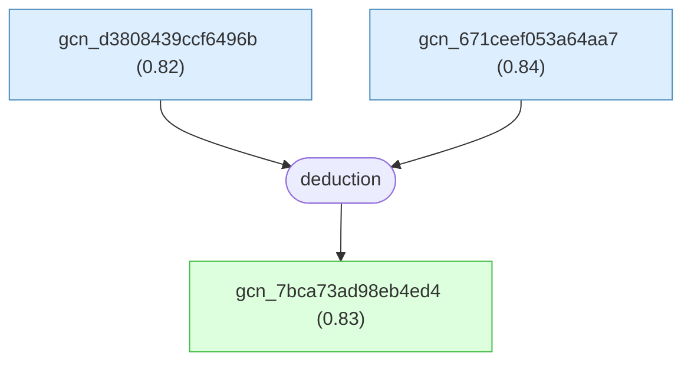

#### gcn_d3808439ccf6496b

📌 `gcn_d3808439ccf6496b`   |   Prior: 0.82   |   Belief: **0.82**

> For twisted bilayer graphene in the noninteracting Bistritzer-MacDonald continuum moire-band calculation, with twist angle theta and largest magic angle theta_M measured in degrees and monolayer graphene velocity v_F about 1e8 cm/s, the computed low-energy Dirac-point Fermi velocity v_F*(theta) for 0 < theta < 3 degrees is usefully approximated by v_F*(theta) ~= 0.5 * |theta - theta_M| * v_F [@DasSarma2020].

#### gcn_671ceef053a64aa7

📌 `gcn_671ceef053a64aa7`   |   Prior: 0.84   |   Belief: **0.84**

> In twisted bilayer graphene, the Bistritzer-MacDonald continuum moire-band model supplies the noninteracting low-energy band structure, and the Dirac-point band Fermi velocity v_F*(theta) from that model is treated as the bare input velocity for subsequent low-energy many-body and phonon-transport calculations [@DasSarma2020].

#### gcn_7bca73ad98eb4ed4 ★

📌 `gcn_7bca73ad98eb4ed4`   |   Belief: **0.83**

> For twisted bilayer graphene, the noninteracting low-energy Dirac-point band Fermi velocity v_F*(theta) produced by the Bistritzer-MacDonald continuum moire-band model is strongly suppressed as theta approaches the largest magic angle theta_M where that velocity vanishes; for 0 < theta < 3 degrees it is usefully described by v_F*(theta) ~= 0.5 * |theta - theta_M| * v_F, with v_F about 1e8 cm/s [@DasSarma2020].

🔗 **deduction**([gcn_d3808439ccf6496b](#gcn_d3808439ccf6496b), [gcn_671ceef053a64aa7](#gcn_671ceef053a64aa7))

Reasoning

1. Define $v_F^*(\theta)$ as the noninteracting low-energy Dirac-point Fermi velocity of twisted bilayer graphene (tBLG), where $\theta$ is the twist angle expressed in degrees and $\theta_M$ denotes the largest magic angle at which the noninteracting Dirac velocity vanishes (i.e., $v_F^*(\theta_M)=0$); the monolayer graphene (MLG) bare Dirac velocity is $v_F\approx 10^{8}\ \mathrm{cm/s}$. 
Fig. 1(a)
2. State the continuum moiré-band calculation basis: the Bistritzer–MacDonald continuum moiré-band model (band-structure model) is used to compute $v_F^*(\theta)$ as a function of $\theta$, and those calculated values are presented as the tBLG Dirac velocity at the Dirac point versus twist angle. The continuum calculation details are those cited from the band-structure model references and prior work.
[54]
[36]
3. Report the empirical approximation extracted from the continuum moiré-band calculation: for twist angles $\theta<3^\circ$ the computed noninteracting tBLG Dirac velocity is well approximated by the linear formula
$$
v_F^*(\theta)\approx 0.5\,|\theta-\theta_M|\,v_F,
$$
where both $\theta$ and $\theta_M$ are measured in degrees, and $v_F\approx 10^8\ \mathrm{cm/s}$. This empirical expression is the explicit formula appearing in the continuum calculation discussion.
[36]
Fig. 1(a)
4. Explain the domain of validity of the empirical approximation: the authors state the approximation holds for $\theta<3^\circ$, while for $\theta>3^\circ$ one may take $v_F^*(\theta)\approx v_F$ for the purposes of their low-energy continuum theory; the number $\theta_M$ from their calculation is $\theta_M\approx 1.02^\circ$ as reported in their continuum-band evaluation.
[36]
5. Explicitly connect $v_F^*(\theta)$ to subsequent low-energy theories: define the Coulomb fine-structure coupling $\alpha$ in terms of $v_F^*$ by $\alpha=e^2/(\kappa\hbar v_F^*)$, where $e$ is the elementary charge, $\hbar$ is the reduced Planck constant, and $\kappa$ is the background dielectric constant; also state that $v_F^*(\theta)$ is the bare (noninteracting) low-energy parameter entering the continuum electron-phonon resistivity formula (the resistivity formula uses $v_F^{*2}$ in the denominator). Thus the empirical approximation for $v_F^*(\theta)$ summarizes the noninteracting Bistritzer–MacDonald moiré-band calculation used throughout the paper to set band-velocity inputs for both phonon and Coulomb interaction theories.

## Claims and deduction from Herzog-Arbeitman, Chew, and Bernevig (2022).

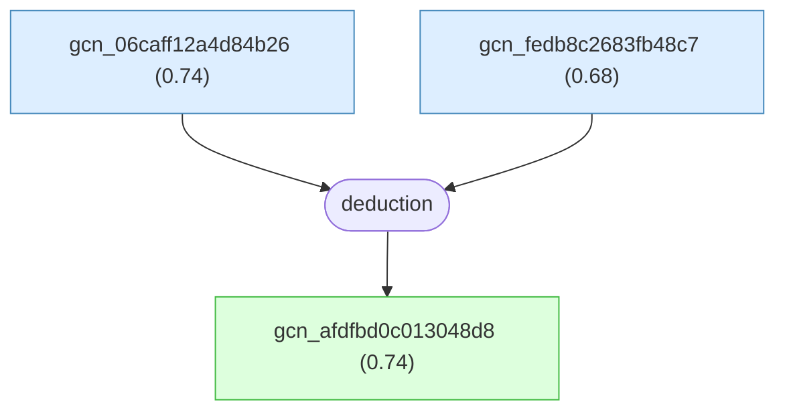

#### gcn_06caff12a4d84b26

📌 `gcn_06caff12a4d84b26`   |   Prior: 0.74   |   Belief: **0.74**

> For the Bistritzer-MacDonald magnetic Bloch Hamiltonian
> $H^{\phi=2\pi}(\mathbf{k})$ of twisted bilayer graphene represented in the
> Landau-level basis $|\mathbf{k},n\rangle$, the numerical procedure truncates
> the basis to $n \le n_{\max}$, diagonalizes the resulting finite Hermitian
> matrix at sampled $\mathbf{k}$ points, and assumes that for the magic-angle BM
> parameters and flux $\phi=2\pi$ a numerically accessible cutoff makes the
> low-energy flat-band eigenvalues and topological diagnostics converge within
> quoted tolerances such as energy errors of order 1 meV [@HerzogArbeitman2022].

#### gcn_fedb8c2683fb48c7

📌 `gcn_fedb8c2683fb48c7`   |   Prior: 0.68   |   Belief: **0.68**

> For the BM magnetic Bloch Hamiltonian
> $H_{BM}^{\phi}(\mathbf{k};w_0,w_1)$ of magic-angle twisted bilayer graphene at
> flux $\phi=2\pi$, truncated in Landau levels and diagonalized across sampled
> interlayer parameters $(w_0,w_1)$, the observed reentrant two flat bands, their
> approximately 40 meV gap to passive bands, and the topology assignments
> separating a crystalline regime from a Landau-level regime are interpreted as
> physical parameter dependence only after convergence in Landau-level cutoff,
> $\mathbf{k}$ mesh, and parameter-grid refinement, subject to the stated BM-model
> approximations [@HerzogArbeitman2022].

#### gcn_afdfbd0c013048d8 ★

📌 `gcn_afdfbd0c013048d8`   |   Belief: **0.74**

> The continuum Bistritzer-MacDonald model of magic-angle twisted bilayer
> graphene, after a layer-dependent momentum shift restores moire periodicity,
> can be represented in a magnetic-translation-irrep Landau-level basis at flux
> $\phi=2\pi$ and diagonalized with a finite Landau-level cutoff; for the BM
> interlayer tunneling parameters studied, this calculation produces two
> low-energy reentrant flat bands per valley and spin separated from passive
> bands by a gap of order 40 meV, with topology controlled by $(w_0,w_1)$:
> physical TBG lies in a crystalline regime with vanishing total Chern number for
> the two flat bands, while the first chiral limit $w_0=0$ lies in a
> Landau-level-type regime where each flat band has Chern number -1
> [@HerzogArbeitman2022].

🔗 **deduction**([gcn_06caff12a4d84b26](#gcn_06caff12a4d84b26), [gcn_fedb8c2683fb48c7](#gcn_fedb8c2683fb48c7))

Reasoning

1. Begin with the Bistritzer-MacDonald (BM) continuum model for a single valley at zero flux:
   $$
   H_{BM}=\begin{pmatrix}-i\hbar v_F\boldsymbol{\sigma}\cdot\boldsymbol{\nabla}&T^\dagger(\mathbf{r})\\[4pt]
   T(\mathbf{r})&-i\hbar v_F\boldsymbol{\sigma}\cdot\boldsymbol{\nabla}\end{pmatrix},
   $$
   with moire tunneling $T(\mathbf{r})=\sum_{j=1}^3 e^{2\pi i\mathbf{q}_j\cdot\mathbf{r}}T_j$ and $T_j$ built from interlayer tunneling parameters $w_0,w_1$. Specify moire geometry ($\mathbf{q}_j,\mathbf{a}_i,\mathbf{b}_i$) and the moire unit cell area $\Omega$ so the dimensionless flux $\phi=eB\Omega$ is defined. Sec. VIII A, Eq. (52)-(53); Sec. VIII, geometry discussion [@HerzogArbeitman2022].
2. Introduce magnetic flux by canonical substitution $-i\hbar\boldsymbol{\nabla}\to\boldsymbol{\pi}$ and restore moire periodicity by a layer-dependent unitary momentum-shift:
   $$
   V_1=\mathrm{diag}\big(e^{i\pi\mathbf{q}_1\cdot\mathbf{r}},\,e^{-i\pi\mathbf{q}_1\cdot\mathbf{r}}\big).
   $$
   Conjugating by $V_1$ yields a form with a periodic interlayer potential $\tilde{T}(\mathbf{r})=T_1+T_2 e^{2\pi i\mathbf{b}_1\cdot\mathbf{r}}+T_3 e^{2\pi i\mathbf{b}_2\cdot\mathbf{r}}$ and shifted Dirac kinetic terms, which are readily expressed in Landau-level ladder operators. This step renders the Hamiltonian compatible with the magnetic Bloch construction. Sec. VIII A, Eq. (54)-(55) [@HerzogArbeitman2022].
3. Express the Dirac kinetic term in Landau-level language at $\phi=2\pi$: using $a,a^\dagger$ defined from $\boldsymbol{\pi}$, write
   $$
   v_F\boldsymbol{\sigma}\cdot\boldsymbol{\pi}=v_F\sqrt{2eB}\begin{pmatrix}0&a^\dagger\\[4pt] a&0\end{pmatrix}=v_F k_\theta\Big(\tfrac{3\sqrt{3}}{2\pi}\Big)^{1/2}\begin{pmatrix}0&a^\dagger\\[4pt] a&0\end{pmatrix},
   $$
   so the kinetic energy acts only in Landau-level index space and can be truncated. The momentum-shift terms act as layer-dependent identity contributions on Landau levels and appear as small offsets compared to moire tunneling. Sec. VIII A, Eq. (56) [@HerzogArbeitman2022].
4. Compute the moire tunneling matrix elements in the Landau-level magnetic Bloch basis using the previously derived Landau-level scattering matrices $\mathcal{H}^{\mathbf{q}}$: the periodic tunneling Fourier components scatter Landau levels according to closed-form expressions in terms of Laguerre polynomials, yielding a finite Landau-level matrix Hamiltonian $H^{\phi=2\pi}(\mathbf{k})$ whose off-diagonal blocks are combinations of $T_j$ times phases $e^{\pm i k_i}$ and $\mathcal{H}^{\pm 2\pi\mathbf{b}_i}$ insertions. Truncate the Landau-level basis to a numerically convergent cutoff to obtain a finite matrix to diagonalize. Sec. VIII A; App. A 6; App. D 1 [@HerzogArbeitman2022].
5. Numerically diagonalize the truncated magnetic Bloch Hamiltonian for magic-angle parameters and a range of interlayer tunneling $(w_0,w_1)$: one finds two low-energy flat bands per valley and spin that reenter at $\phi=2\pi$. For magic-angle parameter choices used, these two flat bands are separated from higher passive bands by an energy gap of order $\sim40$ meV. The dispersion and total Chern number of the flat bands depend sensitively on $(w_0,w_1)$, producing a phase diagram where a crystalline regime (physical TBG parameters) has flat bands with vanishing total Chern number, while a Landau-level regime (including the first chiral limit) has each flat band with Chern -1. These numerical band plots, density of states, and Wilson-loop diagnostics are shown in Figs. 5-7 and Fig. 6 panels [@HerzogArbeitman2022].
6. Summarize dependence on $(w_0,w_1)$ and connect to physical regimes: the parameter $w_0$ controlling AA tunneling versus $w_1$ controlling AB/BA tunneling moves the system between a Landau-level-dominated regime and a crystalline regime where the two flat bands together form an elementary band representation with vanishing total Chern number. The calculated reentrant flat bands at $\phi=2\pi$ and the phase diagram in $(w_0,w_1)$ capture this sensitivity, justifying the claim that the BM Hamiltonian expressed in the magnetic Bloch Landau-level basis yields two reentrant low-energy flat bands per valley and spin with significant gaps to passive bands, with topology determined by $(w_0,w_1)$. Sec. VIII A, Figs. 5-7 [@HerzogArbeitman2022].

## paper_ge2021 -- claims and deduction for Ge et al. 2021.

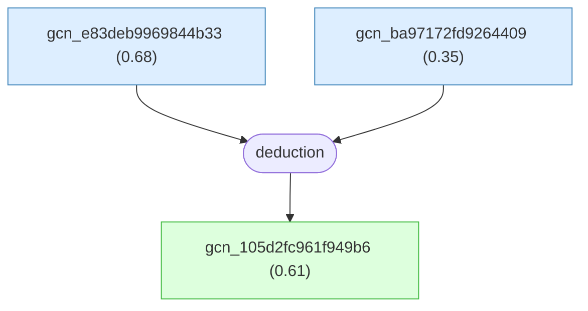

#### gcn_e83deb9969844b33

📌 `gcn_e83deb9969844b33`   |   Prior: 0.68   |   Belief: **0.68**

> For commensurate large-angle twisted bilayer graphene studied by Ge et al. from about 9 degrees to about 27.8 degrees, the pressure-induced narrow bands and van Hove singularities reported for the 9.4 degree structure at interlayer spacing $2.44\,\mathrm{\AA}$ are treated as representative of a broader compression route to engineer flat bands without magic-angle fine tuning [@Ge2021].

#### gcn_ba97172fd9264409

📌 `gcn_ba97172fd9264409`   |   Prior: 0.35   |   Belief: **0.35**

> In compressed twisted bilayer graphene with the same pressure and geometry considered by Ge et al., enhanced Kohn-Sham density of states at the Fermi level and near-Fermi van Hove singularities are used as suggestive single-particle indicators for possible correlation-driven phases, even though no explicit many-body calculation or experimental verification is supplied for superconductivity or correlated insulation [@Ge2021].

#### gcn_105d2fc961f949b6 ★

📌 `gcn_105d2fc961f949b6`   |   Belief: **0.61**

> Applying external compression to commensurate twisted bilayer graphene with twist angles from about 9.4 degrees to about 27.8 degrees can produce narrow flat electronic bands and near-Fermi van Hove singularities in large-angle regimes that are single-layer-graphene-like at ambient pressure; pressure is therefore a feasible control parameter for flat-band engineering in easier-to-fabricate larger-angle devices and motivates, but does not demonstrate, possible correlated phases [@Ge2021].

🔗 **deduction**([gcn_e83deb9969844b33](#gcn_e83deb9969844b33), [gcn_ba97172fd9264409](#gcn_ba97172fd9264409))

Reasoning

1. The established results provide three ingredients: at ambient pressure, large-angle TBG from about 9 degrees up to nearly 30 degrees has SLG-like dispersion near K; pressure monotonically reduces Fermi velocity for large twist angles; and for the 9.4 degree structure, compression to 75.52 GPa removes the linear Dirac-like dispersion, creates flat bands near the Fermi level, and produces near-Fermi van Hove singularities associated with saddle points in the VBM and CBM (Fig. 1, Fig. 3).
2. The results summary states that for twist angles above 9 degrees up to nearly 30 degrees, dispersion is SLG-like at K under ambient conditions but changes drastically under external pressure, and the eigenvalue spectra display a flat band around the Fermi level.
3. Because the control parameter is external pressure rather than precise tuning to the magic angle, the paper interprets compression as an alternative route to generating flat bands in TBG, motivated by the difficulty of preparing precisely controlled small-angle bilayers and by prior focus on twist angles below 2 degrees.
4. The near-Fermi flat bands and associated VHSs enhance the density of states close to the Fermi level, and the paper links such electronic structures to properties previously found in small-angle TBG, including superconductivity and correlated insulation, without claiming direct demonstration of those many-body phases.
5. The forward-looking inference is that, if pressure can generate in larger-angle TBG the same electronic ingredients associated with correlated phenomena in magic-angle systems, then pressure provides opportunities for flat-band engineering and further exploration of pressure-tuned correlated behavior.
6. The argument is suggestive rather than demonstrative for many-body phases: the paper says flat bands may induce superconductivity and that electron correlations take place, but provides no separate many-body derivation or experimental proof of superconductivity or correlated insulating order in compressed large-angle systems.
7. Therefore, the conclusion is that external compression is a practical engineering knob for producing narrow flat bands and associated VHSs in larger-angle TBG, offering an alternative to strict magic-angle fabrication and motivating experimental and theoretical exploration of possible correlation-driven phases.

## paper_yamada2020 -- merged-Dirac-point mechanism in twisted bilayer graphene.

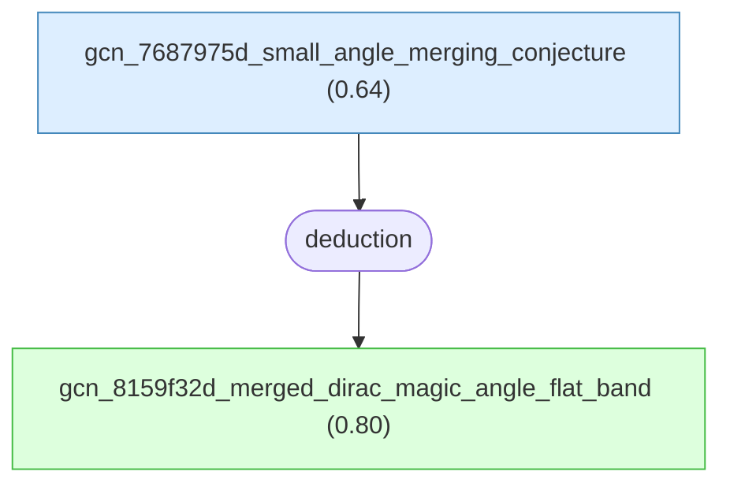

#### gcn_7687975d_small_angle_merging_conjecture

📌 `gcn_7687975d_small_angle_merging_conjecture`   |   Prior: 0.64   |   Belief: **0.64**

> For twisted bilayer graphene in the small-angle continuum limit considered by Yamada and Hasegawa 2020, the K-K' intervalley gap at moire K is treated as negligibly small, the upper two bands near charge neutrality are nearly degenerate, and the four-Dirac-point merging mechanism seen in commensurate tight-binding calculations at moderate twist angles is conjectured to persist continuously to magic-angle conditions, assuming no intervening topological or symmetry reconstruction and no qualitative change from lattice relaxation or electron-electron interactions [@Yamada2020].

#### gcn_8159f32d_merged_dirac_magic_angle_flat_band ★

📌 `gcn_8159f32d_merged_dirac_magic_angle_flat_band`   |   Belief: **0.80**

> In sufficiently small-angle twisted bilayer graphene, where the moire-K gap between the $2n_0$th and $(2n_0+1)$th bands is negligibly small and the upper two bands near charge neutrality are nearly degenerate, Yamada and Hasegawa 2020 propose that three moving Dirac points merge with the fixed K-point Dirac point, producing vanishing Dirac velocity at K; this suppression is conjectured to contribute to extremely narrow nearly flat bands at the magic angles [@Yamada2020].

🔗 **deduction**([gcn_7687975d_small_angle_merging_conjecture](#gcn_7687975d_small_angle_merging_conjecture))

Reasoning

1. Take as established the upstream mechanism: the zero K-point velocity in commensurate tight-binding calculations at moderate twist angles is caused by the merging of three moving Dirac points with the fixed Dirac point at K, producing a quadratic multi-fold touching at $d_{zc}$ (this is the previously derived merging mechanism).
2. Note the small-angle (continuum) limit characteristics relevant to the conjecture: in the small twist-angle limit the tight-binding K-K' intervalley coupling (the K-K' gap at moire K) becomes exponentially small and the upper two bands near K are nearly degenerate, so the band structure locally resembles the continuum-model limit in which moire K has vanishing gap and near-degenerate bands; experimentally, magic-angle phenomena (extremely narrow bands) occur in this small-angle regime and are known to be pressure tunable.
Fig.1
Fig.3
3. Argue plausibility (as stated by the authors) that the same merging process can continuously evolve into the small-angle regime: because the merging-of-four-Dirac-points mechanism is observed in commensurate tight-binding calculations at moderate angles and because the K-K' gap decreases continuously (exponentially) as the twist angle is reduced, the authors propose that the merging process can persist into the small-angle regime where the K-K' gap is negligible and the upper two bands are nearly degenerate; in that limit the same coalescence of Dirac points would produce vanishing K-point velocity and thus contribute to the formation of extremely narrow (nearly flat) bands at the magic angles.
4. Explicitly label the conjectural nature and the limitation acknowledged by the authors: the authors frame this as a proposal (conjecture) rather than a demonstrated theorem, noting that they have not proved that four-Dirac merging is the full or sole origin of the experimentally observed bandwidth collapse at the smallest magic angles, and they acknowledge that demonstrating the mechanism in the small-angle, almost-degenerate two-band regime is numerically difficult because gaps are exponentially small and the bands are nearly degenerate.
Fig.1

## paper_ma2020 -- LKM claims and deduction from Ma et al. (2020).

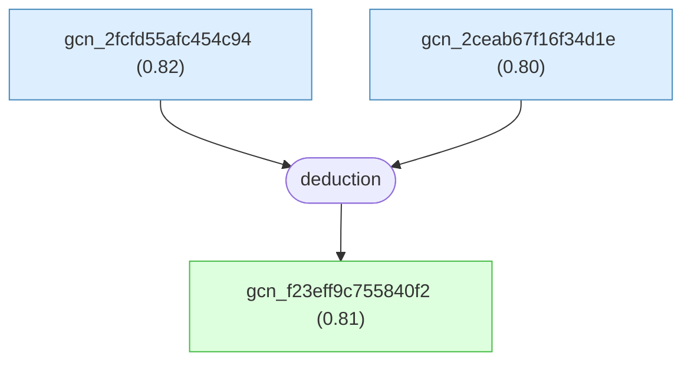

#### gcn_2fcfd55afc454c94

📌 `gcn_2fcfd55afc454c94`   |   Prior: 0.82   |   Belief: **0.82**

> In Ma et al.'s continuum calculations for twisted few-layer graphite, the two few-layer-graphite slabs are treated as rigid, uniformly twisted atomic layers; the calculation does not include in-plane lattice relaxation, out-of-plane corrugation, or spatial twist-angle inhomogeneity across the moire supercell [@Ma2020].

#### gcn_2ceab67f16f34d1e

📌 `gcn_2ceab67f16f34d1e`   |   Prior: 0.80   |   Belief: **0.80**

> For N=3 twisted few-layer graphite systems in Ma et al.'s minimal continuum-model twist-angle scan, with parameters omega_1/omega_2/gamma_0/gamma_1/gamma_3/gamma_4 = 78/98/2610/360/0/0 meV and xi = -1, the principal magic-angle estimate near 1.05 degrees is obtained while omitting remote hoppings gamma_3 and gamma_4; separate full-parameter calculations with gamma_3 = 283 meV and gamma_4 = 138 meV make the flat bands dispersive, separate them in energy, and open twist-angle-dependent gaps at the Dirac points of linear bands, so the precise magic-angle value depends on the chosen continuum parameters and on the minimal-model scan [@Ma2020].

#### gcn_f23eff9c755840f2 ★

📌 `gcn_f23eff9c755840f2`   |   Belief: **0.81**

> In Ma et al.'s continuum description of twisted few-layer graphite, the numerical twist angle at which the two primary moire bands become nearly flat is about 1.05 degrees; this equals the principal magic-angle value obtained for twisted bilayer graphene within the same continuum-model formalism, while the claim is scoped to the primary two-band pair rather than all moire bands [@Ma2020].

🔗 **deduction**([gcn_2fcfd55afc454c94](#gcn_2fcfd55afc454c94), [gcn_2ceab67f16f34d1e](#gcn_2ceab67f16f34d1e))

Reasoning

1. Use the previously established numerical continuum-model framework and the minimal-model calculations to identify the twist angle at which the primary pair of moire bands becomes nearly flat in tFL-graphite; denote the twist angle by $\theta$ measured in degrees.
2. Report the numerical observation from the band plots: the calculations presented for multiple tFL-graphite configurations show that the two primary moire bands become nearly flat at $\theta\approx 1.05^\circ$; this numerical value coincides with the principal magic angle previously reported for twisted bilayer graphene within the same employed continuum-model formalism.
Fig. 2
[9-14]
3. Record the authors' qualification that only two of the multiple moire bands flatten at the magic angle while the remaining bands remain dispersive (albeit narrowed), i.e., the magic-angle flatness pertains to the principal two-band pair in tFL-graphite as in TBG, even though the overall moire spectrum is richer.
Fig. 2

## paper_ma2019 -- LKM claims and deduction from Ma et al. (2019).

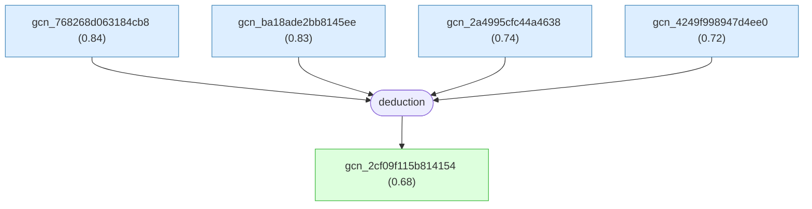

#### gcn_768268d063184cb8

📌 `gcn_768268d063184cb8`   |   Prior: 0.84   |   Belief: **0.84**

> In Ma et al.'s continuum-model description of twisted trilayer graphene, a graphene monolayer on an AB-stacked bilayer is modeled with a single-valley 6x6 Bloch Hamiltonian in the (A1,B1,A2,B2,A3,B3) sublattice basis; setting the AB-bilayer remote hopping parameters gamma_3 = 0, gamma_4 = 0, and the dimer-site energy Delta' = 0 defines a minimal model intended to isolate the primary moire interlayer-coupling mechanisms that produce the largest magic-angle nearly flat central bands [@Ma2019].

#### gcn_ba18ade2bb8145ee

📌 `gcn_ba18ade2bb8145ee`   |   Prior: 0.83   |   Belief: **0.83**

> For Ma et al.'s minimal continuum-model Hamiltonian for twisted trilayer graphene, the tight-binding parameter choices gamma_0 = 2464 meV and gamma_1 = 400 meV, together with gamma_3 = gamma_4 = Delta' = 0, determine the numerically reported largest magic angle near theta = 1.12 degrees, so the precise value is sensitive to the adopted gamma_0 and gamma_1 parameters [@Ma2019].

#### gcn_2a4995cfc44a4638

📌 `gcn_2a4995cfc44a4638`   |   Prior: 0.74   |   Belief: **0.74**

> In Ma et al.'s numerical continuum-model calculation for twisted trilayer graphene, the finite plane-wave basis of moire reciprocal lattice vectors and the finite k-point sampling are assumed to be sufficiently converged that the observed narrowing of the two central bands and the identification of a nearly flat pair are not artifacts of basis truncation or coarse k-point sampling [@Ma2019].

#### gcn_4249f998947d4ee0

📌 `gcn_4249f998947d4ee0`   |   Prior: 0.72   |   Belief: **0.72**

> In Ma et al.'s search for the largest magic angle of twisted trilayer graphene, evaluating the continuum-model band structures on a discrete set of twist angles, including theta = 5.0 degrees, 1.53 degrees, and 1.12 degrees, is assumed to locate the largest nearly flat two-central-band angle within the angular resolution used, rather than missing a narrow higher-angle interval [@Ma2019].

#### gcn_2cf09f115b814154 ★

📌 `gcn_2cf09f115b814154`   |   Belief: **0.68**

> In Ma et al.'s minimal continuum model for twisted trilayer graphene, formed by placing a graphene monolayer on an AB-stacked graphene bilayer, the parameter set gamma_3 = gamma_4 = Delta' = 0, gamma_0 = 2464 meV, and gamma_1 = 400 meV gives a largest magic twist angle near theta = 1.12 degrees, where two low-energy moire bands near charge neutrality become nearly flat around the Fermi level [@Ma2019].

🔗 **deduction**([gcn_768268d063184cb8](#gcn_768268d063184cb8), [gcn_ba18ade2bb8145ee](#gcn_ba18ade2bb8145ee), [gcn_2a4995cfc44a4638](#gcn_2a4995cfc44a4638), [gcn_4249f998947d4ee0](#gcn_4249f998947d4ee0))

Reasoning

1. Define the physical system: "twisted trilayer graphene" (twisted TLG) is a stack where a single graphene monolayer (layer index $3$) is placed on top of an AB-stacked bilayer graphene (layers indices $1,2$) with a relative twist angle $\theta$ between the single layer and the bilayer; the moire superlattice vectors are $\boldsymbol{t}_{1},\boldsymbol{t}_{2}$ and the corresponding moire reciprocal vectors are $\mathbf{G}_{1},\mathbf{G}_{2}$ as constructed from the underlying graphene lattice vectors $\boldsymbol{a}_{1},\boldsymbol{a}_{2}$ and their reciprocal vectors $\boldsymbol{b}_{1},\boldsymbol{b}_{2}$.
2. State the computational framework used to obtain bands: employ a continuum-model Hamiltonian for one valley, written as a $6\times 6$ matrix in the Bloch basis $(A_{1},B_{1},A_{2},B_{2},A_{3},B_{3})$, with the block structure $H_{\mathrm{TLG}}(\theta)=\begin{pmatrix} h_{b}(k_{1}) & T(\boldsymbol{r}) \\ T^{\dagger}(\boldsymbol{r}) & h_{0}(k_{2}) \end{pmatrix} + U$, where $k_{1}=R(-\theta/2)(k-K_{\xi}^{b})$, $k_{2}=R(\theta/2)(k-K_{\xi}^{t})$, $h_{0}(\boldsymbol{k})=-\hbar v_{F}\boldsymbol{k}\cdot\boldsymbol{\sigma}$ is the monolayer graphene Hamiltonian with Fermi velocity $v_{F}$ and Pauli matrices $\boldsymbol{\sigma}$, $h_{b}(k)$ is the AB-stacked bilayer Hamiltonian, $T(\boldsymbol{r})$ is the moire interlayer tunneling between the twisted monolayer and the bilayer, and $U=\mathrm{diag}(-V,-V,0,0,V,V)$ is the perpendicular electric-field induced interlayer potential difference with parameter $V$.
3. Define the minimal-model approximation used to identify the magic-angle physics: set the bilayer remote-hopping parameters to zero, i.e., $\gamma_{3}=0$, $\gamma_{4}=0$, and the on-site dimer potential $\Delta' = 0$, so that the AB-stacked bilayer Hamiltonian $h_{b}$ contains only the leading intralayer nearest-neighbor hopping parameter $\gamma_{0}$ and the dominant interlayer vertical hopping $\gamma_{1}$. The authors state that this minimal model isolates the primary moire and interlayer-coupling physics relevant to flat-band formation.
4. Record the numerical minimal-model tight-binding parameters used to locate the largest magic angle: the nearest-neighbor intralayer hopping is $\gamma_{0}=2464\ \mathrm{meV}$ and the dominant interlayer vertical hopping is $\gamma_{1}=400\ \mathrm{meV}$; set $\gamma_{3}=\gamma_{4}=\Delta'=0$ in the minimal model.
5. Describe the numerical procedure and evidence showing band flattening: use the continuum-model Hamiltonian with the minimal-model parameters and compute moire superlattice band structures for multiple twist angles $\theta$; the computed band structures show that as $\theta$ is decreased from larger values such as $\theta=5^{\circ}$ toward smaller values, the two low-energy moire bands nearest the Fermi level narrow progressively, consistent with moire-band flattening. Fig. 1(c-h).
6. Identify the largest magic angle from the numerical band series: inspect the calculated sequence of band structures shown for decreasing $\theta$ and find the largest twist angle at which the two central bands become nearly dispersionless; the authors report this largest magic angle to be approximately $\theta\approx 1.12^{\circ}$, at which the two low-energy moire bands around charge neutrality are nearly flat in the minimal model. Fig. 1(g,h).
7. State the conclusion that at this magic angle two nearly flat moire bands appear: combine the minimal-model parameter choice ($\gamma_{0}=2464\ \mathrm{meV}$, $\gamma_{1}=400\ \mathrm{meV}$, $\gamma_{3}=\gamma_{4}=\Delta'=0$) with the computed band structures and conclude that for continuum-model twisted trilayer graphene there exists a largest magic twist angle $\theta\approx 1.12^{\circ}$ at which the two low-energy moire bands near charge neutrality become nearly flat. Fig. 1(g,h).

## paper_burg2022 -- claims and deductions from Burg et al. 2022.

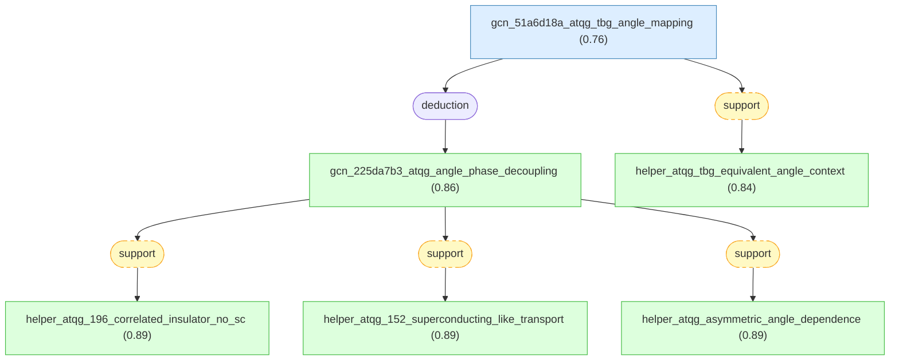

#### gcn_51a6d18a_atqg_tbg_angle_mapping

📌 `gcn_51a6d18a_atqg_tbg_angle_mapping`   |   Prior: 0.76   |   Belief: **0.76**

> For alternating-twist quadrilayer graphene (ATQG), the selected LKM chain uses the heuristic relation theta_TBG = theta_ATQG / phi, with phi approximately 1.618, to compare ATQG twist angles with TBG-like subsystem angles; this mapping is only a comparative tool and does not guarantee quantitative equivalence of bandwidths, interaction strengths, or exact magic-angle conditions between ATQG and TBG [@Burg2022].

#### gcn_225da7b3_atqg_angle_phase_decoupling ★

📌 `gcn_225da7b3_atqg_angle_phase_decoupling`   |   Belief: **0.86**

> In the two Burg et al. ATQG devices, theta=1.96 deg lies above the stated ATQG magic angle of 1.68 deg and shows dominant hole-side correlated-insulator resistance maxima with no observed superconductivity down to 160 mK, while theta=1.52 deg lies below 1.68 deg and shows superconducting-like transport signatures near half filling with weaker correlated-insulator signatures; comparing these devices indicates that superconductivity favors smaller-than-magic angles and correlated insulators favor larger-than-magic angles in these ATQG samples, so superconductivity and correlated insulating order are decoupled as functions of twist angle in a way that differs from some reported TBG trends [@Burg2022].

🔗 **deduction**([gcn_51a6d18a_atqg_tbg_angle_mapping](#gcn_51a6d18a_atqg_tbg_angle_mapping))

Reasoning

1. From the $\theta = 1.96^\circ$ device measurements, the authors establish that correlated insulators on the hole side (at $n = -n_{\text{s}}/2$ and $-n_{\text{s}}$) are the dominant correlated phenomena and that no superconducting signatures are observed in the measured ranges for that device; these observations were presented earlier and are taken as experimental facts for the comparison.
Fig. 1e
2. From the $\theta = 1.52^\circ$ device measurements, the authors establish that superconducting-like signatures—sharp $\mathrm{d}V/\mathrm{d}I$ peaks, a low-resistance dome, a measured $T_{\mathrm{c}} \approx 1.34\,$K, and $T_{\mathrm{BKT}} \approx 1.29\,$K—occur near half filling while correlated-insulator signatures in that device appear weaker than in the larger-angle device; these observations are likewise taken from the experimental data described for the smaller-angle device.
Fig. 3g
3. Comparing these two device-specific outcomes as a function of twist angle, the authors note an asymmetric dependence: superconductivity appears and is more prominent at the smaller twist angle ($\theta = 1.52^\circ$) while correlated insulators are more prominent at the larger twist angle ($\theta = 1.96^\circ$), indicating that superconductivity and correlated insulating order are not tightly coupled across $\theta$ in the same way they sometimes appear coupled in twisted bilayer graphene (TBG).
Fig. 1e
4. The authors place this experimental twist-angle dependence in context by mapping the ATQG twist angles to an equivalent TBG twist angle by dividing the ATQG twist angle by the golden ratio ($\approx 1.62$), thereby noting that the $\theta = 1.96^\circ$ and $\theta = 1.52^\circ$ samples map to TBG-like angles of $1.21^\circ$ and $0.94^\circ$ respectively; they then compare the observed asymmetry to reports in TBG and conclude that the observed decoupling—superconductivity favoring angles smaller than the magic angle while correlated insulators favor larger-than-magic angles—is a trend that departs from some reported TBG behaviors and suggests a distinct role for dispersive bands in ATQG.
5. Based on the direct experimental comparison between the two samples and the discussion of differences relative to TBG literature, the authors conclude that superconductivity and correlated insulating order in ATQG are decoupled as a function of twist angle in the presented devices: superconductivity is favored at angles smaller than the magic angle in these devices while correlated insulators favor larger-than-magic angles, evidencing an asymmetric twist-angle dependence of correlated phases in ATQG.
(Discussion text and comparisons in main text)

#### helper_atqg_196_correlated_insulator_no_sc

📌 `helper_atqg_196_correlated_insulator_no_sc`   |   Belief: **0.89**

> For the Burg et al. ATQG device with theta=1.96 deg, which is above the stated ATQG magic angle 1.68 deg, the selected LKM evidence reports dominant correlated-insulator resistance maxima on the hole-doped side at n=-n_s/2 and -n_s and no observed superconducting signatures down to 160 mK [@Burg2022].

🔗 **support**([gcn_225da7b3_atqg_angle_phase_decoupling](#gcn_225da7b3_atqg_angle_phase_decoupling))

Reasoning

The selected LKM root and factor step 1 explicitly identify the theta=1.96 deg ATQG device as the larger-angle sample with hole-side correlated-insulator maxima and no observed superconductivity down to 160 mK.

#### helper_atqg_152_superconducting_like_transport

📌 `helper_atqg_152_superconducting_like_transport`   |   Belief: **0.89**

> For the Burg et al. ATQG device with theta=1.52 deg, which is below the stated ATQG magic angle 1.68 deg, the selected LKM evidence reports superconducting-like transport signatures near half filling, including sharp dV/dI peaks, a low-resistance dome, T_c approximately 1.34 K, and T_BKT approximately 1.29 K, while correlated-insulator signatures are weaker than in the larger-angle device [@Burg2022].

🔗 **support**([gcn_225da7b3_atqg_angle_phase_decoupling](#gcn_225da7b3_atqg_angle_phase_decoupling))

Reasoning

The selected LKM root and factor step 2 explicitly identify the theta=1.52 deg ATQG device as the smaller-angle sample with superconducting-like transport near half filling and weaker correlated-insulator signatures.

#### helper_atqg_asymmetric_angle_dependence

📌 `helper_atqg_asymmetric_angle_dependence`   |   Belief: **0.89**

> Within the two Burg et al. ATQG samples, the direct device comparison supports an asymmetric twist-angle dependence: superconducting-like transport is more prominent at theta=1.52 deg below the stated 1.68 deg magic angle, whereas correlated-insulator signatures are more prominent at theta=1.96 deg above that angle [@Burg2022].

🔗 **support**([gcn_225da7b3_atqg_angle_phase_decoupling](#gcn_225da7b3_atqg_angle_phase_decoupling))

Reasoning

The selected LKM root and factor steps 3 and 5 state the comparative twist-angle trend: superconductivity is favored below the stated magic angle, while correlated insulators are favored above it in the measured ATQG devices.

#### helper_atqg_tbg_equivalent_angle_context

📌 `helper_atqg_tbg_equivalent_angle_context`   |   Belief: **0.84**

> Using the Burg et al. heuristic theta_TBG = theta_ATQG / phi, the selected LKM evidence places the theta=1.96 deg and theta=1.52 deg ATQG samples at TBG-like angles of approximately 1.21 deg and 0.94 deg, respectively, while preserving the caution that the mapping is comparative rather than quantitatively exact [@Burg2022].

🔗 **support**([gcn_51a6d18a_atqg_tbg_angle_mapping](#gcn_51a6d18a_atqg_tbg_angle_mapping))

Reasoning

The selected LKM premise gives the theta_TBG = theta_ATQG / phi heuristic, and factor step 4 applies it to the two ATQG devices as approximately 1.21 deg and 0.94 deg TBG-like angles.

## paper_nguyen2022 -- claims and deductions from Nguyen et al. 2022.

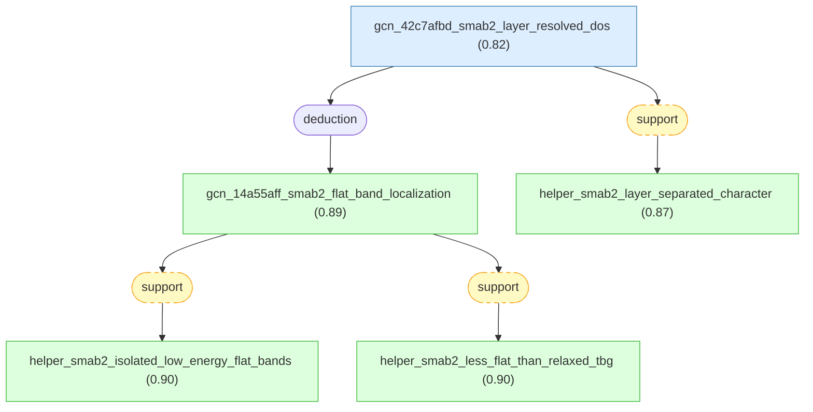

#### gcn_42c7afbd_smab2_layer_resolved_dos

📌 `gcn_42c7afbd_smab2_layer_resolved_dos`   |   Prior: 0.82   |   Belief: **0.82**

> In Nguyen et al.'s relaxed-geometry Slater-Koster p_z tight-binding calculation for SM-(AB)_2, defined as a graphene monolayer twisted by angle theta on an AB-stacked bilayer, the layer-decomposed density of states rho_l(E) at the magic-angle moire geometry shows a strong near-zero-energy flat-band peak on the twisted top monolayer and comparatively broadened near-zero-energy spectral weight across the two bottom bilayer layers; this indicates layer-polarized flat-band spectral weight with coexisting localized and delocalized character across layers [@Nguyen2022].

#### gcn_14a55aff_smab2_flat_band_localization ★

📌 `gcn_14a55aff_smab2_flat_band_localization`   |   Belief: **0.89**

> For Nguyen et al.'s SM-(AB)_2 twisted monolayer-bilayer graphene geometry near theta ~= 1.1 deg, relaxed-geometry tight-binding calculations find isolated low-energy flat bands, but the flat-band manifold is less flat than relaxed magic-angle twisted bilayer graphene because it has a larger bandwidth and smaller zero-energy density-of-states peak; layer-resolved density of states further shows flat-band spectral weight localized mainly on the twisted monolayer top layer and broadened or delocalized across the AB-bilayer bottom layers [@Nguyen2022].

🔗 **deduction**([gcn_42c7afbd_smab2_layer_resolved_dos](#gcn_42c7afbd_smab2_layer_resolved_dos))

Reasoning

1. Begin from upstream conclusions taken as known: conclusion 1 (the magic-angle $\theta\simeq1.1^{\circ}$ coincides with maximized AA-region localization and yields flat bands in relaxed structures) and conclusion 10 (the atomistic relaxation and Slater-Koster $p_{z}$ TB protocol used to compute electronic structure) are treated as established starting points for analyzing SM-(AB)$_2$.
2. Describe the system considered and the computational setup: SM-(AB)$_2$ denotes a twisted monolayer placed atop an AB-stacked bilayer (define SM-(AB)$_2$ accordingly); calculations are performed at the system's magic-angle moire using the relaxed geometries and the TB Hamiltonian from the established protocol.
Fig. 5
3. Report the computed bandstructure observation for SM-(AB)$_2$: the TB bandstructure computed on relaxed geometry shows isolated low-energy flat bands near the Fermi level (i.e., similar in topology to magic-angle TBLG), and the DOS shows a zero-energy peak corresponding to these bands; these features are evident in the plotted bandstructure and DOS for SM-(AB)$_2$.
Fig. 5
4. Quantitatively compare the flatness to magic-angle TBLG: although SM-(AB)$_2$ has isolated low-energy flat bands, the computed bandwidth of these flat bands is larger (i.e., the bands are less flat) and the zero-energy DOS peak is smaller than that obtained for magic-angle TBLG in the relaxed-geometry calculations presented; the paper explicitly states that the bands are "less flat (lower)" and the zero-energy DOS peak is reduced compared to TBLG in their magic-angle comparisons.
Fig. 5
5. Explain the structural-electronic rationale provided: define AAB stacking as the local registry of the moire AA-like regions in SM-(AB)$_2$ (i.e., a mixture of AA and AB stacking); because AA regions are favorable for strong electronic localization while AB is unfavorable, the AAB-type regions reduce net AA-like localization compared to pure AA in TBLG, which diminishes the strength of real-space localization and thereby produces a larger flat-band bandwidth and smaller zero-energy DOS peak in SM-(AB)$_2$.
Fig. 6
6. Report the layer-resolved LDOS result that demonstrates spatially separated localized and delocalized character: layer-decomposed LDOS (define LD-DOS as layer-decomposed density of states) for SM-(AB)$_2$ shows that the flat-band states are spatially localized on the twisted monolayer side (top layer) while the same low-energy states are comparatively delocalized on the bilayer (bottom two layers), i.e., a coexistence of localized and delocalized behavior across different layers of the junction.
Fig. 6
7. Cite supportive comparisons and prior observations: the reported layer-separated localized-delocalized electronic character in SM-(AB)$_2$ is consistent with recent experimental observations referenced by the authors and with related theoretical findings on delocalized correlated states in double-bilayer contexts.
[73]
[74]

#### helper_smab2_isolated_low_energy_flat_bands

📌 `helper_smab2_isolated_low_energy_flat_bands`   |   Belief: **0.90**

> In Nguyen et al.'s relaxed SM-(AB)_2 calculation at the magic-angle moire geometry, the band structure contains isolated low-energy flat bands near the Fermi level and a corresponding zero-energy density-of-states peak [@Nguyen2022].

🔗 **support**([gcn_14a55aff_smab2_flat_band_localization](#gcn_14a55aff_smab2_flat_band_localization))

Reasoning

The selected LKM root and factor step 3 explicitly state that relaxed SM-(AB)_2 has isolated low-energy flat bands near the Fermi level and a zero-energy density-of-states peak at the magic-angle moire geometry.

#### helper_smab2_less_flat_than_relaxed_tbg

📌 `helper_smab2_less_flat_than_relaxed_tbg`   |   Belief: **0.90**

> In Nguyen et al.'s relaxed-geometry comparison, the SM-(AB)_2 low-energy flat-band manifold near theta ~= 1.1 deg is quantitatively less flat than relaxed magic-angle twisted bilayer graphene, with larger flat-band bandwidth and a smaller zero-energy density-of-states peak [@Nguyen2022].

🔗 **support**([gcn_14a55aff_smab2_flat_band_localization](#gcn_14a55aff_smab2_flat_band_localization))

Reasoning

The selected LKM root and factor steps 4 and 5 explicitly compare SM-(AB)_2 with relaxed magic-angle TBLG and report larger bandwidth and a smaller zero-energy DOS peak for SM-(AB)_2.

#### helper_smab2_layer_separated_character

📌 `helper_smab2_layer_separated_character`   |   Belief: **0.87**

> Nguyen et al.'s layer-resolved density-of-states analysis for SM-(AB)_2 indicates spatially separated electronic character: near-zero-energy flat-band states are localized mainly on the twisted top monolayer, while the corresponding spectral weight is comparatively broadened and delocalized across the AB-bilayer bottom layers [@Nguyen2022].

🔗 **support**([gcn_42c7afbd_smab2_layer_resolved_dos](#gcn_42c7afbd_smab2_layer_resolved_dos))

Reasoning

The selected LKM premise and factor step 6 define the layer-decomposed density of states and state the top-layer localization plus bottom-bilayer broadening/delocalization pattern.

## paper_tritsaris2020 -- claims and deduction for Tritsaris et al. 2020.

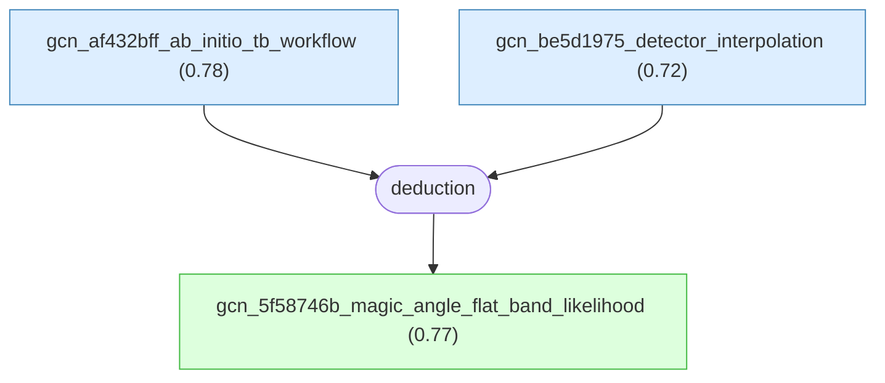

#### gcn_af432bff_ab_initio_tb_workflow

📌 `gcn_af432bff_ab_initio_tb_workflow`   |   Prior: 0.78   |   Belief: **0.78**

> For commensurate twisted bilayer graphene in the Tritsaris et al. 2020 high-throughput workflow, the selected LKM chain treats as established a Wannier-derived tight-binding Hamiltonian workflow in which band structures are diagonalized with 60 k-points along Gamma-M-K and automated flat-band detectors inspect a 0.30 eV window around the Fermi level [@Tritsaris2020].

#### gcn_be5d1975_detector_interpolation

📌 `gcn_be5d1975_detector_interpolation`   |   Prior: 0.72   |   Belief: **0.72**

> For the same Tritsaris et al. 2020 commensurate twisted-bilayer-graphene workflow, the selected LKM chain treats automated low-dispersion-band detections at the sampled commensurate twist angles as inputs that are converted into a continuous flat-band likelihood p(theta) by an interpolation and blending prescription [@Tritsaris2020].

#### gcn_5f58746b_magic_angle_flat_band_likelihood ★

📌 `gcn_5f58746b_magic_angle_flat_band_likelihood`   |   Belief: **0.77**

> For 33 unique commensurate twisted bilayer graphene supercells spanning 0.88 degrees <= theta <= 21.79 degrees, Tritsaris et al. 2020 use ab initio Wannier-derived tight-binding calculations and automated flat-band detection to find that the blended flat-band likelihood p(theta) is maximized near theta* approximately 1.1 degrees, where low-dispersion near-flat bands emerge near the Fermi level in the single-particle tight-binding band structures [@Tritsaris2020].

🔗 **deduction**([gcn_af432bff_ab_initio_tb_workflow](#gcn_af432bff_ab_initio_tb_workflow), [gcn_be5d1975_detector_interpolation](#gcn_be5d1975_detector_interpolation))

Reasoning

1. Treat the high-throughput ab initio TB workflow (conclusion 3) as established and use it to compute commensurate twisted bilayer graphene band structures for a dense set of commensurate angles in the interval $0.88^{\circ} \leq \theta \leq 21.79^{\circ}$; the workflow uses the Wannier-derived TB Hamiltonian, diagonalization with 60 k-points along $\Gamma$-M-K, and automated flat-band detectors within a 0.30 eV window around the Fermi level.
2. Identify commensurate twist angles using the integer-pair parametrization: associate each commensurate twist angle $\theta$ with a pair of integers $(M,N)$ defining the periodic supercell via $\cos(\theta) = (N^2 + 4NM + M^2)/(2(N^2 + NM + M^2))$, so that specific small angles correspond to large $(M,N)$ pairs (for example, $(32,31) \to 1.05^{\circ}$, $(27,26) \to 1.25^{\circ}$, $(23,22) \to 1.47^{\circ}$), enabling enumeration of 33 unique commensurate bilayers in the stated range. [38]
3. Compute TB band structures for the 33 unique commensurate bilayers and apply the automated flat-band detectors to obtain model-based detections of low-dispersion bands at the sampled commensurate $\theta$ values, producing detection outputs that are converted into continuous predictions $p(\theta)$ via the interpolation/blending prescription (conclusion 2). Fig. 4
4. Observe the evolution of low-energy bands with decreasing $\theta$: for large $\theta$ the low-energy band structure resembles that of an isolated graphene monolayer, while as $\theta$ decreases into the small-angle regime the number of bands increases and the bands near the Fermi level become progressively flatter due to interlayer hybridization as seen in the calculated TB band structures.
5. Report the primary quantitative result for bilayer graphene: the computed, blended prediction $p(\theta)$ is maximized near the well-known magic angle, with the ab initio TB calculations identifying $\theta^{*} \approx 1.1^{\circ}$ (the workflow shows G/G@1.08 as an example close to this maximum), and the formation of low-dispersion bands near the Fermi level is observed in the single-particle TB band structures at this angle. Fig. 4
6. Record the caveat about structural relaxation: note that for twist angles below about $1.0^{\circ}$ atomic relaxation effects (structural reconstruction) can significantly modify band structures (e.g., widening single-particle gaps), and that such relaxation effects are not included in the present high-throughput TB workflow, an explicit limitation acknowledged by the authors. [31]

## paper_liu2020 -- LKM claims and deduction from Liu et al. (2020).

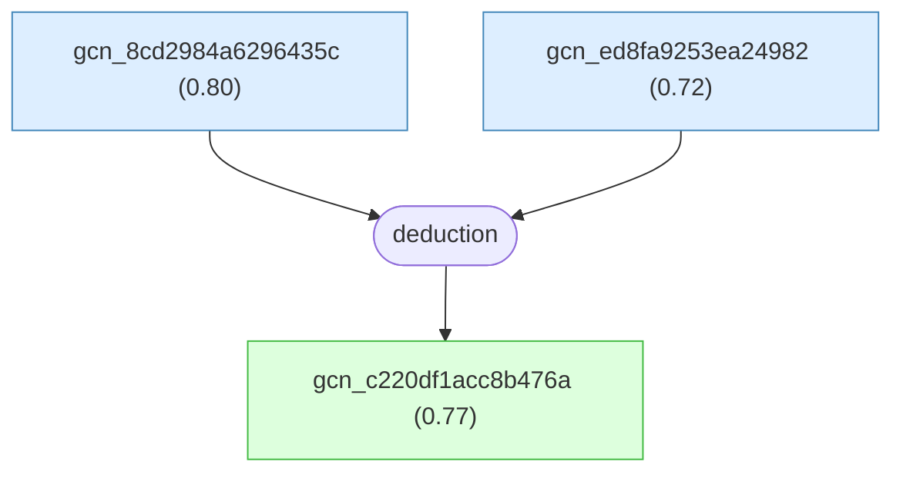

#### gcn_8cd2984a6296435c

📌 `gcn_8cd2984a6296435c`   |   Prior: 0.80   |   Belief: **0.80**

> For Liu et al.'s continuum-model calculations of magic-angle twisted bilayer graphene, the Bistritzer-MacDonald-type moire Hamiltonian is augmented by atomic-registry-dependent interlayer tunneling and a relaxation-derived displacement field that enlarges AB/BA regions and shrinks AA regions; in that reconstructed geometry, the computed low-energy flat-band manifold has larger bandwidth and greater energetic separation from remote bands than in the unreconstructed rigid geometry, with the qualitative trend robust to moderate model-parameter changes even though explicit spatially non-uniform heterostrain is not included [@Liu2020].

#### gcn_ed8fa9253ea24982

📌 `gcn_ed8fa9253ea24982`   |   Prior: 0.72   |   Belief: **0.72**

> For magic-angle twisted bilayer graphene spectra discussed by Liu et al., spatially non-uniform heterostrain means a slowly varying relative in-plane deformation between graphene layers, parameterized by a local strain tensor field epsilon(r) at the moire scale; such heterostrain can reconstruct the electronic band structure and generate additional flat-band density-of-states fine structure, including three-subpeak splitting seen in some STS spectra, but those heterostrain-induced features are not reproduced by continuum-model calculations that include only atomic-registry-driven lattice relaxation [@Liu2020].

#### gcn_c220df1acc8b476a ★

📌 `gcn_c220df1acc8b476a`   |   Belief: **0.77**

> In Liu et al.'s continuum-model electronic-structure calculation for magic-angle twisted bilayer graphene, adding atomic-registry-driven lattice relaxation produces reconstructed geometry with enlarged AB/BA regions and reduced AA regions; compared with the rigid unreconstructed calculation, this reconstructed geometry reproduces the key STS spectroscopic trends of broader low-energy flat bands and greater energetic isolation from remote bands, while the calculation omits explicit spatially non-uniform heterostrain and therefore does not reproduce extra flat-band peak splitting, such as three-subpeak structure, observed in some spectra [@Liu2020].

🔗 **deduction**([gcn_8cd2984a6296435c](#gcn_8cd2984a6296435c), [gcn_ed8fa9253ea24982](#gcn_ed8fa9253ea24982))

Reasoning

1. Define the computational framework: perform continuum-model band-structure and density-of-states (DOS) calculations for magic-angle TBG in two geometries -- the unreconstructed (rigid) geometry and a reconstructed geometry that includes lattice relaxation in the form of atomic registry rearrangement corresponding to enlarged AB/BA regions and shrunken AA regions.
Fig. 4
Fig. S10
2. Explain what is meant by lattice relaxation in the calculation: incorporate atomic registry rearrangement (i.e., allowing the local stacking registries to shift so that AB/BA regions are enlarged and AA regions are reduced and corrugated) when computing the continuum-model moire Hamiltonian and deriving band structures and density of states.
[18-21]
3. Report the computational outcome qualitatively: the calculations that include lattice relaxation produce low-energy flat bands that are broader (increased bandwidth) and more energetically isolated from the remote bands (i.e., larger gaps or separation between flat-band manifold and higher-energy conduction bands) than the calculations performed on the unreconstructed, rigid geometry.
Fig. S10
4. Compare computation to experiment: state that these theoretical results reproduce the essential experimental spectroscopic trends observed in STM/STS measurements on magic-angle TBG, namely that the reconstructed geometry yields broadened low-energy flat bands and increased energetic isolation from remote bands relative to the unreconstructed geometry.
Fig. 4d
Fig. 4e
5. State calculation limitations: explicitly record that the present implementation of the continuum-model calculations does not include heterostrain (spatially varying lattice deformation between layers) and therefore does not capture additional subpeak splitting (three subpeaks) observed in some experimental spectra; the authors attribute such extra splittings to strain effects discussed in prior literature.
[54-55]
Fig. S10

## paper_cantele2020 -- claims and deduction for Cantele et al. 2020.

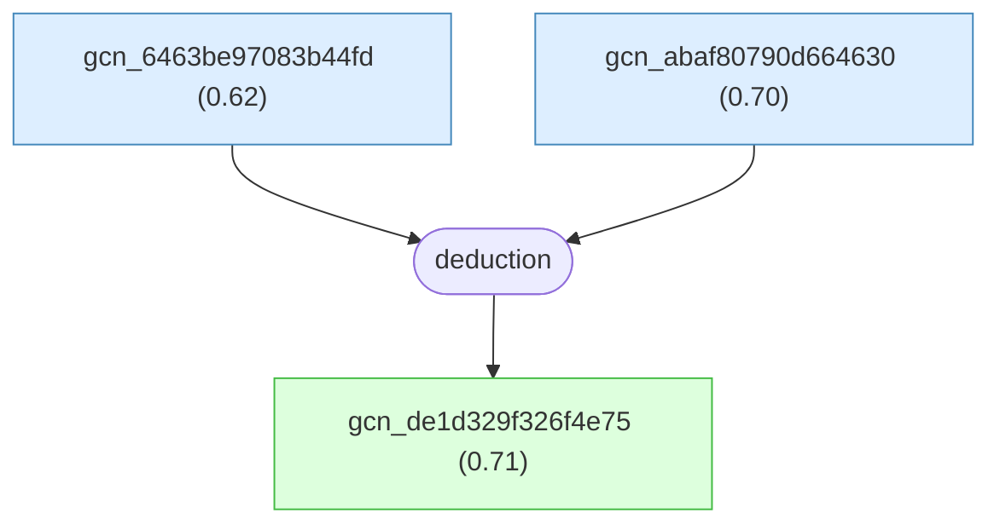

#### gcn_6463be97083b44fd

📌 `gcn_6463be97083b44fd`   |   Prior: 0.62   |   Belief: **0.62**

> For first-magic-angle twisted bilayer graphene, comparing plane-wave DFT Kohn-Sham gaps computed with the vdW-DF2 exchange-correlation functional against spectroscopic gaps assumes that electron-electron correlation and quasiparticle self-energy corrections do not substantially renormalize the relevant gap magnitudes, so DFT gaps of about $26\,\mathrm{meV}$ and $16\,\mathrm{meV}$ can be quantitatively compared to nano-ARPES or tunneling spectroscopy in the same energy window [@Cantele2020].

#### gcn_abaf80790d664630

📌 `gcn_abaf80790d664630`   |   Prior: 0.70   |   Belief: **0.70**

> For twisted bilayer graphene at $\theta=1.08^\circ$, using two constrained optimizations--out-of-plane-only relaxation with fixed in-plane coordinates and in-plane-only relaxation with fixed z coordinates--is treated as a meaningful diagnostic separation of the electronic effects of the two relaxation components, while retaining the caveat that the fully relaxed structure may couple in-plane and out-of-plane degrees of freedom nonlinearly [@Cantele2020].

#### gcn_de1d329f326f4e75 ★

📌 `gcn_de1d329f326f4e75`   |   Belief: **0.71**

> For twisted bilayer graphene at the first magic twist angle $\theta=1.08^\circ$, plane-wave DFT with vdW-DF2 reproduces the near-Fermi narrow flat-band manifold and the $\Gamma$-point gaps to higher and lower bands only when full atomic relaxation includes both in-plane and out-of-plane displacements. In the fully relaxed geometry, the reported flat-band bandwidth is about $20\,\mathrm{meV}$, with upper and lower separation gaps of about $26\,\mathrm{meV}$ and $16\,\mathrm{meV}$, and tight-binding calculations on the same relaxed coordinates give consistent low-energy bands. Unrelaxed flat geometries lack or strongly underestimate these gaps; in-plane-only relaxation gives zero gaps, while out-of-plane-only relaxation gives underestimated gaps of about $2\,\mathrm{meV}$ and $14\,\mathrm{meV}$ [@Cantele2020].

🔗 **deduction**([gcn_6463be97083b44fd](#gcn_6463be97083b44fd), [gcn_abaf80790d664630](#gcn_abaf80790d664630))

Reasoning

1. State upstream result being used as known: the atomistic relaxation patterns induced by interlayer vdW interactions and their quantitative aspects (out-of-plane buckling, in-plane vortexlike displacements, shrinking of AA regions, and numerical displacement magnitudes) are taken as established from the previously reconstructed structural analysis (conclusion 1). These relaxed atomic geometries are the starting point for the following electronic-structure deductions.
2. Summarize the computational approach used to obtain electronic band structures from relaxed and unrelaxed geometries: single-particle electronic structures were computed using DFT within the same VASP/vdW-DF2 framework (self-consistent-field runs sampled at the $\Gamma$ point for the large supercells), and complementary tight-binding calculations were performed using a Slater-Koster parametrization for $p_z$ orbitals with atom positions taken from the relaxed geometries. Non-self-consistent calculations at other $k$ points used the SCF reference; for the smallest cell only one $k$ point could be computed at a time and energies are referred to the SCF Fermi energy. These computational procedures produce band structures for relaxed and unrelaxed atomic configurations that are directly compared. [51]
3. Compare relaxed versus unrelaxed band structures at the first magic angle $\theta=1.08^\circ$: the band-structure plots along the $K-\Gamma-M-K'$ path show that including full atomic relaxation is necessary to reproduce the experimentally observed narrow flat-band manifold and the energy gaps that separate that manifold from both higher and lower energy bands. The fully relaxed DFT band structure shows a bandwidth of approximately $20\,\mathrm{meV}$ and gaps of about $26\,\mathrm{meV}$ on the electron side and about $16\,\mathrm{meV}$ on the hole side. Fig. 5
4. State the failure of unrelaxed geometries to reproduce the experimental gaps: band structures computed for unrelaxed flat bilayer geometries lack the energy gaps isolating the flat-band manifold at $\theta=1.08^\circ$, or greatly underestimate them, while relaxed panels show the gaps. Fig. 5
5. Report partial-relaxation tests and their electronic consequences: in-plane-only relaxation produces essentially zero energy gaps, whereas out-of-plane-only relaxation produces nonzero but underestimated gaps of approximately $2\,\mathrm{meV}$ and $14\,\mathrm{meV}$ on the two sides. Fig. 6
6. Note the agreement between DFT and tight-binding when using the relaxed geometry: tight-binding calculations using the Slater-Koster $p_z$ parametrization on the DFT-relaxed atomic positions reproduce the DFT bands closely near the Fermi energy, indicating that the relaxed geometry is the essential ingredient for the observed flat bands and gaps. Fig. 5

## paper_zhang2019 -- LKM claims and deduction from Zhang et al. (2019).

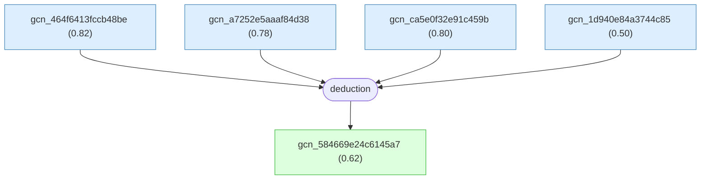

#### gcn_464f6413fccb48be

📌 `gcn_464f6413fccb48be`   |   Prior: 0.82   |   Belief: **0.82**

> For Zhang, Mao, and Senthil's single-valley continuum Hamiltonian for h-BN-aligned magic-angle TBG, the h-BN moire-potential matrices V_j have typical norms |V_j| less than or about 10 meV while the principal TBG moire interlayer coupling is w_1 about 110 meV; therefore their first-approximation band-structure calculation drops the V_j term and retains the top-layer staggered sublattice mass M in H_hBN [@Zhang2019].

#### gcn_a7252e5aaaf84d38

📌 `gcn_a7252e5aaaf84d38`   |   Prior: 0.78   |   Belief: **0.78**

> In Zhang, Mao, and Senthil's h-BN-aligned MA-TBG continuum-model parameterization, an experimentally measured about 35 meV neutral-point gap in monolayer graphene aligned to h-BN is mapped to a top-layer staggered sublattice mass M about 17 meV, using the relation that the single-layer Dirac mass splitting is twice the mass amplitude [@Zhang2019].

#### gcn_ca5e0f32e91c459b

📌 `gcn_ca5e0f32e91c459b`   |   Prior: 0.80   |   Belief: **0.80**

> For Zhang, Mao, and Senthil's h-BN-aligned MA-TBG continuum-model calculations with w_1 about 110 meV, w_0/w_1 = 0.7, magic-angle twist parameters, and staggered mass M about 15-17 meV, the active conduction and valence bands in one valley are numerically isolated across the MBZ so their Chern numbers are well defined; the reported valley + values are C = +1 for the conduction active band and C = -1 for the valence active band [@Zhang2019].

#### gcn_1d940e84a3744c85

📌 `gcn_1d940e84a3744c85`   |   Prior: 0.50   |   Belief: **0.50**

> The selected Zhang, Mao, and Senthil LKM evidence factor contains premise id gcn_1d940e84a3744c85 with empty premise content; this placeholder records that an unspecified premise was present in the LKM chain but supplies no independent scientific assertion beyond the chain membership [@Zhang2019].

#### gcn_584669e24c6145a7 ★

📌 `gcn_584669e24c6145a7`   |   Belief: **0.62**

> In Zhang, Mao, and Senthil's single-valley continuum model for magic-angle TBG with the top graphene layer nearly aligned to h-BN, H = H_TBG + H_hBN combines the standard TBG continuum Hamiltonian with a top-layer h-BN term containing a staggered sublattice mass M and weaker V_j moire potentials; for M about 15-17 meV and |V_j| much smaller than w_1 about 110 meV, numerical diagonalization gives gapped MBZ-corner Dirac crossings, one isolated conduction and one isolated valence active band per valley, valley + Chern numbers C = +1 and C = -1 for the conduction and valence active bands respectively, and an indirect active-band gap of order 5 meV at M = 15 meV and theta_M = 1.20 degrees [@Zhang2019].

🔗 **deduction**([gcn_464f6413fccb48be](#gcn_464f6413fccb48be), [gcn_a7252e5aaaf84d38](#gcn_a7252e5aaaf84d38), [gcn_ca5e0f32e91c459b](#gcn_ca5e0f32e91c459b), [gcn_1d940e84a3744c85](#gcn_1d940e84a3744c85))

Reasoning

1. State the single-valley continuum Hamiltonian for magic-angle twisted bilayer graphene (MA-TBG) aligned with hexagonal boron nitride (h-BN) as the sum of a TBG continuum-model term and an h-BN-induced term: H=H_TBG+H_hBN, where H_TBG is the standard continuum-model Hamiltonian for twisted bilayer graphene and H_hBN encodes effects of the aligned h-BN on the top graphene layer. [56]
2. Write explicitly the h-BN-induced part of the Hamiltonian as H_hBN = sum_k M psi_t^\dagger(k) mu_z psi_t(k) + sum_{j=1}^6 psi_t^\dagger(k+Q'_j) V_j psi_t(k), and define k, top and bottom layer spinors, sublattice Pauli matrix mu_z, staggered mass M, h-BN mismatch wavevectors Q'_j, and moire potential matrices V_j. [56]
3. Explain the origin and role of the M term: aligned h-BN breaks in-plane C_2 symmetry of graphene and produces a staggered sublattice potential on the top graphene layer, acting as a mass for that layer's Dirac cones. [57]
4. Provide empirical and theoretical parameter estimates: monolayer graphene nearly aligned with h-BN shows a neutral-point gap around 35 meV, implying M about 17 meV; DFT estimates give V_j about 10 meV; the dominant TBG moire interlayer coupling is w_1 about 110 meV and lattice relaxation is represented by w_0/w_1 = 0.7, establishing M about 15-17 meV and |V_j| much smaller than w_1. [56] [10]
5. State the band-structure approximation: because V_j is estimated to be significantly smaller than the principal TBG moire scale, the authors ignore the sum_j V_j moire-potential term as a first approximation and diagonalize H_TBG + M sum_k psi_t^\dagger(k) mu_z psi_t(k) in the TBG moire Brillouin zone. [10]
6. Describe the continuum-model ingredients diagonalized: H_TBG is the Bistritzer-MacDonald continuum Hamiltonian for one valley, with Dirac Hamiltonians for top and bottom layers coupled by interlayer moire tunneling matrices T_j at wavevectors Q_j; the sublattice spinors and single-valley layer Dirac Hamiltonian form the basis for numerical diagonalization. [56]
7. Report the numerical diagonalization for representative realistic parameters: for theta_M = 1.20 degrees and M = 15 meV, with w_1 = 110 meV and w_0/w_1 = 0.7, the computed single-valley band structure gaps the MBZ-corner Dirac crossings, isolates the conduction and valence active bands from other bands, and gives an indirect active-band gap of order 5 meV. Fig. 1
8. Explain how band Chern numbers are determined and report their values: because the active bands are isolated, their Chern numbers are well defined and computed numerically; for valley + the conduction band has C=+1 and the valence band has C=-1, with opposite signs in the time-reversed valley. [8] Fig. 3
9. Connect the band-gap and topology statements into the final assertion: the explicit H_hBN form plus diagonalization of H_TBG+H_hBN under realistic parameter estimates yields gapped Dirac crossings, isolated conduction and valence active bands, valley-resolved Chern numbers +1 and -1 for valley +, and an about 5 meV indirect gap for M=15 meV and theta_M=1.20 degrees. Fig. 1

## paper_wang2020 -- claims and deductions from Wang, Bultinck, and Zaletel 2020.

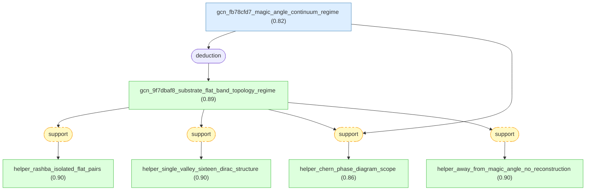

#### gcn_fb78cfd7_magic_angle_continuum_regime

📌 `gcn_fb78cfd7_magic_angle_continuum_regime`   |   Prior: 0.82   |   Belief: **0.82**

> In Wang, Bultinck, and Zaletel's TBG-on-transition-metal-dichalcogenide continuum analysis, the two-valley Bistritzer-MacDonald continuum model with effectively decoupled valley indices tau = +/- is an appropriate description of single-particle flat-band physics only for sufficiently small twist angles near the first magic angle theta* ~= 1.08 degrees, where intervalley scattering is negligible, the eight active flat bands are isolated from remote bands by appreciable gaps, and their bandwidths are comparable to or smaller than the proximate Rashba, Ising, and sublattice energy scales [@Wang2020].

#### gcn_9f7dbaf8_substrate_flat_band_topology_regime ★

📌 `gcn_9f7dbaf8_substrate_flat_band_topology_regime`   |   Belief: **0.89**

> In Wang, Bultinck, and Zaletel's continuum two-decoupled-valley description of magic-angle TBG on a transition metal dichalcogenide, the reported reconstructed-band phenomena--Rashba-induced isolated extremely flat band pairs near K^{+/-}, the sixteen-Dirac-point single-valley four-band structure, and Chern-number phase diagrams for isolated active bands--are scoped to sufficiently small twist angles near the first magic angle, where the active eight bands are isolated and have bandwidth comparable to or smaller than proximate scales such as Rashba ~16 meV, Ising ~1 meV, and sublattice u ~1-2 meV; away from that regime, large active-band bandwidth can prevent Rashba reconstruction and the reported topology and extreme flatness need not occur [@Wang2020].

🔗 **deduction**([gcn_fb78cfd7_magic_angle_continuum_regime](#gcn_fb78cfd7_magic_angle_continuum_regime))

Reasoning

1. State the applicability domain of the continuum two-decoupled-valley model: require that the TBG twist angle be small enough so that valley-mixing terms are negligible and the two-valley continuum approximation is valid (i.e., the low-energy physics can be described by separate $\tau=\pm$ valley moire Hamiltonians).
2. Specify the additional constraint that the twist angle must be sufficiently close to the first magic angle (approximately $\theta^{*}\sim 1.08^{\circ}$) so that (i) the eight active flat bands near charge neutrality are well separated from remote bands by an appreciable gap, and (ii) the bandwidth of the active eight bands is comparable to or smaller than the realistic proximity-induced energy scales (Rashba $\sim 16\ \text{meV}$, Ising $\sim 1\ \text{meV}$, sublattice splitting $u\sim 1$-$2\ \text{meV}$); these two conditions ensure that the proximity terms can reconstruct the active bands and induce the topological phenomena described.
3. Explain the failure mode when away from this regime: if the twist angle is too far from the first magic angle so that the active-band bandwidth becomes large compared to the SOC strengths, the Rashba and other proximity couplings will be too weak relative to the kinetic bandwidth to significantly reconstruct the active bands; consequently the Rashba-induced splitting that produces extremely-flat pairs near $K^{\pm}$, the 16 Dirac-point structure, and the Chern-number phase diagrams derived for the reconstructed bands will not occur.
4. Conclude that the reconstructed-band phenomena reported in this work (isolated flat pairs at $K^{\pm}$, the sixteen-Dirac pattern, and the computed valley-Chern and time-reversal TI phase diagrams) apply within the continuum, two-decoupled-valley description appropriate for small twist angles and require being sufficiently close to the first magic angle so that the active eight bands are narrow and separated from remote bands; outside this regime the reported topology and extreme flatness are not expected to be realized.

#### helper_rashba_isolated_flat_pairs

📌 `helper_rashba_isolated_flat_pairs`   |   Belief: **0.90**

> Within Wang et al.'s near-first-magic-angle TBG-on-TMD continuum regime, Rashba proximity coupling can reconstruct the active bands into isolated, extremely flat band pairs near K^{+/-} [@Wang2020].

🔗 **support**([gcn_9f7dbaf8_substrate_flat_band_topology_regime](#gcn_9f7dbaf8_substrate_flat_band_topology_regime))

Reasoning

The selected LKM root explicitly names Rashba-induced isolated extremely flat band pairs near K^{+/-}, and factor steps 2-4 scope this statement to the near-first-magic-angle active-band regime.

#### helper_single_valley_sixteen_dirac_structure

📌 `helper_single_valley_sixteen_dirac_structure`   |   Belief: **0.90**

> Within Wang et al.'s near-first-magic-angle, single-valley four-band continuum spectrum for TBG on a transition metal dichalcogenide, the reconstructed active bands exhibit a sixteen-Dirac-point structure [@Wang2020].

🔗 **support**([gcn_9f7dbaf8_substrate_flat_band_topology_regime](#gcn_9f7dbaf8_substrate_flat_band_topology_regime))

Reasoning

The selected LKM root explicitly names the sixteen-Dirac-point structure in the single-valley four-band spectrum as one of the reconstructed-band phenomena covered by the scoped conclusion.

#### helper_chern_phase_diagram_scope

📌 `helper_chern_phase_diagram_scope`   |   Belief: **0.86**

> Wang et al.'s Chern-number phase diagrams for TBG-on-TMD isolated active bands are scoped to the continuum two-decoupled-valley model near the first magic angle, where the active flat bands are isolated from remote bands and narrow enough for proximate terms to reconstruct them [@Wang2020].

🔗 **support**([gcn_fb78cfd7_magic_angle_continuum_regime](#gcn_fb78cfd7_magic_angle_continuum_regime), [gcn_9f7dbaf8_substrate_flat_band_topology_regime](#gcn_9f7dbaf8_substrate_flat_band_topology_regime))

Reasoning

The LKM premise provides the model and near-magic-angle isolation conditions, while the selected root names the computed Chern-number phase diagrams for isolated active bands within that regime.

#### helper_away_from_magic_angle_no_reconstruction

📌 `helper_away_from_magic_angle_no_reconstruction`   |   Belief: **0.90**

> In Wang et al.'s TBG-on-TMD continuum setting, if the twist angle is too far from the first magic angle and the active-band bandwidth is much larger than the proximate Rashba, Ising, and sublattice couplings, Rashba coupling is not expected to reconstruct the active bands, so the reported band topology and extreme flatness need not occur [@Wang2020].

🔗 **support**([gcn_9f7dbaf8_substrate_flat_band_topology_regime](#gcn_9f7dbaf8_substrate_flat_band_topology_regime))

Reasoning

The selected LKM root and factor step 3 explicitly state the failure mode: away from the first magic angle, large active-band bandwidth makes proximate couplings too weak to reconstruct the active bands.

## paper_park2021 -- LKM claims and deduction from Park et al. (2021).

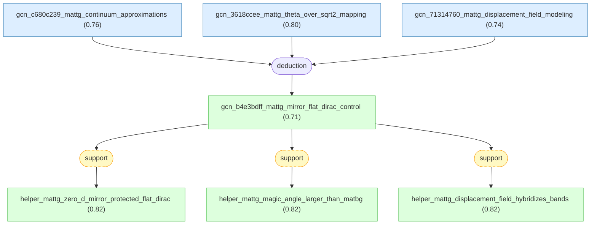

#### gcn_c680c239_mattg_continuum_approximations

📌 `gcn_c680c239_mattg_continuum_approximations`   |   Prior: 0.76   |   Belief: **0.76**

> For Park et al.'s continuum-model calculation of mirror-symmetric A-tw-A magic-angle twisted trilayer graphene, with three graphene monolayers sequentially twisted by +theta and -theta, the selected LKM chain treats the calculation as qualitatively capturing mirror-protected flat bands, coexisting gapless Dirac bands, and displacement-field-driven hybridization while using three approximations: neglecting direct top-bottom layer coupling, fixing interlayer hoppings w=0.1 eV and w'=0.08 eV with w' mimicking lattice relaxation, and representing perpendicular displacement field D by a non-self-consistent interlayer potential difference Delta V=dD/epsilon_0 with d about 0.3 nm [@Park2021].

#### gcn_3618ccee_mattg_theta_over_sqrt2_mapping

📌 `gcn_3618ccee_mattg_theta_over_sqrt2_mapping`   |   Prior: 0.80   |   Belief: **0.80**

> In the selected Park et al. LKM chain, the mirror-symmetric flat bands of A-tw-A twisted trilayer graphene are approximately reduced to a twisted-bilayer-like band structure with effective twist angle theta/sqrt(2), implying a MATTG magic-angle estimate near theta_MATTG about 1.6 degrees, while the mapping is explicitly scoped by neglected higher-order coupling terms, layer-dependent relaxation effects, and deviations from ideal mirror symmetry [@Park2021].

#### gcn_71314760_mattg_displacement_field_modeling

📌 `gcn_71314760_mattg_displacement_field_modeling`   |   Prior: 0.74   |   Belief: **0.74**

> In Park et al.'s MATTG continuum-model treatment, an externally applied perpendicular electric displacement field D is modeled as an imposed interlayer electrostatic potential difference Delta V=dD/epsilon_0 with interlayer spacing d about 0.3 nm; the selected LKM chain treats this non-self-consistent approximation as qualitatively capturing mirror-symmetry breaking and flat-band/Dirac-band hybridization, while warning that screening and non-local corrections can shift quantitative hybridization strengths and Van Hove singularity positions [@Park2021].

#### gcn_b4e3bdff_mattg_mirror_flat_dirac_control ★

📌 `gcn_b4e3bdff_mattg_mirror_flat_dirac_control`   |   Belief: **0.71**

> For Park et al.'s mirror-symmetric A-tw-A magic-angle twisted trilayer graphene with sequential twist angles +theta and -theta and theta about 1.57 degrees, continuum-model calculations yield mirror-symmetry-protected flat bands derived from mirror-symmetric outer-layer hopping combinations and coexisting gapless Dirac bands of opposite mirror character, so flat-band/Dirac-band hybridization is forbidden when mirror symmetry is present; the flat bands map approximately to MATBG-like bands with effective twist angle theta/sqrt(2), giving a larger MATTG magic angle near 1.6 degrees, and a perpendicular displacement field D breaks mirror symmetry and hybridizes the flat and Dirac bands, enabling electrical control of flat-band bandwidth and topology under the stated continuum-model approximations [@Park2021].

🔗 **deduction**([gcn_c680c239_mattg_continuum_approximations](#gcn_c680c239_mattg_continuum_approximations), [gcn_3618ccee_mattg_theta_over_sqrt2_mapping](#gcn_3618ccee_mattg_theta_over_sqrt2_mapping), [gcn_71314760_mattg_displacement_field_modeling](#gcn_71314760_mattg_displacement_field_modeling))

Reasoning

1. Define the system and calculation framework: MATTG consists of three graphene monolayers with sequential twist angles $\theta$ and $-\theta$ between layers; the continuum-model calculation used is the twisted-bilayer continuum model extended to a third layer with the same relative twist as the bottom layer. The calculation neglects direct coupling between the topmost and bottommost layers and uses interlayer hopping parameters off-diagonal $w=0.1\ \mathrm{eV}$ and diagonal $w'=0.08\ \mathrm{eV}$ (the latter empirically accounting for lattice relaxation). Fig. 1b, Fig. 1c [2,18,25,26]
2. Present the calculated bandstructure at zero perpendicular electric displacement field $D$: the calculated bands for valley K show a set of nearly flat bands near charge neutrality and coexisting gapless Dirac bands, with the mirror-symmetry character of each eigenstate indicated by a colour scale (mirror-symmetric eigenstates evaluate to $+1$ under the top-bottom layer inner-product projection, mirror-antisymmetric to $-1$, and intermediate values for nonsymmetric states). In these zero-$D$ calculations, the flat bands are mirror symmetric and the Dirac bands are mirror antisymmetric, hence hybridization between them is symmetry-forbidden at $D=0$. Fig. 1b
3. Explain the origin of the flat bands in this mirror-symmetric stacking: the flat bands arise from mirror-symmetric hopping from the two outer layers onto the central layer; mathematically, these flat bands reduce to an effective twisted-bilayer-like bandstructure with an effective twist angle $\theta/\sqrt{2}$ (that is, effective twist $=\theta/\sqrt{2}$), implying a larger MATTG magic angle than MATBG. Using $\theta\approx1.57^\circ$, this reduction yields an estimated MATTG magic-angle value $\theta_{\mathrm{MATTG}}\approx1.6^\circ$. Fig. 1b [18]
4. Describe the effect of a perpendicular displacement field $D$ in the calculation: applying a finite $D$ breaks the mirror symmetry by imposing an interlayer potential difference $\Delta V = d D/\varepsilon_{0}$ (where $d\approx0.3\ \mathrm{nm}$ is the interlayer spacing and $\varepsilon_{0}$ is the vacuum permittivity), which mixes mirror-symmetry characters and allows hybridization between the formerly mirror-protected flat bands and the Dirac bands. The calculated bandstructure at finite $D$ shows this hybridization and the resulting controllable changes in band bandwidth and topology. Fig. 1c
5. State the approximations and limitations used in the calculations as presented: neglect of direct coupling between the topmost and bottommost layers is explicitly adopted; the chosen interlayer hopping parameters are $w=0.1\ \mathrm{eV}$ and $w'=0.08\ \mathrm{eV}$; the calculation does not include a self-consistent screening treatment of the applied $D$ (authors remark that screening by outer layers reduces the actual interlayer field relative to externally applied $D$), nor high-order and non-local interlayer coupling terms that can introduce particle-hole asymmetry. Extended Data Fig. 1

#### helper_mattg_zero_d_mirror_protected_flat_dirac

📌 `helper_mattg_zero_d_mirror_protected_flat_dirac`   |   Belief: **0.82**

> For Park et al.'s zero-displacement-field continuum calculation of mirror-symmetric A-tw-A MATTG near theta about 1.57 degrees, the flat bands are mirror symmetric, the coexisting gapless Dirac bands are mirror antisymmetric, and symmetry forbids their hybridization at D=0 [@Park2021].

🔗 **support**([gcn_b4e3bdff_mattg_mirror_flat_dirac_control](#gcn_b4e3bdff_mattg_mirror_flat_dirac_control))

Reasoning

The selected root and LKM factor step 2 explicitly state that at zero displacement field the flat bands and Dirac bands have opposite mirror characters, making their hybridization symmetry-forbidden.

#### helper_mattg_magic_angle_larger_than_matbg

📌 `helper_mattg_magic_angle_larger_than_matbg`   |   Belief: **0.82**

> For Park et al.'s mirror-symmetric A-tw-A MATTG model, the selected LKM chain states that the flat bands reduce mathematically to MATBG-like bands with effective twist angle theta/sqrt(2), so a physical twist theta about 1.57 degrees corresponds to a larger trilayer magic-angle estimate near 1.6 degrees [@Park2021].

🔗 **support**([gcn_b4e3bdff_mattg_mirror_flat_dirac_control](#gcn_b4e3bdff_mattg_mirror_flat_dirac_control))

Reasoning

The selected root and LKM factor step 3 explicitly state the theta/sqrt(2) reduction and the resulting larger MATTG magic-angle estimate near 1.6 degrees.

#### helper_mattg_displacement_field_hybridizes_bands

📌 `helper_mattg_displacement_field_hybridizes_bands`   |   Belief: **0.82**

> For Park et al.'s MATTG continuum model, applying a finite perpendicular displacement field D through Delta V=dD/epsilon_0 breaks the mirror symmetry, mixes mirror characters, and allows hybridization between formerly mirror-protected flat bands and Dirac bands, producing tunable changes in flat-band bandwidth and topology [@Park2021].

🔗 **support**([gcn_b4e3bdff_mattg_mirror_flat_dirac_control](#gcn_b4e3bdff_mattg_mirror_flat_dirac_control))

Reasoning

The selected root and LKM factor step 4 explicitly state that finite D breaks mirror symmetry, mixes mirror character, and permits flat/Dirac band hybridization with tunable bandwidth and topology.

## cross_paper -- grounded synthesis across validated TBG root subgraphs.

```mermaid
graph TD
    gcn_006f88d8_ma_tbg_superconducting_domes["gcn_006f88d8_ma_tbg_superconducting_domes (0.87)"]:::external
    gcn_7bca73ad98eb4ed4["gcn_7bca73ad98eb4ed4 (0.83)"]:::external
    gcn_afdfbd0c013048d8["gcn_afdfbd0c013048d8 (0.74)"]:::external
    gcn_105d2fc961f949b6["gcn_105d2fc961f949b6 (0.61)"]:::external
    gcn_8159f32d_merged_dirac_magic_angle_flat_band["gcn_8159f32d_merged_dirac_magic_angle_flat_band (0.80)"]:::external
    gcn_f23eff9c755840f2["gcn_f23eff9c755840f2 (0.81)"]:::external
    gcn_2cf09f115b814154["gcn_2cf09f115b814154 (0.68)"]:::external
    gcn_225da7b3_atqg_angle_phase_decoupling["gcn_225da7b3_atqg_angle_phase_decoupling (0.86)"]:::external
    gcn_14a55aff_smab2_flat_band_localization["gcn_14a55aff_smab2_flat_band_localization (0.89)"]:::external
    gcn_5f58746b_magic_angle_flat_band_likelihood["gcn_5f58746b_magic_angle_flat_band_likelihood (0.77)"]:::external
    gcn_c220df1acc8b476a["gcn_c220df1acc8b476a (0.77)"]:::external
    gcn_de1d329f326f4e75["gcn_de1d329f326f4e75 (0.71)"]:::external
    gcn_584669e24c6145a7["gcn_584669e24c6145a7 (0.62)"]:::external
    gcn_9f7dbaf8_substrate_flat_band_topology_regime["gcn_9f7dbaf8_substrate_flat_band_topology_regime (0.89)"]:::external
    gcn_b4e3bdff_mattg_mirror_flat_dirac_control["gcn_b4e3bdff_mattg_mirror_flat_dirac_control (0.71)"]:::external
    parent_tbg_flat_band_to_correlated_phenomenology["parent_tbg_flat_band_to_correlated_phenomenology (0.73)"]:::derived
    parent_scoped_flat_band_variants["parent_scoped_flat_band_variants (0.59)"]:::derived
    parent_multilayer_extensions_not_equivalent_to_tbg["parent_multilayer_extensions_not_equivalent_to_tbg (0.71)"]:::derived
    parent_no_same_scope_contradiction_found["parent_no_same_scope_contradiction_found (0.51)"]:::derived
    parent_relaxation_dft_realistic_flat_band_modeling["parent_relaxation_dft_realistic_flat_band_modeling (0.67)"]:::derived
    parent_substrate_topological_perturbation_scope["parent_substrate_topological_perturbation_scope (0.72)"]:::derived
    parent_mattg_superconducting_moire_extension_not_equivalent["parent_mattg_superconducting_moire_extension_not_equivalent (0.74)"]:::derived
    strat_32(["support"]):::weak
    gcn_7bca73ad98eb4ed4 --> strat_32
    gcn_5f58746b_magic_angle_flat_band_likelihood --> strat_32
    gcn_006f88d8_ma_tbg_superconducting_domes --> strat_32
    strat_32 --> parent_tbg_flat_band_to_correlated_phenomenology
    strat_33(["support"]):::weak
    gcn_105d2fc961f949b6 --> strat_33
    gcn_8159f32d_merged_dirac_magic_angle_flat_band --> strat_33
    gcn_afdfbd0c013048d8 --> strat_33
    gcn_f23eff9c755840f2 --> strat_33
    gcn_5f58746b_magic_angle_flat_band_likelihood --> strat_33
    strat_33 --> parent_scoped_flat_band_variants
    strat_34(["support"]):::weak
    gcn_2cf09f115b814154 --> strat_34
    gcn_225da7b3_atqg_angle_phase_decoupling --> strat_34
    gcn_14a55aff_smab2_flat_band_localization --> strat_34
    strat_34 --> parent_multilayer_extensions_not_equivalent_to_tbg
    strat_35(["support"]):::weak
    gcn_006f88d8_ma_tbg_superconducting_domes --> strat_35
    gcn_7bca73ad98eb4ed4 --> strat_35
    gcn_afdfbd0c013048d8 --> strat_35
    gcn_105d2fc961f949b6 --> strat_35
    gcn_8159f32d_merged_dirac_magic_angle_flat_band --> strat_35
    gcn_f23eff9c755840f2 --> strat_35
    gcn_2cf09f115b814154 --> strat_35
    gcn_225da7b3_atqg_angle_phase_decoupling --> strat_35
    gcn_14a55aff_smab2_flat_band_localization --> strat_35
    gcn_5f58746b_magic_angle_flat_band_likelihood --> strat_35
    gcn_c220df1acc8b476a --> strat_35
    gcn_de1d329f326f4e75 --> strat_35
    gcn_584669e24c6145a7 --> strat_35
    gcn_9f7dbaf8_substrate_flat_band_topology_regime --> strat_35
    gcn_b4e3bdff_mattg_mirror_flat_dirac_control --> strat_35
    strat_35 --> parent_no_same_scope_contradiction_found
    strat_36(["support"]):::weak
    gcn_c220df1acc8b476a --> strat_36
    gcn_de1d329f326f4e75 --> strat_36
    gcn_5f58746b_magic_angle_flat_band_likelihood --> strat_36
    strat_36 --> parent_relaxation_dft_realistic_flat_band_modeling
    strat_37(["support"]):::weak
    gcn_584669e24c6145a7 --> strat_37
    gcn_9f7dbaf8_substrate_flat_band_topology_regime --> strat_37
    strat_37 --> parent_substrate_topological_perturbation_scope
    strat_38(["support"]):::weak
    gcn_b4e3bdff_mattg_mirror_flat_dirac_control --> strat_38
    gcn_006f88d8_ma_tbg_superconducting_domes --> strat_38
    strat_38 --> parent_mattg_superconducting_moire_extension_not_equivalent

    classDef setting fill:#f0f0f0,stroke:#999,color:#333
    classDef premise fill:#ddeeff,stroke:#4488bb,color:#333
    classDef derived fill:#ddffdd,stroke:#44bb44,color:#333
    classDef question fill:#fff3dd,stroke:#cc9944,color:#333
    classDef background fill:#f5f5f5,stroke:#bbb,stroke-dasharray: 5 5,color:#333
    classDef orphan fill:#fff,stroke:#ccc,stroke-dasharray: 5 5,color:#333
    classDef external fill:#fff,stroke:#aaa,stroke-dasharray: 3 3,color:#333
    classDef weak fill:#fff9c4,stroke:#f9a825,stroke-dasharray: 5 5,color:#333
    classDef contra fill:#ffebee,stroke:#c62828,color:#333
```

#### parent_tbg_flat_band_to_correlated_phenomenology

📌 `parent_tbg_flat_band_to_correlated_phenomenology`   |   Belief: **0.73**

> The selected TBG roots connect a magic-angle flat-band mechanism to correlated phase phenomenology: BM-continuum velocity suppression near the first magic angle and ab initio flat-band detection near theta about 1.1 degrees provide single-particle flat-band context, while Cao et al. observe superconducting domes adjacent to correlated insulating behavior in MA-TBG devices [@DasSarma2020; @Tritsaris2020; @Cao2018].

🔗 **support**([gcn_7bca73ad98eb4ed4](#gcn_7bca73ad98eb4ed4), [gcn_5f58746b_magic_angle_flat_band_likelihood](#gcn_5f58746b_magic_angle_flat_band_likelihood), [gcn_006f88d8_ma_tbg_superconducting_domes](#gcn_006f88d8_ma_tbg_superconducting_domes))

Reasoning

BM velocity suppression and ab initio flat-band likelihood ground the single-particle magic-angle flat-band context, while the Cao root grounds the correlated-insulator and superconducting-dome phenomenology. This is a scoped synthesis bridge, not an equivalence or causal proof.

#### parent_scoped_flat_band_variants

📌 `parent_scoped_flat_band_variants`   |   Belief: **0.59**

> The pressure-tuned, merged-Dirac, magnetic-Bloch, few-layer-graphite, and ab initio roots are scoped variants of flat-band formation or detection around moire graphene: they share flat or velocity-suppressed bands as the theme, but differ by pressure, flux, commensuration, continuum/tight-binding method, or multilayer geometry [@Ge2021; @Yamada2020; @HerzogArbeitman2022; @Ma2020; @Tritsaris2020].

🔗 **support**([gcn_105d2fc961f949b6](#gcn_105d2fc961f949b6), [gcn_8159f32d_merged_dirac_magic_angle_flat_band](#gcn_8159f32d_merged_dirac_magic_angle_flat_band), [gcn_afdfbd0c013048d8](#gcn_afdfbd0c013048d8), [gcn_f23eff9c755840f2](#gcn_f23eff9c755840f2), [gcn_5f58746b_magic_angle_flat_band_likelihood](#gcn_5f58746b_magic_angle_flat_band_likelihood))

Reasoning

Each premise is a validated selected root about flat-band formation, velocity suppression, or flat-band detection in a scoped moire graphene setting. Their shared theme supports a parent variant claim while their different regimes prevent equivalence.

#### parent_multilayer_extensions_not_equivalent_to_tbg

📌 `parent_multilayer_extensions_not_equivalent_to_tbg`   |   Belief: **0.71**

> The twisted trilayer, alternating-twist quadrilayer, and twisted monolayer-bilayer roots are nearby moire graphene extensions rather than equivalents of magic-angle TBG: each uses a different stacking or layer count and the selected LKM claims explicitly scope their flat-band or correlated-phase behavior to those geometries [@Ma2019; @Burg2022; @Nguyen2022].

🔗 **support**([gcn_2cf09f115b814154](#gcn_2cf09f115b814154), [gcn_225da7b3_atqg_angle_phase_decoupling](#gcn_225da7b3_atqg_angle_phase_decoupling), [gcn_14a55aff_smab2_flat_band_localization](#gcn_14a55aff_smab2_flat_band_localization))

Reasoning

The trilayer, quadrilayer, and monolayer-bilayer roots all preserve their own layer geometry and reported behavior. They support a nearby-extension synthesis claim and explicitly do not justify equivalence to TBG.

#### parent_no_same_scope_contradiction_found

📌 `parent_no_same_scope_contradiction_found`   |   Belief: **0.51**

> Across the selected TBG, substrate-perturbed TBG, and nearby multilayer moire roots, the parent synthesis treats apparent differences in angles, relaxation protocols, substrate perturbations, pressure response, multilayer behavior, and correlated-phase trends as scope distinctions because the source claims do not assert incompatible values for the same system under the same conditions.

🔗 **support**([gcn_006f88d8_ma_tbg_superconducting_domes](#gcn_006f88d8_ma_tbg_superconducting_domes), [gcn_7bca73ad98eb4ed4](#gcn_7bca73ad98eb4ed4), [gcn_afdfbd0c013048d8](#gcn_afdfbd0c013048d8), [gcn_105d2fc961f949b6](#gcn_105d2fc961f949b6), [gcn_8159f32d_merged_dirac_magic_angle_flat_band](#gcn_8159f32d_merged_dirac_magic_angle_flat_band), [gcn_f23eff9c755840f2](#gcn_f23eff9c755840f2), [gcn_2cf09f115b814154](#gcn_2cf09f115b814154), [gcn_225da7b3_atqg_angle_phase_decoupling](#gcn_225da7b3_atqg_angle_phase_decoupling), [gcn_14a55aff_smab2_flat_band_localization](#gcn_14a55aff_smab2_flat_band_localization), [gcn_5f58746b_magic_angle_flat_band_likelihood](#gcn_5f58746b_magic_angle_flat_band_likelihood), [gcn_c220df1acc8b476a](#gcn_c220df1acc8b476a), [gcn_de1d329f326f4e75](#gcn_de1d329f326f4e75), [gcn_584669e24c6145a7](#gcn_584669e24c6145a7), [gcn_9f7dbaf8_substrate_flat_band_topology_regime](#gcn_9f7dbaf8_substrate_flat_band_topology_regime), [gcn_b4e3bdff_mattg_mirror_flat_dirac_control](#gcn_b4e3bdff_mattg_mirror_flat_dirac_control))

Reasoning

The parent candidates, contradiction flags, and validated subgraph roots show different systems, methods, twist-angle regimes, relaxation or substrate perturbations, pressure/flux conditions, and layer counts. Those differences are logged as scope distinctions rather than contradiction edges.

#### parent_relaxation_dft_realistic_flat_band_modeling

📌 `parent_relaxation_dft_realistic_flat_band_modeling`   |   Belief: **0.67**

> The lattice-reconstruction, DFT-relaxation, and ab initio roots support a more realistic modeling scope for magic-angle TBG flat bands: relaxation-aware continuum modeling explains broader and better isolated flat bands, full in-plane and out-of-plane DFT relaxation is needed for first-magic-angle gaps and narrow bands, and Wannier-based ab initio workflows provide an independent flat-band detection context [@Liu2020; @Cantele2020; @Tritsaris2020].

🔗 **support**([gcn_c220df1acc8b476a](#gcn_c220df1acc8b476a), [gcn_de1d329f326f4e75](#gcn_de1d329f326f4e75), [gcn_5f58746b_magic_angle_flat_band_likelihood](#gcn_5f58746b_magic_angle_flat_band_likelihood))

Reasoning

The Liu root grounds lattice-relaxed continuum spectroscopy trends, the Cantele root grounds full atomic relaxation in first-magic-angle DFT and tight-binding bands, and the Tritsaris root adds an ab initio flat-band likelihood workflow. Together they support realistic flat-band modeling scope without treating the methods as equivalent.

#### parent_substrate_topological_perturbation_scope

📌 `parent_substrate_topological_perturbation_scope`   |   Belief: **0.72**

> The h-BN-aligned and transition-metal-dichalcogenide substrate roots support a substrate/topological perturbation scope for magic-angle TBG: h-BN alignment introduces a staggered-mass continuum term with valley Chern active bands, while TBG on a TMD is scoped to near-first-magic-angle active bands where proximate Rashba, Ising, and sublattice terms can reconstruct flat bands and Chern-number phase diagrams [@Zhang2019; @Wang2020].

🔗 **support**([gcn_584669e24c6145a7](#gcn_584669e24c6145a7), [gcn_9f7dbaf8_substrate_flat_band_topology_regime](#gcn_9f7dbaf8_substrate_flat_band_topology_regime))

Reasoning

The Zhang root grounds h-BN-induced staggered-mass topology in MA-TBG, while the Wang root grounds a TMD-proximity regime where substrate terms reconstruct active bands and define Chern-number phase diagrams. This is a substrate/topology scope bridge only.

#### parent_mattg_superconducting_moire_extension_not_equivalent

📌 `parent_mattg_superconducting_moire_extension_not_equivalent`   |   Belief: **0.74**

> The Park et al. MATTG root extends the superconducting magic-angle moire graphene family beyond bilayer TBG, but it is not equivalent to MA-TBG: MATTG uses mirror-symmetric A-tw-A trilayer geometry with a larger magic angle near 1.6 degrees and displacement-field-tunable flat/Dirac-band hybridization, whereas the Cao et al. root concerns bilayer MA-TBG superconducting domes adjacent to correlated insulating states [@Park2021; @Cao2018].

🔗 **support**([gcn_b4e3bdff_mattg_mirror_flat_dirac_control](#gcn_b4e3bdff_mattg_mirror_flat_dirac_control), [gcn_006f88d8_ma_tbg_superconducting_domes](#gcn_006f88d8_ma_tbg_superconducting_domes))

Reasoning

The Park root places mirror-symmetric magic-angle twisted trilayer graphene in the same broader superconducting moire graphene family, while the Cao root preserves the bilayer MA-TBG phenomenology. The different layer count and mirror-symmetry control prevent equivalence.

## Inference Results

**BP converged:** True (2 iterations)

| Label | Type | Prior | Belief | Role |
|-------|------|-------|--------|------|
| [gcn_ba97172fd9264409](#gcn_ba97172fd9264409) | claim | 0.35 | 0.3500 | independent |
| [gcn_1d940e84a3744c85](#gcn_1d940e84a3744c85) | claim | 0.50 | 0.5000 | independent |
| [parent_no_same_scope_contradiction_found](#parent_no_same_scope_contradiction_found) | claim | — | 0.5071 | derived |
| [parent_scoped_flat_band_variants](#parent_scoped_flat_band_variants) | claim | — | 0.5882 | derived |
| [gcn_105d2fc961f949b6](#gcn_105d2fc961f949b6) | claim | — | 0.6131 | derived |
| [gcn_6463be97083b44fd](#gcn_6463be97083b44fd) | claim | 0.62 | 0.6200 | independent |
| [gcn_584669e24c6145a7](#gcn_584669e24c6145a7) | claim | — | 0.6215 | derived |
| [gcn_7687975d_small_angle_merging_conjecture](#gcn_7687975d_small_angle_merging_conjecture) | claim | 0.64 | 0.6400 | independent |
| [parent_relaxation_dft_realistic_flat_band_modeling](#parent_relaxation_dft_realistic_flat_band_modeling) | claim | — | 0.6711 | derived |
| [gcn_2cf09f115b814154](#gcn_2cf09f115b814154) | claim | — | 0.6762 | derived |
| [gcn_e83deb9969844b33](#gcn_e83deb9969844b33) | claim | 0.68 | 0.6800 | independent |
| [gcn_fedb8c2683fb48c7](#gcn_fedb8c2683fb48c7) | claim | 0.68 | 0.6800 | independent |
| [gcn_abaf80790d664630](#gcn_abaf80790d664630) | claim | 0.70 | 0.7000 | independent |
| [gcn_de1d329f326f4e75](#gcn_de1d329f326f4e75) | claim | — | 0.7058 | derived |
| [parent_multilayer_extensions_not_equivalent_to_tbg](#parent_multilayer_extensions_not_equivalent_to_tbg) | claim | — | 0.7064 | derived |
| [gcn_b4e3bdff_mattg_mirror_flat_dirac_control](#gcn_b4e3bdff_mattg_mirror_flat_dirac_control) | claim | — | 0.7133 | derived |
| [gcn_4249f998947d4ee0](#gcn_4249f998947d4ee0) | claim | 0.72 | 0.7200 | independent |
| [gcn_ed8fa9253ea24982](#gcn_ed8fa9253ea24982) | claim | 0.72 | 0.7200 | independent |
| [gcn_be5d1975_detector_interpolation](#gcn_be5d1975_detector_interpolation) | claim | 0.72 | 0.7200 | independent |
| [parent_substrate_topological_perturbation_scope](#parent_substrate_topological_perturbation_scope) | claim | — | 0.7205 | derived |
| [parent_tbg_flat_band_to_correlated_phenomenology](#parent_tbg_flat_band_to_correlated_phenomenology) | claim | — | 0.7253 | derived |
| [gcn_afdfbd0c013048d8](#gcn_afdfbd0c013048d8) | claim | — | 0.7385 | derived |
| [gcn_06caff12a4d84b26](#gcn_06caff12a4d84b26) | claim | 0.74 | 0.7400 | independent |
| [gcn_2a4995cfc44a4638](#gcn_2a4995cfc44a4638) | claim | 0.74 | 0.7400 | independent |
| [gcn_71314760_mattg_displacement_field_modeling](#gcn_71314760_mattg_displacement_field_modeling) | claim | 0.74 | 0.7400 | independent |
| [parent_mattg_superconducting_moire_extension_not_equivalent](#parent_mattg_superconducting_moire_extension_not_equivalent) | claim | — | 0.7414 | derived |
| [gcn_51a6d18a_atqg_tbg_angle_mapping](#gcn_51a6d18a_atqg_tbg_angle_mapping) | claim | 0.76 | 0.7600 | independent |
| [gcn_c680c239_mattg_continuum_approximations](#gcn_c680c239_mattg_continuum_approximations) | claim | 0.76 | 0.7600 | independent |
| [gcn_5f58746b_magic_angle_flat_band_likelihood](#gcn_5f58746b_magic_angle_flat_band_likelihood) | claim | — | 0.7662 | derived |
| [gcn_c220df1acc8b476a](#gcn_c220df1acc8b476a) | claim | — | 0.7730 | derived |
| [gcn_a7252e5aaaf84d38](#gcn_a7252e5aaaf84d38) | claim | 0.78 | 0.7800 | independent |
| [gcn_af432bff_ab_initio_tb_workflow](#gcn_af432bff_ab_initio_tb_workflow) | claim | 0.78 | 0.7800 | independent |
| [gcn_ffd6d31f_correlated_insulator_phenomenology](#gcn_ffd6d31f_correlated_insulator_phenomenology) | claim | 0.78 | 0.7800 | independent |
| [gcn_3618ccee_mattg_theta_over_sqrt2_mapping](#gcn_3618ccee_mattg_theta_over_sqrt2_mapping) | claim | 0.80 | 0.8000 | independent |
| [gcn_8cd2984a6296435c](#gcn_8cd2984a6296435c) | claim | 0.80 | 0.8000 | independent |
| [gcn_ca5e0f32e91c459b](#gcn_ca5e0f32e91c459b) | claim | 0.80 | 0.8000 | independent |
| [gcn_2ceab67f16f34d1e](#gcn_2ceab67f16f34d1e) | claim | 0.80 | 0.8000 | independent |
| [gcn_8159f32d_merged_dirac_magic_angle_flat_band](#gcn_8159f32d_merged_dirac_magic_angle_flat_band) | claim | — | 0.8034 | derived |
| [gcn_f23eff9c755840f2](#gcn_f23eff9c755840f2) | claim | — | 0.8108 | derived |
| [gcn_2fcfd55afc454c94](#gcn_2fcfd55afc454c94) | claim | 0.82 | 0.8200 | independent |
| [gcn_42c7afbd_smab2_layer_resolved_dos](#gcn_42c7afbd_smab2_layer_resolved_dos) | claim | 0.82 | 0.8200 | independent |
| [gcn_464f6413fccb48be](#gcn_464f6413fccb48be) | claim | 0.82 | 0.8200 | independent |
| [gcn_d3808439ccf6496b](#gcn_d3808439ccf6496b) | claim | 0.82 | 0.8200 | independent |
| [gcn_fb78cfd7_magic_angle_continuum_regime](#gcn_fb78cfd7_magic_angle_continuum_regime) | claim | 0.82 | 0.8200 | independent |
| [helper_mattg_displacement_field_hybridizes_bands](#helper_mattg_displacement_field_hybridizes_bands) | claim | — | 0.8204 | derived |
| [helper_mattg_magic_angle_larger_than_matbg](#helper_mattg_magic_angle_larger_than_matbg) | claim | — | 0.8204 | derived |
| [helper_mattg_zero_d_mirror_protected_flat_dirac](#helper_mattg_zero_d_mirror_protected_flat_dirac) | claim | — | 0.8204 | derived |
| [gcn_7bca73ad98eb4ed4](#gcn_7bca73ad98eb4ed4) | claim | — | 0.8263 | derived |
| [gcn_ba18ade2bb8145ee](#gcn_ba18ade2bb8145ee) | claim | 0.83 | 0.8300 | independent |
| [gcn_671ceef053a64aa7](#gcn_671ceef053a64aa7) | claim | 0.84 | 0.8400 | independent |
| [gcn_768268d063184cb8](#gcn_768268d063184cb8) | claim | 0.84 | 0.8400 | independent |
| [helper_atqg_tbg_equivalent_angle_context](#helper_atqg_tbg_equivalent_angle_context) | claim | — | 0.8413 | derived |
| [helper_chern_phase_diagram_scope](#helper_chern_phase_diagram_scope) | claim | — | 0.8584 | derived |
| [gcn_225da7b3_atqg_angle_phase_decoupling](#gcn_225da7b3_atqg_angle_phase_decoupling) | claim | — | 0.8603 | derived |
| [helper_smab2_layer_separated_character](#helper_smab2_layer_separated_character) | claim | — | 0.8683 | derived |
| [gcn_006f88d8_ma_tbg_superconducting_domes](#gcn_006f88d8_ma_tbg_superconducting_domes) | claim | — | 0.8698 | derived |
| [helper_atqg_152_superconducting_like_transport](#helper_atqg_152_superconducting_like_transport) | claim | — | 0.8864 | derived |
| [helper_atqg_196_correlated_insulator_no_sc](#helper_atqg_196_correlated_insulator_no_sc) | claim | — | 0.8864 | derived |
| [helper_atqg_asymmetric_angle_dependence](#helper_atqg_asymmetric_angle_dependence) | claim | — | 0.8864 | derived |
| [gcn_14a55aff_smab2_flat_band_localization](#gcn_14a55aff_smab2_flat_band_localization) | claim | — | 0.8887 | derived |
| [gcn_9f7dbaf8_substrate_flat_band_topology_regime](#gcn_9f7dbaf8_substrate_flat_band_topology_regime) | claim | — | 0.8887 | derived |
| [helper_ma_tbg_domes_adjacent_to_correlated_insulator](#helper_ma_tbg_domes_adjacent_to_correlated_insulator) | claim | — | 0.8906 | derived |
| [helper_ma_tbg_half_filling_insulating_window](#helper_ma_tbg_half_filling_insulating_window) | claim | — | 0.8906 | derived |
| [helper_ma_tbg_resistance_suppressed_at_70_mk](#helper_ma_tbg_resistance_suppressed_at_70_mk) | claim | — | 0.8906 | derived |
| [helper_away_from_magic_angle_no_reconstruction](#helper_away_from_magic_angle_no_reconstruction) | claim | — | 0.8991 | derived |
| [helper_rashba_isolated_flat_pairs](#helper_rashba_isolated_flat_pairs) | claim | — | 0.8991 | derived |
| [helper_single_valley_sixteen_dirac_structure](#helper_single_valley_sixteen_dirac_structure) | claim | — | 0.8991 | derived |
| [helper_smab2_isolated_low_energy_flat_bands](#helper_smab2_isolated_low_energy_flat_bands) | claim | — | 0.8991 | derived |
| [helper_smab2_less_flat_than_relaxed_tbg](#helper_smab2_less_flat_than_relaxed_tbg) | claim | — | 0.8991 | derived |
