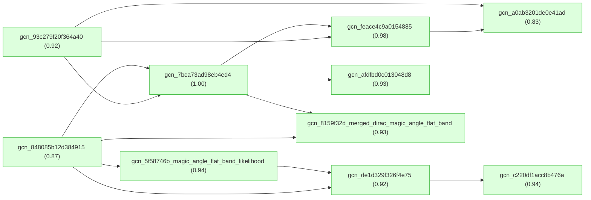
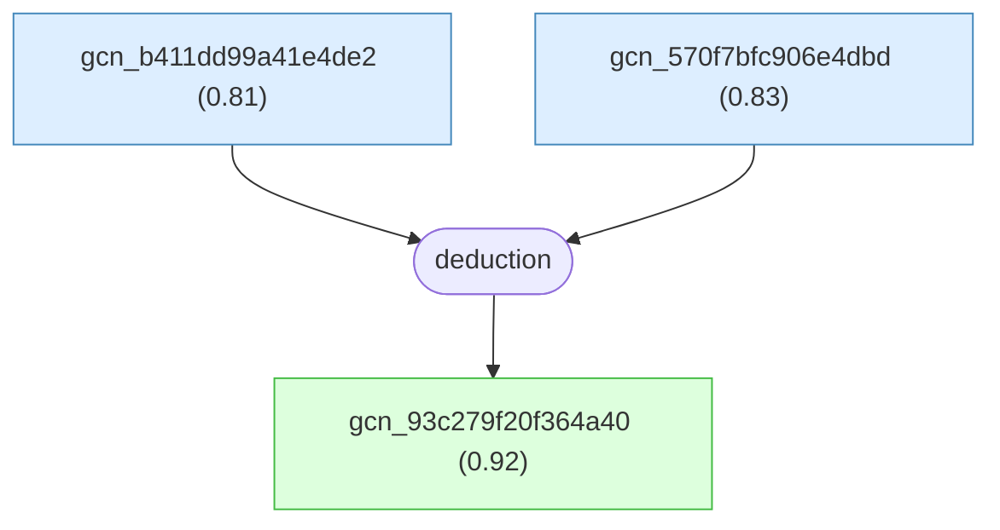
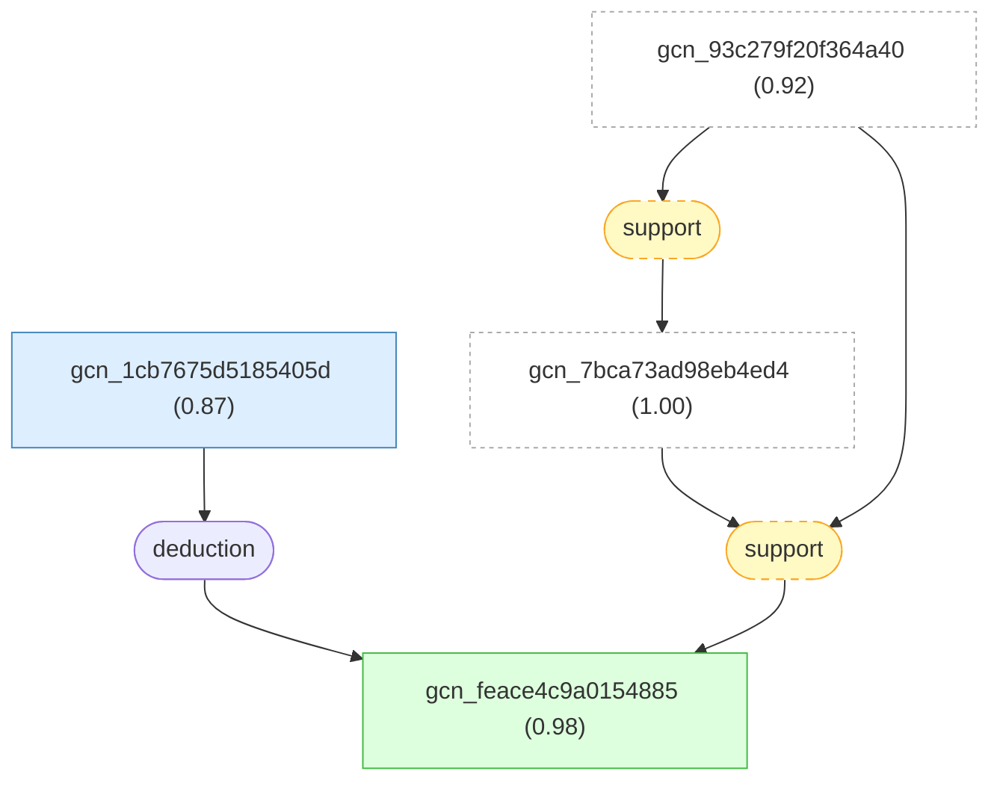
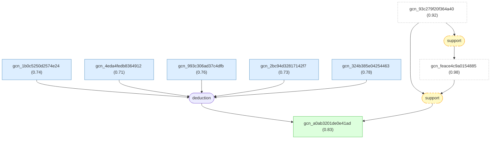
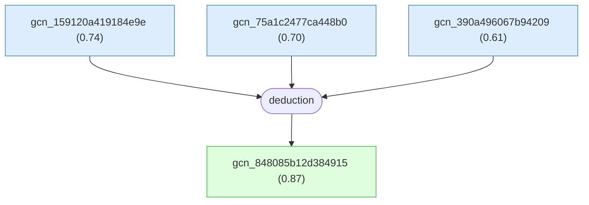
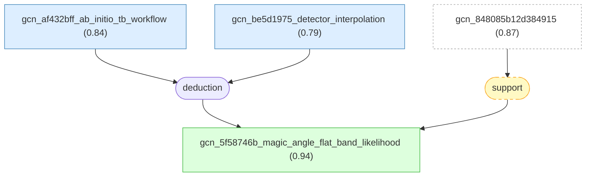
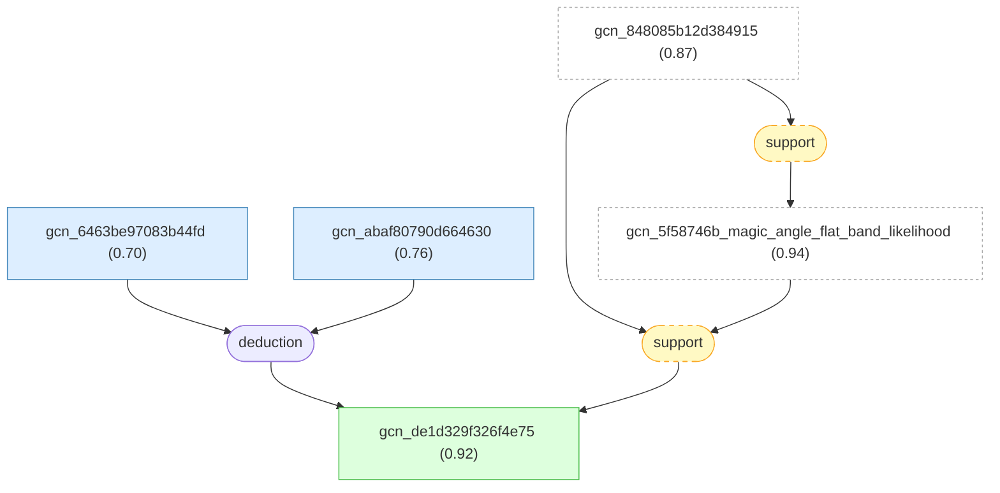
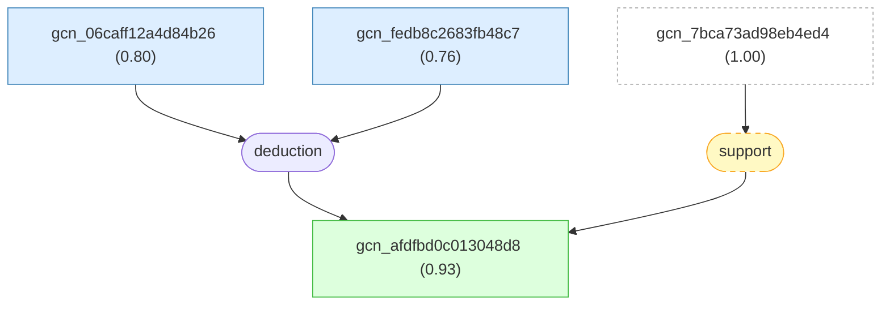
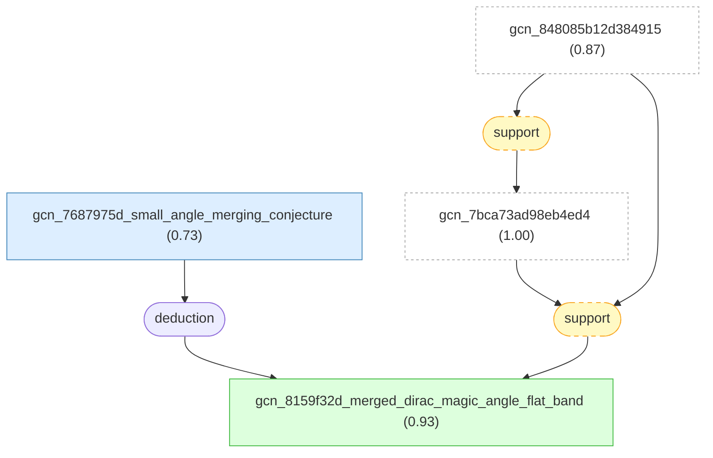

# tbg-magic-angle-gaia

Gaia knowledge package regenerated from one BM velocity root and connected LKM-backed TBG magic-angle extensions.

May 4 scope note: this rendered reasoning document covers the connected graph rooted at `gcn_7bca73ad98eb4ed4`. The package intentionally stops below the approximate 100-node target because bridge searches did not find chain-backed paths to the rejected pressure, substrate, superconducting-observation, or multilayer branches without agent-authored synthesis.

## Overview

## Introduction

#### gcn_7bca73ad98eb4ed4 ★

📌 `gcn_7bca73ad98eb4ed4`   |   Belief: **1.00**

> For twisted bilayer graphene, the noninteracting low-energy Dirac-point band Fermi velocity v_F*(theta) produced by the Bistritzer-MacDonald continuum moire-band model is strongly suppressed as theta approaches the largest magic angle theta_M where that velocity vanishes; for 0 < theta < 3 degrees it is usefully described by v_F*(theta) ~= 0.5 * |theta - theta_M| * v_F, with v_F about 1e8 cm/s [@DasSarma2020].

🔗 **support**([gcn_848085b12d384915](#gcn_848085b12d384915))

Reasoning

The Uchida et al. LKM chain is an independent Kohn-Sham calculation where the Dirac Fermi velocity vanishes near theta about 1.08 degrees and flat bands emerge. It supports the BM root's velocity-suppression phenomenon while preserving the different method and parameter scope.

#### gcn_93c279f20f364a40 ★

📌 `gcn_93c279f20f364a40`   |   Belief: **0.92**

> In Wu, Hwang, and Das Sarma's continuum moire Hamiltonian calculation for twisted bilayer graphene, v_F*(theta) is strongly suppressed near theta_magic about 1.025 degrees, and a perturbative moire-wavefunction calculation gives the electron-phonon matrix-element form factor F(theta)=(1+beta^2)/(1+beta)^2 with beta=3(alpha_0^2+alpha_1^2), where alpha_j=w_j/(hbar v_F |kappa_{+1}|) for the AA and AB/BA tunneling parameters [@Wu2018].

🔗 **deduction**([gcn_b411dd99a41e4de2](#gcn_b411dd99a41e4de2), [gcn_570f7bfc906e4dbd](#gcn_570f7bfc906e4dbd))

Reasoning

1. Define the valley +K moire continuum Hamiltonian as a 4x4 block matrix with layer Dirac Hamiltonians and spatially periodic interlayer tunneling.
2. Define h_l(k) with twist angle theta, monolayer velocity v_F about 10^8 cm/s, and layer-shifted Dirac momenta kappa_l.
3. Expand interlayer tunneling in three moire Fourier components with AA and AB/BA tunneling parameters w_0 and w_1.
4. Use w_0=90 meV and w_1=117 meV, diagonalize the continuum Hamiltonian, and obtain strong v_F*(theta) suppression with a largest magic angle theta_magic about 1.025 degrees.
5. Construct perturbative moire wavefunctions from four layer/momentum components near a moire Dirac point.
6. Define alpha_j=w_j/(hbar v_F |kappa_{+1}|) and beta=3(alpha_0^2+alpha_1^2), which also defines v_F* in the Dirac form of the projected Hamiltonian.
7. Derive F(theta)=(1+beta^2)/(1+beta)^2 as the electron-phonon matrix-element form factor, varying from 0.5 near strong interlayer mixing to 1 for vanishing tunneling.
8. Treat v_F*(theta) and F(theta) as known twist-angle inputs for transport and superconductivity calculations.

#### gcn_feace4c9a0154885 ★

📌 `gcn_feace4c9a0154885`   |   Belief: **0.98**

> In Das Sarma and Wu's strange-metallicity model for twisted bilayer graphene, the BM continuum calculation predicts strong v_F* suppression near the magic angle and v_F*/v_F about 1/4 at theta=1.5 degrees; because the phonon-limited resistivity and its temperature coefficient scale as 1/v_F*^2, this velocity reduction implies up to about a 16-fold enhancement of phonon-limited resistivity relative to untwisted monolayer graphene in the small-v_F* regime [@DasSarma2022].

🔗 **support**([gcn_7bca73ad98eb4ed4](#gcn_7bca73ad98eb4ed4), [gcn_93c279f20f364a40](#gcn_93c279f20f364a40))

Reasoning

Both source claims are LKM-backed BM/continuum velocity claims used as low-energy inputs for electron-phonon or transport calculations. They support the strange-metallicity extension's narrower statement that suppressed v_F* enhances phonon-limited resistivity through the stated 1/v_F*^2 scaling.

#### gcn_a0ab3201de0e41ad ★

📌 `gcn_a0ab3201de0e41ad`   |   Belief: **0.83**

> Qin, Zou, and MacDonald's mean-field finite-pairing-momentum BdG calculations for MATBG continuum-model flat bands with optical-phonon attraction and intravalley Coulomb repulsion find that T_c(mu) has dome-like maxima at flat-band van Hove singularities, H_c2(mu) peaks at the same chemical potentials, and extracted v_F*(mu)=k_B T_c(mu)/(hbar q_c(mu)) has V-shaped minima there, robust across the explored ranges eta about 0.7-0.85, theta about 1.07-1.15 degrees, and u about 20-40 meV nm^2 [@Qin2021].

🔗 **support**([gcn_93c279f20f364a40](#gcn_93c279f20f364a40), [gcn_feace4c9a0154885](#gcn_feace4c9a0154885))

Reasoning

The accepted extensions keep the path within LKM-backed MATBG continuum calculations where v_F* and electron-phonon inputs are used for transport or pairing. This supports the Qin-Zou-MacDonald phonon-mediated BdG extension only as a model-family continuation.

#### gcn_848085b12d384915 ★

📌 `gcn_848085b12d384915`   |   Belief: **0.87**

> Uchida et al.'s Kohn-Sham band-structure calculations for twisted bilayer graphene find a magic twist angle theta_M about 1.08 degrees where the Dirac Fermi velocity vanishes; near this angle the low-energy Kohn-Sham bands become extremely flat over most of the Brillouin zone, including nearly dispersionless half-filled bands around E_F and about 10 meV splitting between flat bands at Gamma for theta=0.99 degrees [@Uchida2014].

🔗 **deduction**([gcn_159120a419184e9e](#gcn_159120a419184e9e), [gcn_75a1c2477ca448b0](#gcn_75a1c2477ca448b0), [gcn_390a496067b94209](#gcn_390a496067b94209))

Reasoning

1. Start from upstream localization and velocity-reduction results in small-angle corrugated twisted bilayer graphene.
2. Define the magic angle as the twist angle where Kohn-Sham Dirac Fermi velocity v_F=(1/hbar) d epsilon / d k vanishes.
3. Report that theta=0.99 degrees has extremely flat bands near E_F and about 10 meV splitting between the flat bands at Gamma.
4. Extract theta_M about 1.08 degrees from the computed velocity-versus-angle curve.
5. Relate AA-region localization to reduced dispersion and half-filled flat bands.
6. Note consistency with earlier continuum and tight-binding predictions while preserving the different numerical method.

#### gcn_5f58746b_magic_angle_flat_band_likelihood ★

📌 `gcn_5f58746b_magic_angle_flat_band_likelihood`   |   Belief: **0.94**

> For 33 unique commensurate twisted bilayer graphene supercells spanning 0.88 degrees <= theta <= 21.79 degrees, Tritsaris et al. 2020 use ab initio Wannier-derived tight-binding calculations and automated flat-band detection to find that the blended flat-band likelihood p(theta) is maximized near theta* approximately 1.1 degrees, where low-dispersion near-flat bands emerge near the Fermi level in the single-particle tight-binding band structures [@Tritsaris2020].

🔗 **support**([gcn_848085b12d384915](#gcn_848085b12d384915))

Reasoning

Both LKM-backed claims are first-principles or ab initio-derived TBG calculations near the first magic angle that report flat or low-dispersion bands. The support is scoped to independent agreement on near-1.1-degree flat-band formation, not equivalence of workflows.

#### gcn_c220df1acc8b476a ★

📌 `gcn_c220df1acc8b476a`   |   Belief: **0.94**

> In Liu et al.'s continuum-model electronic-structure calculation for magic-angle twisted bilayer graphene, adding atomic-registry-driven lattice relaxation produces reconstructed geometry with enlarged AB/BA regions and reduced AA regions; compared with the rigid unreconstructed calculation, this reconstructed geometry reproduces the key STS spectroscopic trends of broader low-energy flat bands and greater energetic isolation from remote bands, while the calculation omits explicit spatially non-uniform heterostrain and therefore does not reproduce extra flat-band peak splitting, such as three-subpeak structure, observed in some spectra [@Liu2020].

🔗 **support**([gcn_de1d329f326f4e75](#gcn_de1d329f326f4e75))

Reasoning

The Cantele DFT relaxation chain and the Liu continuum/STS chain both concern magic-angle TBG relaxation effects on flat-band isolation. This supports the Liu extension as a connected relaxation-specific continuation while keeping DFT and continuum/STS scopes distinct.

#### gcn_de1d329f326f4e75 ★

📌 `gcn_de1d329f326f4e75`   |   Belief: **0.92**

> For twisted bilayer graphene at the first magic twist angle $\theta=1.08^\circ$, plane-wave DFT with vdW-DF2 reproduces the near-Fermi narrow flat-band manifold and the $\Gamma$-point gaps to higher and lower bands only when full atomic relaxation includes both in-plane and out-of-plane displacements. In the fully relaxed geometry, the reported flat-band bandwidth is about $20\,\mathrm{meV}$, with upper and lower separation gaps of about $26\,\mathrm{meV}$ and $16\,\mathrm{meV}$, and tight-binding calculations on the same relaxed coordinates give consistent low-energy bands. Unrelaxed flat geometries lack or strongly underestimate these gaps; in-plane-only relaxation gives zero gaps, while out-of-plane-only relaxation gives underestimated gaps of about $2\,\mathrm{meV}$ and $14\,\mathrm{meV}$ [@Cantele2020].

🔗 **support**([gcn_848085b12d384915](#gcn_848085b12d384915), [gcn_5f58746b_magic_angle_flat_band_likelihood](#gcn_5f58746b_magic_angle_flat_band_likelihood))

Reasoning

The accepted ab initio/Kohn-Sham flat-band claims provide the connected TBG first-magic-angle context for Cantele et al.'s more specific DFT result that full atomic relaxation is required to reproduce the narrow flat-band manifold and gaps at theta=1.08 degrees.

#### gcn_afdfbd0c013048d8 ★

📌 `gcn_afdfbd0c013048d8`   |   Belief: **0.93**

> The continuum Bistritzer-MacDonald model of magic-angle twisted bilayer
> graphene, after a layer-dependent momentum shift restores moire periodicity,
> can be represented in a magnetic-translation-irrep Landau-level basis at flux
> $\phi=2\pi$ and diagonalized with a finite Landau-level cutoff; for the BM
> interlayer tunneling parameters studied, this calculation produces two
> low-energy reentrant flat bands per valley and spin separated from passive
> bands by a gap of order 40 meV, with topology controlled by $(w_0,w_1)$:
> physical TBG lies in a crystalline regime with vanishing total Chern number for
> the two flat bands, while the first chiral limit $w_0=0$ lies in a
> Landau-level-type regime where each flat band has Chern number -1
> [@HerzogArbeitman2022].

🔗 **support**([gcn_7bca73ad98eb4ed4](#gcn_7bca73ad98eb4ed4))

Reasoning

The magnetic-Bloch extension explicitly starts from the BM continuum model at magic-angle parameters. The BM velocity root supplies the connected zero-field magic-angle BM context, while the extension keeps its flux=2pi and topology conditions separate.

#### gcn_8159f32d_merged_dirac_magic_angle_flat_band ★

📌 `gcn_8159f32d_merged_dirac_magic_angle_flat_band`   |   Belief: **0.93**

> In sufficiently small-angle twisted bilayer graphene, where the moire-K gap between the $2n_0$th and $(2n_0+1)$th bands is negligibly small and the upper two bands near charge neutrality are nearly degenerate, Yamada and Hasegawa 2020 propose that three moving Dirac points merge with the fixed K-point Dirac point, producing vanishing Dirac velocity at K; this suppression is conjectured to contribute to extremely narrow nearly flat bands at the magic angles [@Yamada2020].

🔗 **support**([gcn_7bca73ad98eb4ed4](#gcn_7bca73ad98eb4ed4), [gcn_848085b12d384915](#gcn_848085b12d384915))

Reasoning

The merged-Dirac chain is a conjectural same-system mechanism for vanishing Dirac velocity and near-flat bands at small magic angles. The BM and Kohn-Sham velocity roots support it as a connected mechanistic extension, not as a proved equivalence.

## paper_dassarma2020 -- LKM claims and deduction from Das Sarma and Wu (2020).

#### gcn_d3808439ccf6496b

📌 `gcn_d3808439ccf6496b`   |   Prior: 0.82   |   Belief: **0.89**

> For twisted bilayer graphene in the noninteracting Bistritzer-MacDonald continuum moire-band calculation, with twist angle theta and largest magic angle theta_M measured in degrees and monolayer graphene velocity v_F about 1e8 cm/s, the computed low-energy Dirac-point Fermi velocity v_F*(theta) for 0 < theta < 3 degrees is usefully approximated by v_F*(theta) ~= 0.5 * |theta - theta_M| * v_F [@DasSarma2020].

#### gcn_671ceef053a64aa7

📌 `gcn_671ceef053a64aa7`   |   Prior: 0.84   |   Belief: **0.90**

> In twisted bilayer graphene, the Bistritzer-MacDonald continuum moire-band model supplies the noninteracting low-energy band structure, and the Dirac-point band Fermi velocity v_F*(theta) from that model is treated as the bare input velocity for subsequent low-energy many-body and phonon-transport calculations [@DasSarma2020].

#### gcn_7bca73ad98eb4ed4 ★

📌 `gcn_7bca73ad98eb4ed4`   |   Belief: **1.00**

> For twisted bilayer graphene, the noninteracting low-energy Dirac-point band Fermi velocity v_F*(theta) produced by the Bistritzer-MacDonald continuum moire-band model is strongly suppressed as theta approaches the largest magic angle theta_M where that velocity vanishes; for 0 < theta < 3 degrees it is usefully described by v_F*(theta) ~= 0.5 * |theta - theta_M| * v_F, with v_F about 1e8 cm/s [@DasSarma2020].

🔗 **support**([gcn_848085b12d384915](#gcn_848085b12d384915))

Reasoning

The Uchida et al. LKM chain is an independent Kohn-Sham calculation where the Dirac Fermi velocity vanishes near theta about 1.08 degrees and flat bands emerge. It supports the BM root's velocity-suppression phenomenon while preserving the different method and parameter scope.

## paper_wu2018 -- continuum velocity and electron-phonon form factor in MATBG.

#### gcn_b411dd99a41e4de2

📌 `gcn_b411dd99a41e4de2`   |   Prior: 0.76   |   Belief: **0.81**

> For a moire Dirac point in twisted bilayer graphene, Wu, Hwang, and Das Sarma construct degenerate Dirac-point eigenstates from four layer/momentum spinors with amplitudes set by alpha_j=w_j/(hbar v_F |kappa_{+1}|), define beta=3(alpha_0^2+alpha_1^2), and approximate the deformation-potential electron-phonon spinor-overlap factor as F(theta)=(1+beta^2)/(1+beta)^2, with 0.5 <= F(theta) <= 1 used as a transport matrix-element correction [@Wu2018].

#### gcn_570f7bfc906e4dbd

📌 `gcn_570f7bfc906e4dbd`   |   Prior: 0.78   |   Belief: **0.83**

> Using continuum-model interlayer tunneling parameters w_0=90 meV and w_1=117 meV to incorporate atomic-relaxation effects, Wu, Hwang, and Das Sarma obtain a largest magic angle theta_magic about 1.025 degrees and a strongly suppressed twist-angle-dependent Dirac velocity v_F*(theta), while noting sample-dependent relaxation and strain can shift theta_magic and v_F* by order tens of percent [@Wu2018].

#### gcn_93c279f20f364a40 ★

📌 `gcn_93c279f20f364a40`   |   Belief: **0.92**

> In Wu, Hwang, and Das Sarma's continuum moire Hamiltonian calculation for twisted bilayer graphene, v_F*(theta) is strongly suppressed near theta_magic about 1.025 degrees, and a perturbative moire-wavefunction calculation gives the electron-phonon matrix-element form factor F(theta)=(1+beta^2)/(1+beta)^2 with beta=3(alpha_0^2+alpha_1^2), where alpha_j=w_j/(hbar v_F |kappa_{+1}|) for the AA and AB/BA tunneling parameters [@Wu2018].

🔗 **deduction**([gcn_b411dd99a41e4de2](#gcn_b411dd99a41e4de2), [gcn_570f7bfc906e4dbd](#gcn_570f7bfc906e4dbd))

Reasoning

1. Define the valley +K moire continuum Hamiltonian as a 4x4 block matrix with layer Dirac Hamiltonians and spatially periodic interlayer tunneling.
2. Define h_l(k) with twist angle theta, monolayer velocity v_F about 10^8 cm/s, and layer-shifted Dirac momenta kappa_l.
3. Expand interlayer tunneling in three moire Fourier components with AA and AB/BA tunneling parameters w_0 and w_1.
4. Use w_0=90 meV and w_1=117 meV, diagonalize the continuum Hamiltonian, and obtain strong v_F*(theta) suppression with a largest magic angle theta_magic about 1.025 degrees.
5. Construct perturbative moire wavefunctions from four layer/momentum components near a moire Dirac point.
6. Define alpha_j=w_j/(hbar v_F |kappa_{+1}|) and beta=3(alpha_0^2+alpha_1^2), which also defines v_F* in the Dirac form of the projected Hamiltonian.
7. Derive F(theta)=(1+beta^2)/(1+beta)^2 as the electron-phonon matrix-element form factor, varying from 0.5 near strong interlayer mixing to 1 for vanishing tunneling.
8. Treat v_F*(theta) and F(theta) as known twist-angle inputs for transport and superconductivity calculations.

## paper_dassarma2022 -- BM velocity suppression and phonon-limited resistivity.

#### gcn_1cb7675d5185405d

📌 `gcn_1cb7675d5185405d`   |   Prior: 0.80   |   Belief: **0.87**

> For twisted bilayer graphene, the Bistritzer-MacDonald continuum moire-band model predicts a moire-band Fermi velocity v_F*(theta) at the moire Dirac points; with standard BM parameters it strongly suppresses v_F* toward zero near a magic twist angle around 1 degree and gives v_F*/v_F about 1/4 at theta=1.5 degrees within the noninteracting continuum approximation without lattice relaxation or many-body self-energy corrections [@DasSarma2022].

#### gcn_feace4c9a0154885 ★

📌 `gcn_feace4c9a0154885`   |   Belief: **0.98**

> In Das Sarma and Wu's strange-metallicity model for twisted bilayer graphene, the BM continuum calculation predicts strong v_F* suppression near the magic angle and v_F*/v_F about 1/4 at theta=1.5 degrees; because the phonon-limited resistivity and its temperature coefficient scale as 1/v_F*^2, this velocity reduction implies up to about a 16-fold enhancement of phonon-limited resistivity relative to untwisted monolayer graphene in the small-v_F* regime [@DasSarma2022].

🔗 **support**([gcn_7bca73ad98eb4ed4](#gcn_7bca73ad98eb4ed4), [gcn_93c279f20f364a40](#gcn_93c279f20f364a40))

Reasoning

Both source claims are LKM-backed BM/continuum velocity claims used as low-energy inputs for electron-phonon or transport calculations. They support the strange-metallicity extension's narrower statement that suppressed v_F* enhances phonon-limited resistivity through the stated 1/v_F*^2 scaling.

## paper_qin2021 -- critical fields and phonon-mediated pairing in MATBG.

#### gcn_1b0c5250d2574e24

📌 `gcn_1b0c5250d2574e24`   |   Prior: 0.72   |   Belief: **0.74**

> In MATBG flat-band models where optical phonon energies are about 196 meV for E_2 modes and about 170 meV for A_1/B_1 modes while the electronic flat-band bandwidth is much smaller than 100 meV, Qin, Zou, and MacDonald treat the electron-optical-phonon interaction as effectively instantaneous and parameterize it by static BCS-like couplings g_0 and g_1 [@Qin2021].

#### gcn_4eda4fedb8364912

📌 `gcn_4eda4fedb8364912`   |   Prior: 0.68   |   Belief: **0.71**

> In Qin, Zou, and MacDonald's mean-field BdG modeling of MATBG superconductivity, the short-range intravalley Coulomb repulsion parameter u is treated as a phenomenological tuning parameter in meV nm^2 that can be adjusted to reproduce experimental critical temperatures and represents the principal depairing short-range Coulomb effect in the static interaction tensor [@Qin2021].

#### gcn_993c306ad37c4dfb

📌 `gcn_993c306ad37c4dfb`   |   Prior: 0.74   |   Belief: **0.76**

> For Qin, Zou, and MacDonald's MATBG finite-pairing-momentum BdG calculations, intervalley Coulomb scattering matrix elements are neglected relative to intravalley Coulomb repulsion, so the principal depairing Coulomb effect is represented by a single intravalley parameter u in the interaction tensor [@Qin2021].

#### gcn_2bc94d32817142f7

📌 `gcn_2bc94d32817142f7`   |   Prior: 0.70   |   Belief: **0.73**

> Qin, Zou, and MacDonald use non-interaction-reconstructed MATBG continuum-model band structures parameterized by twist angle theta and tunneling ratio eta=t_AA/t_AB to represent the flat-band van Hove singularities that determine where phonon-mediated pairing produces maxima of T_c(mu) and minima of extracted average velocity v_F*(mu), while assuming neglected interaction-driven flavor symmetry breaking does not qualitatively change this prediction [@Qin2021].

#### gcn_324b385e04254463

📌 `gcn_324b385e04254463`   |   Prior: 0.76   |   Belief: **0.78**

> In Qin, Zou, and MacDonald's MATBG calculations, superconducting critical-temperature maxima and minima of extracted average velocity v_F* occur at chemical potentials corresponding to flat-band van Hove singularities, and this coincidence persists across explored variations of eta, theta, and Coulomb depairing strength u when the interaction remains phonon-dominated and not strongly filling-dependent [@Qin2021].

#### gcn_a0ab3201de0e41ad ★

📌 `gcn_a0ab3201de0e41ad`   |   Belief: **0.83**

> Qin, Zou, and MacDonald's mean-field finite-pairing-momentum BdG calculations for MATBG continuum-model flat bands with optical-phonon attraction and intravalley Coulomb repulsion find that T_c(mu) has dome-like maxima at flat-band van Hove singularities, H_c2(mu) peaks at the same chemical potentials, and extracted v_F*(mu)=k_B T_c(mu)/(hbar q_c(mu)) has V-shaped minima there, robust across the explored ranges eta about 0.7-0.85, theta about 1.07-1.15 degrees, and u about 20-40 meV nm^2 [@Qin2021].

🔗 **support**([gcn_93c279f20f364a40](#gcn_93c279f20f364a40), [gcn_feace4c9a0154885](#gcn_feace4c9a0154885))

Reasoning

The accepted extensions keep the path within LKM-backed MATBG continuum calculations where v_F* and electron-phonon inputs are used for transport or pairing. This supports the Qin-Zou-MacDonald phonon-mediated BdG extension only as a model-family continuation.

## paper_uchida2014 -- Kohn-Sham velocity collapse and flat bands in TBG.

#### gcn_159120a419184e9e

📌 `gcn_159120a419184e9e`   |   Prior: 0.70   |   Belief: **0.74**

> For commensurate twisted bilayer graphene unit cells labeled by integer pairs (N,N-1), Uchida et al. represent out-of-plane corrugation z(r) by a two-dimensional Fourier series, fit dominant coefficients from optimized larger-angle geometries, extrapolate those coefficients for theta<2 degrees, reconstruct z(r), and use the resulting corrugated geometries as inputs for small-angle band-structure calculations near theta=0.99 degrees [@Uchida2014].

#### gcn_75a1c2477ca448b0

📌 `gcn_75a1c2477ca448b0`   |   Prior: 0.66   |   Belief: **0.70**

> In Uchida et al.'s Kohn-Sham calculations for twisted bilayer graphene, the quoted magic angle theta_M about 1.08 degrees is defined by the vanishing Dirac Fermi velocity and depends on extrapolated small-angle atomic geometries, finite real-space grids, chosen pseudopotentials, and the LDA exchange-correlation approximation with limited vdW-DF checks [@Uchida2014].

#### gcn_390a496067b94209

📌 `gcn_390a496067b94209`   |   Prior: 0.55   |   Belief: **0.61**

> Uchida et al. interpret half-filled flat Kohn-Sham bands at charge neutrality in twisted bilayer graphene as indicating a possible tendency toward magnetic ordering upon slight twisting, while acknowledging that explicit spin-polarized total-energy comparisons, Hubbard-model analysis, or many-body calculations would be required to establish spontaneous magnetism [@Uchida2014].

#### gcn_848085b12d384915 ★

📌 `gcn_848085b12d384915`   |   Belief: **0.87**

> Uchida et al.'s Kohn-Sham band-structure calculations for twisted bilayer graphene find a magic twist angle theta_M about 1.08 degrees where the Dirac Fermi velocity vanishes; near this angle the low-energy Kohn-Sham bands become extremely flat over most of the Brillouin zone, including nearly dispersionless half-filled bands around E_F and about 10 meV splitting between flat bands at Gamma for theta=0.99 degrees [@Uchida2014].

🔗 **deduction**([gcn_159120a419184e9e](#gcn_159120a419184e9e), [gcn_75a1c2477ca448b0](#gcn_75a1c2477ca448b0), [gcn_390a496067b94209](#gcn_390a496067b94209))

Reasoning

1. Start from upstream localization and velocity-reduction results in small-angle corrugated twisted bilayer graphene.
2. Define the magic angle as the twist angle where Kohn-Sham Dirac Fermi velocity v_F=(1/hbar) d epsilon / d k vanishes.
3. Report that theta=0.99 degrees has extremely flat bands near E_F and about 10 meV splitting between the flat bands at Gamma.
4. Extract theta_M about 1.08 degrees from the computed velocity-versus-angle curve.
5. Relate AA-region localization to reduced dispersion and half-filled flat bands.
6. Note consistency with earlier continuum and tight-binding predictions while preserving the different numerical method.

## paper_tritsaris2020 -- claims and deduction for Tritsaris et al. 2020.

#### gcn_af432bff_ab_initio_tb_workflow

📌 `gcn_af432bff_ab_initio_tb_workflow`   |   Prior: 0.78   |   Belief: **0.84**

> For commensurate twisted bilayer graphene in the Tritsaris et al. 2020 high-throughput workflow, the selected LKM chain treats as established a Wannier-derived tight-binding Hamiltonian workflow in which band structures are diagonalized with 60 k-points along Gamma-M-K and automated flat-band detectors inspect a 0.30 eV window around the Fermi level [@Tritsaris2020].

#### gcn_be5d1975_detector_interpolation

📌 `gcn_be5d1975_detector_interpolation`   |   Prior: 0.72   |   Belief: **0.79**

> For the same Tritsaris et al. 2020 commensurate twisted-bilayer-graphene workflow, the selected LKM chain treats automated low-dispersion-band detections at the sampled commensurate twist angles as inputs that are converted into a continuous flat-band likelihood p(theta) by an interpolation and blending prescription [@Tritsaris2020].

#### gcn_5f58746b_magic_angle_flat_band_likelihood ★

📌 `gcn_5f58746b_magic_angle_flat_band_likelihood`   |   Belief: **0.94**

> For 33 unique commensurate twisted bilayer graphene supercells spanning 0.88 degrees <= theta <= 21.79 degrees, Tritsaris et al. 2020 use ab initio Wannier-derived tight-binding calculations and automated flat-band detection to find that the blended flat-band likelihood p(theta) is maximized near theta* approximately 1.1 degrees, where low-dispersion near-flat bands emerge near the Fermi level in the single-particle tight-binding band structures [@Tritsaris2020].

🔗 **support**([gcn_848085b12d384915](#gcn_848085b12d384915))

Reasoning

Both LKM-backed claims are first-principles or ab initio-derived TBG calculations near the first magic angle that report flat or low-dispersion bands. The support is scoped to independent agreement on near-1.1-degree flat-band formation, not equivalence of workflows.

## paper_liu2020 -- LKM claims and deduction from Liu et al. (2020).

#### gcn_8cd2984a6296435c

📌 `gcn_8cd2984a6296435c`   |   Prior: 0.80   |   Belief: **0.85**

> For Liu et al.'s continuum-model calculations of magic-angle twisted bilayer graphene, the Bistritzer-MacDonald-type moire Hamiltonian is augmented by atomic-registry-dependent interlayer tunneling and a relaxation-derived displacement field that enlarges AB/BA regions and shrinks AA regions; in that reconstructed geometry, the computed low-energy flat-band manifold has larger bandwidth and greater energetic separation from remote bands than in the unreconstructed rigid geometry, with the qualitative trend robust to moderate model-parameter changes even though explicit spatially non-uniform heterostrain is not included [@Liu2020].

#### gcn_ed8fa9253ea24982

📌 `gcn_ed8fa9253ea24982`   |   Prior: 0.72   |   Belief: **0.79**

> For magic-angle twisted bilayer graphene spectra discussed by Liu et al., spatially non-uniform heterostrain means a slowly varying relative in-plane deformation between graphene layers, parameterized by a local strain tensor field epsilon(r) at the moire scale; such heterostrain can reconstruct the electronic band structure and generate additional flat-band density-of-states fine structure, including three-subpeak splitting seen in some STS spectra, but those heterostrain-induced features are not reproduced by continuum-model calculations that include only atomic-registry-driven lattice relaxation [@Liu2020].

#### gcn_c220df1acc8b476a ★

📌 `gcn_c220df1acc8b476a`   |   Belief: **0.94**

> In Liu et al.'s continuum-model electronic-structure calculation for magic-angle twisted bilayer graphene, adding atomic-registry-driven lattice relaxation produces reconstructed geometry with enlarged AB/BA regions and reduced AA regions; compared with the rigid unreconstructed calculation, this reconstructed geometry reproduces the key STS spectroscopic trends of broader low-energy flat bands and greater energetic isolation from remote bands, while the calculation omits explicit spatially non-uniform heterostrain and therefore does not reproduce extra flat-band peak splitting, such as three-subpeak structure, observed in some spectra [@Liu2020].

🔗 **support**([gcn_de1d329f326f4e75](#gcn_de1d329f326f4e75))

Reasoning

The Cantele DFT relaxation chain and the Liu continuum/STS chain both concern magic-angle TBG relaxation effects on flat-band isolation. This supports the Liu extension as a connected relaxation-specific continuation while keeping DFT and continuum/STS scopes distinct.

## paper_cantele2020 -- claims and deduction for Cantele et al. 2020.

#### gcn_6463be97083b44fd

📌 `gcn_6463be97083b44fd`   |   Prior: 0.62   |   Belief: **0.70**

> For first-magic-angle twisted bilayer graphene, comparing plane-wave DFT Kohn-Sham gaps computed with the vdW-DF2 exchange-correlation functional against spectroscopic gaps assumes that electron-electron correlation and quasiparticle self-energy corrections do not substantially renormalize the relevant gap magnitudes, so DFT gaps of about $26\,\mathrm{meV}$ and $16\,\mathrm{meV}$ can be quantitatively compared to nano-ARPES or tunneling spectroscopy in the same energy window [@Cantele2020].

#### gcn_abaf80790d664630

📌 `gcn_abaf80790d664630`   |   Prior: 0.70   |   Belief: **0.76**

> For twisted bilayer graphene at $\theta=1.08^\circ$, using two constrained optimizations--out-of-plane-only relaxation with fixed in-plane coordinates and in-plane-only relaxation with fixed z coordinates--is treated as a meaningful diagnostic separation of the electronic effects of the two relaxation components, while retaining the caveat that the fully relaxed structure may couple in-plane and out-of-plane degrees of freedom nonlinearly [@Cantele2020].

#### gcn_de1d329f326f4e75 ★

📌 `gcn_de1d329f326f4e75`   |   Belief: **0.92**

> For twisted bilayer graphene at the first magic twist angle $\theta=1.08^\circ$, plane-wave DFT with vdW-DF2 reproduces the near-Fermi narrow flat-band manifold and the $\Gamma$-point gaps to higher and lower bands only when full atomic relaxation includes both in-plane and out-of-plane displacements. In the fully relaxed geometry, the reported flat-band bandwidth is about $20\,\mathrm{meV}$, with upper and lower separation gaps of about $26\,\mathrm{meV}$ and $16\,\mathrm{meV}$, and tight-binding calculations on the same relaxed coordinates give consistent low-energy bands. Unrelaxed flat geometries lack or strongly underestimate these gaps; in-plane-only relaxation gives zero gaps, while out-of-plane-only relaxation gives underestimated gaps of about $2\,\mathrm{meV}$ and $14\,\mathrm{meV}$ [@Cantele2020].

🔗 **support**([gcn_848085b12d384915](#gcn_848085b12d384915), [gcn_5f58746b_magic_angle_flat_band_likelihood](#gcn_5f58746b_magic_angle_flat_band_likelihood))

Reasoning

The accepted ab initio/Kohn-Sham flat-band claims provide the connected TBG first-magic-angle context for Cantele et al.'s more specific DFT result that full atomic relaxation is required to reproduce the narrow flat-band manifold and gaps at theta=1.08 degrees.

## Claims and deduction from Herzog-Arbeitman, Chew, and Bernevig (2022).

#### gcn_06caff12a4d84b26

📌 `gcn_06caff12a4d84b26`   |   Prior: 0.74   |   Belief: **0.80**

> For the Bistritzer-MacDonald magnetic Bloch Hamiltonian
> $H^{\phi=2\pi}(\mathbf{k})$ of twisted bilayer graphene represented in the
> Landau-level basis $|\mathbf{k},n\rangle$, the numerical procedure truncates
> the basis to $n \le n_{\max}$, diagonalizes the resulting finite Hermitian
> matrix at sampled $\mathbf{k}$ points, and assumes that for the magic-angle BM
> parameters and flux $\phi=2\pi$ a numerically accessible cutoff makes the
> low-energy flat-band eigenvalues and topological diagnostics converge within
> quoted tolerances such as energy errors of order 1 meV [@HerzogArbeitman2022].

#### gcn_fedb8c2683fb48c7

📌 `gcn_fedb8c2683fb48c7`   |   Prior: 0.68   |   Belief: **0.76**

> For the BM magnetic Bloch Hamiltonian
> $H_{BM}^{\phi}(\mathbf{k};w_0,w_1)$ of magic-angle twisted bilayer graphene at
> flux $\phi=2\pi$, truncated in Landau levels and diagonalized across sampled
> interlayer parameters $(w_0,w_1)$, the observed reentrant two flat bands, their
> approximately 40 meV gap to passive bands, and the topology assignments
> separating a crystalline regime from a Landau-level regime are interpreted as
> physical parameter dependence only after convergence in Landau-level cutoff,
> $\mathbf{k}$ mesh, and parameter-grid refinement, subject to the stated BM-model
> approximations [@HerzogArbeitman2022].

#### gcn_afdfbd0c013048d8 ★

📌 `gcn_afdfbd0c013048d8`   |   Belief: **0.93**

> The continuum Bistritzer-MacDonald model of magic-angle twisted bilayer
> graphene, after a layer-dependent momentum shift restores moire periodicity,
> can be represented in a magnetic-translation-irrep Landau-level basis at flux
> $\phi=2\pi$ and diagonalized with a finite Landau-level cutoff; for the BM
> interlayer tunneling parameters studied, this calculation produces two
> low-energy reentrant flat bands per valley and spin separated from passive
> bands by a gap of order 40 meV, with topology controlled by $(w_0,w_1)$:
> physical TBG lies in a crystalline regime with vanishing total Chern number for
> the two flat bands, while the first chiral limit $w_0=0$ lies in a
> Landau-level-type regime where each flat band has Chern number -1
> [@HerzogArbeitman2022].

🔗 **support**([gcn_7bca73ad98eb4ed4](#gcn_7bca73ad98eb4ed4))

Reasoning

The magnetic-Bloch extension explicitly starts from the BM continuum model at magic-angle parameters. The BM velocity root supplies the connected zero-field magic-angle BM context, while the extension keeps its flux=2pi and topology conditions separate.

## paper_yamada2020 -- merged-Dirac-point mechanism in twisted bilayer graphene.

#### gcn_7687975d_small_angle_merging_conjecture

📌 `gcn_7687975d_small_angle_merging_conjecture`   |   Prior: 0.64   |   Belief: **0.73**

> For twisted bilayer graphene in the small-angle continuum limit considered by Yamada and Hasegawa 2020, the K-K' intervalley gap at moire K is treated as negligibly small, the upper two bands near charge neutrality are nearly degenerate, and the four-Dirac-point merging mechanism seen in commensurate tight-binding calculations at moderate twist angles is conjectured to persist continuously to magic-angle conditions, assuming no intervening topological or symmetry reconstruction and no qualitative change from lattice relaxation or electron-electron interactions [@Yamada2020].

#### gcn_8159f32d_merged_dirac_magic_angle_flat_band ★

📌 `gcn_8159f32d_merged_dirac_magic_angle_flat_band`   |   Belief: **0.93**

> In sufficiently small-angle twisted bilayer graphene, where the moire-K gap between the $2n_0$th and $(2n_0+1)$th bands is negligibly small and the upper two bands near charge neutrality are nearly degenerate, Yamada and Hasegawa 2020 propose that three moving Dirac points merge with the fixed K-point Dirac point, producing vanishing Dirac velocity at K; this suppression is conjectured to contribute to extremely narrow nearly flat bands at the magic angles [@Yamada2020].

🔗 **support**([gcn_7bca73ad98eb4ed4](#gcn_7bca73ad98eb4ed4), [gcn_848085b12d384915](#gcn_848085b12d384915))

Reasoning

The merged-Dirac chain is a conjectural same-system mechanism for vanishing Dirac velocity and near-flat bands at small magic angles. The BM and Kohn-Sham velocity roots support it as a connected mechanistic extension, not as a proved equivalence.

## Inference Results

**BP converged:** True (2 iterations)

| Label | Type | Prior | Belief | Role |
|-------|------|-------|--------|------|
| [gcn_390a496067b94209](#gcn_390a496067b94209) | claim | 0.55 | 0.6084 | independent |
| [gcn_6463be97083b44fd](#gcn_6463be97083b44fd) | claim | 0.62 | 0.6994 | independent |
| [gcn_75a1c2477ca448b0](#gcn_75a1c2477ca448b0) | claim | 0.66 | 0.7041 | independent |
| [gcn_4eda4fedb8364912](#gcn_4eda4fedb8364912) | claim | 0.68 | 0.7084 | independent |
| [gcn_7687975d_small_angle_merging_conjecture](#gcn_7687975d_small_angle_merging_conjecture) | claim | 0.64 | 0.7257 | independent |
| [gcn_2bc94d32817142f7](#gcn_2bc94d32817142f7) | claim | 0.70 | 0.7266 | independent |
| [gcn_159120a419184e9e](#gcn_159120a419184e9e) | claim | 0.70 | 0.7389 | independent |
| [gcn_1b0c5250d2574e24](#gcn_1b0c5250d2574e24) | claim | 0.72 | 0.7449 | independent |
| [gcn_fedb8c2683fb48c7](#gcn_fedb8c2683fb48c7) | claim | 0.68 | 0.7560 | independent |
| [gcn_abaf80790d664630](#gcn_abaf80790d664630) | claim | 0.70 | 0.7627 | independent |
| [gcn_993c306ad37c4dfb](#gcn_993c306ad37c4dfb) | claim | 0.74 | 0.7631 | independent |
| [gcn_324b385e04254463](#gcn_324b385e04254463) | claim | 0.76 | 0.7813 | independent |
| [gcn_ed8fa9253ea24982](#gcn_ed8fa9253ea24982) | claim | 0.72 | 0.7908 | independent |
| [gcn_be5d1975_detector_interpolation](#gcn_be5d1975_detector_interpolation) | claim | 0.72 | 0.7911 | independent |
| [gcn_06caff12a4d84b26](#gcn_06caff12a4d84b26) | claim | 0.74 | 0.8017 | independent |
| [gcn_b411dd99a41e4de2](#gcn_b411dd99a41e4de2) | claim | 0.76 | 0.8135 | independent |
| [gcn_a0ab3201de0e41ad](#gcn_a0ab3201de0e41ad) | claim | — | 0.8268 | derived |
| [gcn_570f7bfc906e4dbd](#gcn_570f7bfc906e4dbd) | claim | 0.78 | 0.8290 | independent |
| [gcn_af432bff_ab_initio_tb_workflow](#gcn_af432bff_ab_initio_tb_workflow) | claim | 0.78 | 0.8358 | independent |
| [gcn_8cd2984a6296435c](#gcn_8cd2984a6296435c) | claim | 0.80 | 0.8506 | independent |
| [gcn_1cb7675d5185405d](#gcn_1cb7675d5185405d) | claim | 0.80 | 0.8690 | independent |
| [gcn_848085b12d384915](#gcn_848085b12d384915) | claim | — | 0.8749 | derived |
| [gcn_d3808439ccf6496b](#gcn_d3808439ccf6496b) | claim | 0.82 | 0.8889 | independent |
| [gcn_671ceef053a64aa7](#gcn_671ceef053a64aa7) | claim | 0.84 | 0.9013 | independent |
| [gcn_93c279f20f364a40](#gcn_93c279f20f364a40) | claim | — | 0.9169 | derived |
| [gcn_de1d329f326f4e75](#gcn_de1d329f326f4e75) | claim | — | 0.9172 | derived |
| [gcn_8159f32d_merged_dirac_magic_angle_flat_band](#gcn_8159f32d_merged_dirac_magic_angle_flat_band) | claim | — | 0.9273 | derived |
| [gcn_afdfbd0c013048d8](#gcn_afdfbd0c013048d8) | claim | — | 0.9311 | derived |
| [gcn_c220df1acc8b476a](#gcn_c220df1acc8b476a) | claim | — | 0.9358 | derived |
| [gcn_5f58746b_magic_angle_flat_band_likelihood](#gcn_5f58746b_magic_angle_flat_band_likelihood) | claim | — | 0.9373 | derived |
| [gcn_feace4c9a0154885](#gcn_feace4c9a0154885) | claim | — | 0.9758 | derived |
| [gcn_7bca73ad98eb4ed4](#gcn_7bca73ad98eb4ed4) | claim | — | 0.9950 | derived |
